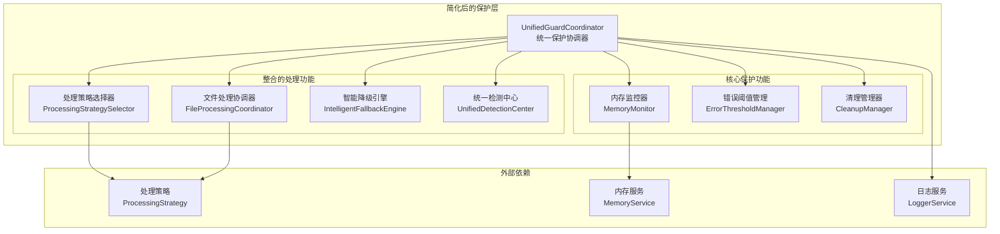

# 简化保护层整合方案

## 📋 概述

本文档详细细化了统一解析器架构计划中"阶段三：保护机制整合"的具体实施方案，旨在简化保护层，保留 [`UnifiedGuardCoordinator`](src/service/parser/guard/UnifiedGuardCoordinator.ts) 作为主要入口，整合 [`ProcessingGuard`](src/service/parser/guard/ProcessingGuard.ts) 功能，优化错误处理和内存保护。

## 🔍 功能重叠分析

### 当前架构问题

#### UnifiedGuardCoordinator 功能
- **内存保护**: 内存监控、检查、清理、限制设置
- **错误保护**: 错误阈值管理、降级决策
- **文件处理协调**: 与策略选择器和文件处理协调器集成
- **生命周期管理**: 初始化、销毁、重置

#### ProcessingGuard 功能
- **内存保护**: 通过 MemoryGuard 间接提供内存保护
- **错误保护**: 通过 ErrorThresholdManager 提供错误阈值管理
- **文件处理**: 完整的文件处理流程，包括检测、策略选择、执行
- **降级处理**: 智能降级引擎集成

### 功能重叠识别

| 功能领域 | UnifiedGuardCoordinator | ProcessingGuard | 重叠程度 |
|---------|------------------------|-----------------|----------|
| 内存监控 | ✅ 直接实现 | ✅ 通过 MemoryGuard | 高 |
| 错误阈值管理 | ✅ 直接集成 | ✅ 通过 ErrorThresholdManager | 高 |
| 文件处理协调 | ✅ 基础协调 | ✅ 完整流程 | 中 |
| 降级处理 | ✅ 基础降级 | ✅ 智能降级引擎 | 中 |
| 生命周期管理 | ✅ 完整实现 | ✅ 完整实现 | 高 |

## 🏗️ 简化后的保护层架构

### 设计原则

1. **单一入口**: UnifiedGuardCoordinator 作为唯一的保护机制入口
2. **功能整合**: 将 ProcessingGuard 的核心功能整合到 UnifiedGuardCoordinator
3. **职责清晰**: 明确分离保护逻辑和业务逻辑
4. **向后兼容**: 保持现有 API 接口不变

### 架构图



## 🎯 核心功能整合

### 1. 内存保护机制整合

#### 当前实现差异
- **UnifiedGuardCoordinator**: 直接使用 IMemoryMonitorService
- **ProcessingGuard**: 通过 MemoryGuard 间接使用

#### 整合方案
```typescript
// 统一的内存保护接口
interface IMemoryProtection {
  // 基础监控
  startMonitoring(): void;
  stopMonitoring(): void;
  checkMemoryUsage(): MemoryStatus;
  
  // 高级功能
  forceCleanup(): Promise<void>;
  gracefulDegradation(): void;
  setMemoryLimit(limitMB: number): void;
  
  // 统计信息
  getMemoryStats(): MemoryStats;
  getMemoryHistory(): MemoryHistory[];
  clearHistory(): void;
}
```

### 2. 错误处理机制整合

#### 统一错误处理流程
```typescript
// 统一的错误处理接口
interface IErrorProtection {
  // 错误阈值管理
  shouldUseFallback(): boolean;
  recordError(error: Error, context?: string): void;
  reset(): void;
  
  // 错误统计
  getErrorStats(): ErrorStats;
  getErrorHistory(): ErrorHistory[];
}
```

### 3. 文件处理协调整合

#### 整合 ProcessingGuard 的处理流程
```typescript
// 统一的文件处理接口
interface IFileProcessingCoordinator {
  // 主要处理方法
  processFile(filePath: string, content: string): Promise<FileProcessingResult>;
  
  // 降级处理
  processWithFallback(filePath: string, content: string, reason: string): Promise<FallbackResult>;
  
  // 状态查询
  getProcessingStats(): ProcessingStats;
}
```

## 🔧 统一的错误处理和内存保护机制

### 1. 统一事件处理

```typescript
class UnifiedGuardCoordinator {
  private setupEventHandlers(): void {
    // 统一处理内存压力事件
    if (typeof process !== 'undefined' && process.on) {
      process.on('memoryPressure', this.handleMemoryPressure.bind(this));
      process.on('uncaughtException', this.handleUncaughtException.bind(this));
      process.on('unhandledRejection', this.handleUnhandledRejection.bind(this));
    }
  }

  private handleMemoryPressure(event: any): void {
    this.logger?.warn('Memory pressure detected', event);
    
    // 统一的内存压力处理流程
    this.executeMemoryPressureProtocol();
  }

  private async executeMemoryPressureProtocol(): Promise<void> {
    try {
      // 1. 记录错误
      this.recordError(new Error('Memory pressure detected'), 'memory-pressure');
      
      // 2. 执行清理
      await this.forceCleanup();
      
      // 3. 检查是否需要降级
      if (!this.isMemoryHealthy()) {
        this.gracefulDegradation();
      }
    } catch (error) {
      this.logger?.error(`Memory pressure protocol failed: ${error}`);
    }
  }
}
```

### 2. 智能降级策略

```typescript
class UnifiedGuardCoordinator {
  private async executeIntelligentFallback(
    filePath: string, 
    content: string, 
    reason: string,
    cachedDetection?: DetectionResult
  ): Promise<FallbackResult> {
    // 1. 分析降级原因
    const fallbackContext = this.analyzeFallbackContext(reason);
    
    // 2. 选择最佳降级策略
    const strategy = await this.selectOptimalFallbackStrategy(
      filePath, 
      content, 
      fallbackContext,
      cachedDetection
    );
    
    // 3. 执行降级处理
    const result = await this.executeFallbackStrategy(strategy, filePath, content);
    
    // 4. 记录降级结果
    this.recordFallbackResult(strategy, result);
    
    return result;
  }

  private analyzeFallbackContext(reason: string): FallbackContext {
    return {
      reason,
      memoryStatus: this.getMemoryStats(),
      errorStats: this.getErrorStats(),
      timestamp: new Date(),
      systemLoad: this.getSystemLoad()
    };
  }
}
```

### 3. 统一的资源管理

```typescript
class UnifiedGuardCoordinator {
  private resourceManager: UnifiedResourceManager;

  private async performUnifiedCleanup(triggerReason: string): Promise<CleanupResult> {
    const cleanupContext: CleanupContext = {
      triggerReason,
      memoryUsage: this.getCurrentMemoryUsage(),
      timestamp: new Date(),
      priority: this.determineCleanupPriority(triggerReason)
    };

    // 执行分层清理
    const results = await this.resourceManager.executeLayeredCleanup(cleanupContext);
    
    // 验证清理效果
    const effectiveness = await this.validateCleanupEffectiveness(results);
    
    return {
      success: effectiveness.isAcceptable,
      memoryFreed: results.totalMemoryFreed,
      cleanedCaches: results.cleanedCaches,
      effectiveness
    };
  }
}
```

## 📋 详细实施步骤

### 阶段一：准备工作（1-2天）

#### 1.1 创建统一接口定义
```typescript
// 创建 src/service/parser/guard/interfaces/
// - IUnifiedProtection.ts
// - IMemoryProtection.ts
// - IErrorProtection.ts
// - IFileProcessingCoordinator.ts
```

#### 1.2 扩展 UnifiedGuardCoordinator
```typescript
// 扩展现有的 UnifiedGuardCoordinator 类
// 添加 ProcessingGuard 的核心功能
// 保持现有接口不变
```

### 阶段二：核心功能整合（2-3天）

#### 2.1 整合内存保护功能
- 将 ProcessingGuard 中的内存检查逻辑整合到 UnifiedGuardCoordinator
- 统一内存监控接口
- 优化内存压力处理流程

#### 2.2 整合错误处理功能
- 统一错误阈值管理
- 整合智能降级引擎
- 优化错误记录和统计

#### 2.3 整合文件处理协调
- 将 ProcessingGuard 的文件处理流程整合
- 保持与现有策略选择器的兼容性
- 优化处理性能

### 阶段三：直接迁移实现（1-2天）

#### 3.1 扩展 UnifiedGuardCoordinator 接口
```typescript
// 扩展 IUnifiedGuardCoordinator 接口
export interface IUnifiedGuardCoordinator extends IUnifiedGuardCoordinatorBase {
  // 添加 ProcessingGuard 特有的方法
  processFileWithDetection(filePath: string, content: string): Promise<ProcessingResult>;
  getProcessingStats(): ProcessingStats;
  clearDetectionCache(): void;
}
```

#### 3.2 更新依赖注入配置
```typescript
// 更新 BusinessServiceRegistrar
// 将 TYPES.ProcessingGuard 直接绑定到 UnifiedGuardCoordinator
// 移除 ProcessingGuard 的独立绑定
```

### 阶段四：测试和验证（2-3天）

#### 4.1 单元测试
- UnifiedGuardCoordinator 扩展功能测试
- 整合后的内存保护功能测试
- 整合后的错误处理功能测试
- 智能降级引擎集成测试

#### 4.2 集成测试
- 端到端文件处理测试
- 内存压力场景测试
- 错误阈值场景测试
- 降级策略测试

#### 4.3 性能测试
- 内存使用对比测试
- 处理性能基准测试
- 并发处理测试

### 阶段五：直接迁移和清理（1-2天）

#### 5.1 查找并替换所有使用方
- 搜索所有使用 ProcessingGuard 的代码
- 直接替换为使用 UnifiedGuardCoordinator
- 验证功能完整性

#### 5.2 清理旧代码
- 删除 ProcessingGuard.ts 文件
- 移除相关类型定义
- 更新文档和注释

## 🔄 直接迁移策略

### 1. 直接替换方案

由于项目处于开发阶段，我们可以直接将 ProcessingGuard 的功能整合到 UnifiedGuardCoordinator 中，然后替换所有使用 ProcessingGuard 的地方，无需保持向后兼容。

### 2. 迁移步骤

#### 2.1 扩展 UnifiedGuardCoordinator
- 将 ProcessingGuard 的所有核心功能直接整合到 UnifiedGuardCoordinator
- 保持 ProcessingGuard 的接口方法，但内部实现统一
- 添加 ProcessingGuard 特有的智能降级和检测功能

#### 2.2 更新依赖注入
- 将 TYPES.ProcessingGuard 直接绑定到 UnifiedGuardCoordinator
- 移除 ProcessingGuard 的独立绑定
- 确保所有依赖正确注入

#### 2.3 直接替换使用方
- 查找所有使用 ProcessingGuard 的地方
- 直接替换为使用 UnifiedGuardCoordinator
- 验证功能完整性

### 3. 简化的迁移计划

1. **阶段一**: 扩展 UnifiedGuardCoordinator 整合所有功能
2. **阶段二**: 更新依赖注入配置
3. **阶段三**: 替换所有使用方
4. **阶段四**: 移除 ProcessingGuard 代码
5. **阶段五**: 清理相关类型定义

## 🧪 测试和验证计划

### 1. 单元测试

#### UnifiedGuardCoordinator 扩展测试
```typescript
describe('UnifiedGuardCoordinator - Extended Features', () => {
  describe('整合的文件处理功能', () => {
    test('应该正确处理文件当条件满足时', async () => {
      // 测试正常文件处理流程
    });

    test('应该在内存超限时使用降级处理', async () => {
      // 测试内存限制触发降级
    });

    test('应该在错误阈值达到时使用降级处理', async () => {
      // 测试错误阈值触发降级
    });

    test('应该正确执行智能降级策略', async () => {
      // 测试智能降级引擎集成
    });
  });

  describe('统一的内存保护', () => {
    test('应该正确监控内存使用', () => {
      // 测试内存监控功能
    });

    test('应该在内存压力时执行清理', async () => {
      // 测试内存压力处理
    });

    test('应该正确执行优雅降级', () => {
      // 测试优雅降级机制
    });
  });
});
```

#### 整合功能测试
```typescript
describe('UnifiedGuardCoordinator - Integrated Features', () => {
  test('应该正确整合 ProcessingGuard 的所有功能', async () => {
    // 验证功能整合完整性
  });

  test('应该保持与原 ProcessingGuard 相同的行为', async () => {
    // 对比整合前后的行为一致性
  });

  test('应该提供增强的功能', async () => {
    // 验证新增的增强功能
  });
});
```

### 2. 集成测试

#### 端到端处理测试
```typescript
describe('Protection Layer Integration Tests', () => {
  test('应该完整处理文件从检测到分块', async () => {
    // 测试完整的文件处理流程
  });

  test('应该正确处理内存压力和错误阈值组合场景', async () => {
    // 测试复杂场景下的保护机制
  });

  test('应该保持与现有系统的兼容性', async () => {
    // 测试与现有组件的集成
  });
});
```

### 3. 性能测试

#### 基准测试
```typescript
describe('Protection Layer Performance Tests', () => {
  test('内存使用应该不显著增加', async () => {
    // 对比整合前后的内存使用
  });

  test('处理性能应该不退化', async () => {
    // 对比整合前后的处理速度
  });

  test('并发处理应该稳定', async () => {
    // 测试高并发场景下的稳定性
  });
});
```

### 4. 验证清单

#### 功能验证
- [ ] 内存监控功能正常工作
- [ ] 错误阈值管理正常
- [ ] 文件处理流程完整
- [ ] 清理机制正确触发
- [ ] 降级策略正确执行
- [ ] 事件处理无遗漏
- [ ] 智能降级引擎集成正常

#### 性能验证
- [ ] 内存使用无显著增加
- [ ] 处理性能无退化
- [ ] 响应时间在可接受范围内
- [ ] 并发处理稳定

#### 迁移验证
- [ ] 所有 ProcessingGuard 使用点已替换
- [ ] 功能行为保持一致
- [ ] 所有测试用例通过
- [ ] 性能无退化

## 📊 预期收益

### 1. 架构简化
- **减少代码重复**: 消除 UnifiedGuardCoordinator 和 ProcessingGuard 之间的功能重叠
- **统一入口点**: 单一的保护机制入口，降低使用复杂度
- **清晰的职责分离**: 明确分离保护逻辑和业务逻辑

### 2. 维护性提升
- **减少维护成本**: 单一代码库，减少维护工作量
- **提高代码质量**: 统一的实现标准和错误处理
- **简化测试**: 减少测试用例数量，提高测试覆盖率

### 3. 性能优化
- **减少内存开销**: 消除重复的组件实例
- **提高处理效率**: 优化的处理流程和减少的中间层
- **更好的资源管理**: 统一的资源管理和清理机制

### 4. 扩展性增强
- **更容易添加新功能**: 统一的扩展点
- **更好的配置管理**: 集中的配置和调优
- **更灵活的策略选择**: 统一的策略选择机制

## 🚨 风险控制

### 1. 迁移风险
- **风险**: 直接迁移可能破坏现有功能
- **缓解**: 全面的测试覆盖和分步验证
- **验证**: 完整的回归测试和功能验证

### 2. 性能风险
- **风险**: 整合后性能退化
- **缓解**: 详细的性能基准测试
- **验证**: 持续的性能监控

### 3. 复杂性风险
- **风险**: 整合过程中引入新的复杂性
- **缓解**: 分阶段实施，逐步验证
- **验证**: 代码审查和架构评审

## 📅 实施时间表

| 阶段 | 任务 | 预计时间 | 依赖 |
|------|------|----------|------|
| 阶段一 | 准备工作 | 1天 | 无 |
| 阶段二 | 核心功能整合 | 2天 | 阶段一完成 |
| 阶段三 | 直接迁移实现 | 1天 | 阶段二完成 |
| 阶段四 | 测试和验证 | 2天 | 阶段三完成 |
| 阶段五 | 直接迁移和清理 | 1天 | 阶段四完成 |

**总计**: 7天

## 🎯 成功标准

### 1. 功能完整性
- 所有现有功能正常工作
- 新的统一保护机制稳定运行
- 错误处理和内存保护机制有效

### 2. 性能标准
- 内存使用不增加超过 5%
- 处理性能不退化超过 3%
- 响应时间保持在可接受范围内

### 3. 迁移标准
- 所有 ProcessingGuard 使用点成功替换
- 功能行为保持一致
- 所有现有测试用例通过
- 性能无显著退化

### 4. 质量标准
- 代码覆盖率不低于 90%
- 无严重或高级别的代码质量问题
- 文档完整且准确

这个详细的简化保护层整合方案提供了完整的实施路径，确保在简化架构的同时保持功能完整性和向后兼容性。