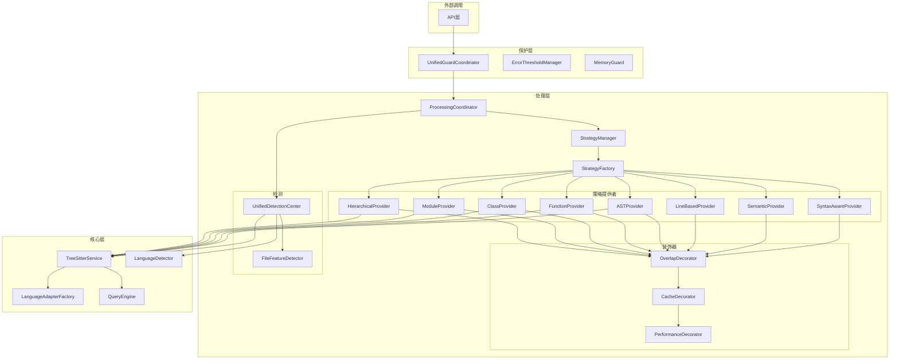

# 统一解析器架构重构计划

## 概述

本文档描述了将 `src/service/parser` 目录下的多个模块（`universal`、`splitting`、`guard`、`core`）合并为统一架构的计划。通过消除功能冗余和重复代码，提高代码的可维护性和可扩展性。

## 当前问题分析

### 1. 功能重叠和重复代码

**universal、splitting 和 core/strategy 目录的重复功能：**
- 策略工厂模式（多个 ProcessingStrategyFactory）
- 分段策略实现（语义、括号、行数、函数等）
- 配置管理系统
- 语言检测逻辑
- 代码块处理逻辑
- 策略管理器和协调器

**guard 目录的功能分析：**
- `ProcessingGuard` - 处理保护器，整合错误处理和内存保护
- `UnifiedGuardCoordinator` - 统一保护协调器
- `MemoryGuard` - 内存保护机制
- 这些组件提供了保护层，应该保留但需要整合到新架构中

**core 目录的功能分析：**
- `TreeSitterService` - AST解析服务
- `LanguageDetector` - 语言检测
- 各种语言适配器
- 查询引擎和缓存
- 这些是核心基础设施，应该作为基础服务保留

**core/strategy 目录的特殊性：**
- 提供基于AST的细粒度分段策略（函数、类、模块等）
- 与TreeSitter深度集成
- 更精确的代码结构分析
- 应该整合到统一策略体系中，作为高级策略提供者

## 统一架构设计

### 新的目录结构

```
src/service/parser/
├── core/                          # 核心基础设施
│   ├── parse/                     # 解析服务
│   │   ├── TreeSitterService.ts   # AST解析服务
│   │   └── DynamicParserManager.ts
│   ├── language-detection/        # 语言检测
│   │   ├── LanguageDetector.ts
│   │   └── TreeSitterLanguageDetector.ts
│   ├── normalization/             # 语言适配器
│   │   ├── LanguageAdapterFactory.ts
│   │   ├── BaseLanguageAdapter.ts
│   │   └── adapters/              # 各种语言适配器
│   ├── query/                     # 查询引擎
│   │   ├── QueryEngineFactory.ts
│   │   ├── QueryCache.ts
│   │   └── QueryRegistry.ts
│   └── strategy/                  # 核心分段策略
│       ├── ChunkingStrategy.ts
│       ├── ChunkingStrategyManager.ts
│       └── 各种具体策略实现
├── processing/                    # 统一处理层（合并 universal + splitting）
│   ├── strategies/                # 分段策略
│   │   ├── interfaces/            # 策略接口
│   │   │   ├── ISplitStrategy.ts
│   │   │   └── IStrategyProvider.ts
│   │   ├── providers/             # 策略提供者
│   │   │   ├── SyntaxAwareProvider.ts
│   │   │   ├── SemanticProvider.ts
│   │   │   ├── LineBasedProvider.ts
│   │   │   ├── ASTProvider.ts
│   │   │   ├── FunctionProvider.ts    # 来自core/strategy
│   │   │   ├── ClassProvider.ts       # 来自core/strategy  
│   │   │   ├── ModuleProvider.ts      # 来自core/strategy
│   │   │   └── HierarchicalProvider.ts # 来自core/strategy
│   │   ├── decorators/            # 策略装饰器
│   │   │   ├── OverlapDecorator.ts
│   │   │   ├── CacheDecorator.ts
│   │   │   └── PerformanceDecorator.ts
│   │   ├── factory/               # 策略工厂
│   │   │   └── StrategyFactory.ts
│   │   └── manager/               # 策略管理器（来自core/strategy）
│   │       └── StrategyManager.ts
│   ├── detection/                 # 检测逻辑
│   │   ├── UnifiedDetectionCenter.ts
│   │   ├── FileFeatureDetector.ts
│   │   └── BackupFileProcessor.ts
│   ├── coordination/              # 协调管理
│   │   ├── StrategyManager.ts
│   │   ├── ProcessingCoordinator.ts
│   │   └── ProtectionCoordinator.ts
│   ├── utils/                     # 工具函数
│   │   ├── ComplexityCalculator.ts
│   │   ├── SemanticBoundaryAnalyzer.ts
│   │   └── CodeQualityAssessment.ts
│   └── types/                     # 类型定义
│       └── index.ts
├── guard/                         # 保护机制（保留但简化）
│   ├── UnifiedGuardCoordinator.ts # 统一保护协调器
│   ├── ErrorThresholdManager.ts
│   └── MemoryGuard.ts
└── interfaces/                    # 公共接口
    ├── ISplitStrategy.ts
    ├── IStrategyProvider.ts
    ├── IProcessingCoordinator.ts
    └── IGuardCoordinator.ts
```

### 架构关系图



## 关键整合点

### 1. 策略接口统一

**当前状态：**
- `universal/strategies/IProcessingStrategy`
- `splitting/interfaces/ISplitStrategy`

**统一方案：**
```typescript
// 新的统一接口
export interface ISplitStrategy {
  split(
    content: string,
    language: string,
    filePath?: string,
    options?: ChunkingOptions,
    nodeTracker?: any,
    ast?: any
  ): Promise<CodeChunk[]>;
  
  getName(): string;
  supportsLanguage(language: string): boolean;
  getPriority(): number;
}
```

### 2. 工厂模式整合

**当前状态：**
- `universal/strategies/ProcessingStrategyFactory`
- `universal/strategy/ProcessingStrategyFactory` 
- `splitting/core/SplitStrategyFactory`

**统一方案：**
```typescript
export class UnifiedStrategyFactory {
  // 支持两种创建模式
  createStrategy(detection: DetectionResult): ISplitStrategy;
  createStrategyWithProvider(providerName: string, options?: ChunkingOptions): ISplitStrategy;
  
  // 注册策略提供者
  registerProvider(provider: IStrategyProvider): void;
  getAvailableProviders(): string[];
}
```

### 3. 检测逻辑统一

**当前状态：**
- `universal/UnifiedDetectionCenter`
- `universal/utils/FileFeatureDetector`
- `core/language-detection/LanguageDetector`

**统一方案：**
```typescript
export class UnifiedDetectionService {
  // 整合所有检测逻辑
  async detectFile(filePath: string, content: string): Promise<DetectionResult> {
    // 1. 备份文件检测
    // 2. 扩展名检测  
    // 3. 内容检测
    // 4. TreeSitter语言检测
    // 5. 文件特征分析
  }
}
```

### 4. 保护机制整合

**当前状态：**
- `guard/ProcessingGuard`
- `guard/UnifiedGuardCoordinator`
- `guard/MemoryGuard`
- `universal/ErrorThresholdManager`

**统一方案：**
```typescript
export class UnifiedGuardCoordinator {
  // 整合所有保护机制
  async processWithProtection(
    filePath: string, 
    content: string
  ): Promise<ProcessingResult> {
    // 1. 内存检查
    // 2. 错误阈值检查
    // 3. 策略选择和执行
    // 4. 降级处理
  }
}
```

## 实施计划

### 阶段一：基础架构统一（1-2周）

1. **创建统一的策略接口** (`src/service/parser/interfaces/`)
   - 合并 `IProcessingStrategy` 和 `ISplitStrategy`
   - 定义统一的 `IStrategyProvider` 接口

2. **统一配置管理**
   - 合并两个目录的配置系统
   - 创建 `UnifiedConfigManager`

3. **创建新的目录结构**
   - 建立 `processing/` 目录结构
   - 迁移通用工具类

### 阶段二：核心组件迁移（2-3周）

1. **迁移策略实现**
   - 将 universal 的策略迁移到 `processing/strategies/providers/`
   - 将 splitting 的策略提供者迁移到新架构
   - **将 core/strategy 的AST策略迁移为高级策略提供者**

2. **整合策略工厂**
   - 创建 `UnifiedStrategyFactory`
   - 支持多种创建模式（检测驱动、提供者驱动、AST驱动）

3. **统一检测逻辑**
   - 整合 `UnifiedDetectionCenter` 和 `LanguageDetector`
   - 创建 `UnifiedDetectionService`

4. **协调机制整合**
   - 合并 `StrategyManager` 和 `ProcessingCoordinator`
   - **整合 core/strategy 的 `ChunkingStrategyManager`**

### 阶段三：保护机制整合（1周）

1. **简化保护层**
   - 保留 `UnifiedGuardCoordinator` 作为主要入口
   - 整合 `ProcessingGuard` 功能
   - 优化错误处理和内存保护

### 阶段四：核心服务整合（1周） ✅ 已完成

1. **明确核心服务边界** ✅
   - `core/` 目录专注于基础设施
   - `processing/` 目录专注于业务逻辑
   - 清晰的依赖关系
   - 创建了 `CoreServiceBoundary.md` 文档

### 阶段五：功能整合和优化（1-2周） ✅ 已完成

1. **装饰器整合** ✅
   - 统一重叠、缓存、性能装饰器
   - 优化装饰器链
   - 创建了 `StrategyDecoratorBuilder` 和 `DecoratorFactory`
   - 实现了向后兼容性适配器

2. **测试迁移** ✅
   - 更新所有测试用例
   - 确保向后兼容
   - 创建了全面的装饰器测试套件

3. **文档更新** ✅
   - 更新API文档和架构文档
   - 创建了装饰器系统使用指南
   - 提供了迁移指南和最佳实践

**完成总结**：详见 [阶段四、五完成总结](phase-four-five-completion-summary.md)

### 阶段六：清理和验证（1周）

1. **删除旧代码**
   - 移除 universal 和 splitting 目录
   - 清理重复的接口和类型

2. **API兼容性**
   - 确保向后兼容
   - 提供迁移指南

3. **性能测试**
   - 验证合并后的性能
   - 集成测试

## 预期收益

### 1. 代码质量提升
- **消除重复代码**：减少约40%的代码量
- **统一接口**：简化API使用
- **清晰职责**：每个组件职责明确

### 2. 维护性提升
- **模块化设计**：易于扩展和维护
- **统一测试**：减少测试重复
- **文档统一**：清晰的架构文档

### 3. 性能优化
- **减少内存占用**：消除重复实例
- **优化初始化**：减少依赖注入复杂度
- **缓存共享**：统一的缓存机制

### 4. 扩展性增强
- **插件化架构**：易于添加新策略
- **配置统一**：统一的配置管理
- **监控统一**：统一的性能监控

## 风险与缓解措施

### 1. 迁移风险
- **风险**：破坏现有功能
- **缓解**：分阶段迁移，保持向后兼容

### 2. 性能风险
- **风险**：合并后性能下降
- **缓解**：充分的性能测试和基准测试

### 3. 测试覆盖
- **风险**：测试用例不完整
- **缓解**：迁移期间保持100%测试覆盖

## 总结

通过将 `universal`、`splitting`、`guard` 和 `core` 目录整合为统一的架构，我们可以：

1. **消除功能冗余**：减少重复代码和维护成本
2. **统一接口设计**：提供一致的API体验  
3. **优化性能**：减少内存占用和初始化时间
4. **增强可扩展性**：支持插件化架构
5. **改善可维护性**：清晰的模块边界和职责划分

这个重构将为未来的功能扩展和性能优化奠定坚实的基础。