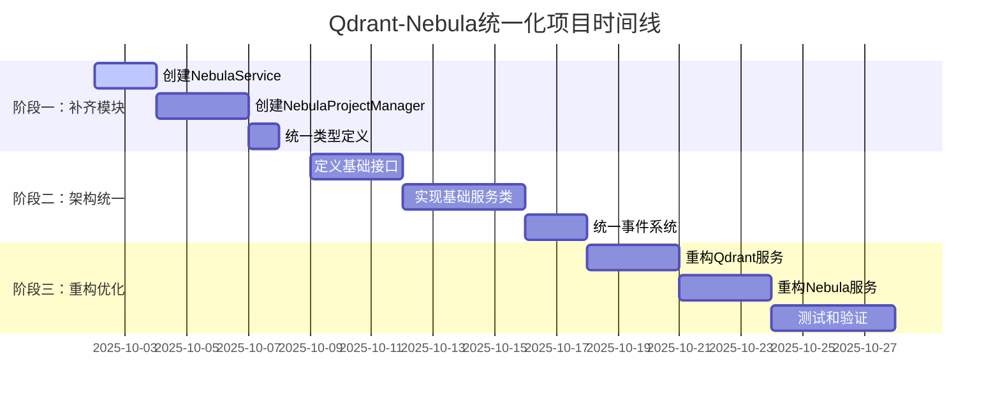

# Qdrant与Nebula数据库服务统一化执行计划

## 项目概述

本计划旨在统一Qdrant和Nebula两个数据库服务的架构，解决当前存在的结构不一致和功能缺失问题，提高代码的可维护性和可扩展性。

## 项目目标

1. **补齐Nebula缺失的功能模块**
2. **统一两个服务的架构模式**
3. **提取公共逻辑，减少代码重复**
4. **建立可扩展的数据库服务框架**

## 阶段划分

### 阶段一：补齐Nebula缺失模块（第1-2周）

#### 任务1.1：创建NebulaService类
- **目标**：实现与QdrantService对应的统一服务类
- **输出**：`src/database/nebula/NebulaService.ts`
- **依赖**：现有NebulaConnectionManager和NebulaQueryBuilder
- **工作量**：2天
- **优先级**：高

#### 任务1.2：创建NebulaProjectManager
- **目标**：实现项目级别的操作封装
- **输出**：`src/database/nebula/NebulaProjectManager.ts`
- **依赖**：ProjectIdManager、NebulaSpaceManager
- **工作量**：3天
- **优先级**：高

#### 任务1.3：移动和统一类型定义
- **目标**：将NebulaTypes.ts移动到nebula目录并完善
- **输出**：`src/database/nebula/NebulaTypes.ts`
- **依赖**：无
- **工作量**：1天
- **优先级**：中

### 阶段二：架构统一化（第3-4周）

#### 任务2.1：定义基础接口
- **目标**：创建统一的数据服务接口
- **输出**：
  - `src/database/common/IDatabaseService.ts`
  - `src/database/common/IConnectionManager.ts`
  - `src/database/common/IProjectManager.ts`
- **依赖**：阶段一完成
- **工作量**：3天
- **优先级**：中

#### 任务2.2：实现基础服务类
- **目标**：提取公共逻辑到基类
- **输出**：
  - `src/database/common/BaseDatabaseService.ts`
  - `src/database/common/BaseConnectionManager.ts`
- **依赖**：任务2.1完成
- **工作量**：4天
- **优先级**：中

#### 任务2.3：统一事件系统
- **目标**：为两个服务实现统一的事件机制
- **输出**：
  - `src/database/common/DatabaseEventTypes.ts`
  - 事件系统集成
- **依赖**：任务2.2完成
- **工作量**：2天
- **优先级**：低

### 阶段三：重构和优化（第5-6周）

#### 任务3.1：重构Qdrant服务
- **目标**：基于新的基础接口重构Qdrant服务
- **输出**：更新Qdrant相关类
- **依赖**：阶段二完成
- **工作量**：3天
- **优先级**：中

#### 任务3.2：重构Nebula服务
- **目标**：基于新的基础接口重构Nebula服务
- **输出**：更新Nebula相关类
- **依赖**：任务3.1完成
- **工作量**：3天
- **优先级**：中

#### 任务3.3：测试和验证
- **目标**：确保重构后的功能完整性
- **输出**：集成测试用例
- **依赖**：任务3.2完成
- **工作量**：4天
- **优先级**：高

## 详细任务分解

### 任务1.1详细设计：NebulaService类

```typescript
// 接口定义
export interface INebulaService {
  // 基础操作
  initialize(): Promise<boolean>;
  isConnected(): boolean;
  close(): Promise<void>;
  
  // 项目相关操作
  createSpaceForProject(projectPath: string): Promise<boolean>;
  deleteSpaceForProject(projectPath: string): Promise<boolean>;
  
  // 数据操作
  insertNodes(nodes: NebulaNode[]): Promise<boolean>;
  insertRelationships(relationships: NebulaRelationship[]): Promise<boolean>;
  
  // 查询操作
  findNodesByLabel(label: string, filter?: any): Promise<any[]>;
  findRelationships(type?: string, filter?: any): Promise<any[]>;
}
```

### 任务1.2详细设计：NebulaProjectManager类

```typescript
export interface INebulaProjectManager {
  createSpaceForProject(projectPath: string, config?: any): Promise<boolean>;
  deleteSpaceForProject(projectPath: string): Promise<boolean>;
  getSpaceInfoForProject(projectPath: string): Promise<NebulaSpaceInfo | null>;
  clearSpaceForProject(projectPath: string): Promise<boolean>;
  listProjectSpaces(): Promise<ProjectSpaceInfo[]>;
}
```

## 风险管理和缓解措施

### 技术风险
1. **兼容性风险**
   - 风险：重构可能破坏现有API
   - 缓解：保持向后兼容，分阶段迁移

2. **性能风险**
   - 风险：抽象层可能影响性能
   - 缓解：性能测试和优化

3. **测试覆盖风险**
   - 风险：测试用例不完整
   - 缓解：补充集成测试

### 项目风险
1. **时间风险**
   - 风险：任务延期
   - 缓解：设置缓冲时间，优先完成核心功能

2. **依赖风险**
   - 风险：依赖模块变更
   - 缓解：明确接口契约，减少耦合

## 成功标准

### 功能标准
- [ ] Nebula服务具备与Qdrant相同的功能完整性
- [ ] 两个服务的API保持一致性
- [ ] 现有功能不受影响

### 质量标准
- [ ] 代码重复率降低30%
- [ ] 测试覆盖率保持95%以上
- [ ] 性能指标无显著下降

### 架构标准
- [ ] 统一的接口定义
- [ ] 清晰的模块边界
- [ ] 良好的扩展性设计

## 交付物清单

### 文档交付物
- [x] 对比分析报告 (`docs/review/qdrant-nebula-comparison-analysis.md`)
- [x] 执行计划 (`docs/plan/qdrant-nebula-unification-plan.md`)
- [ ] API迁移指南
- [ ] 测试报告

### 代码交付物
- [ ] NebulaService类实现
- [ ] NebulaProjectManager类实现
- [ ] 统一的基础接口
- [ ] 重构后的服务实现
- [ ] 完整的测试用例

## 时间线



## 结论

通过本计划的实施，将实现Qdrant和Nebula两个数据库服务的架构统一，显著提升代码质量和可维护性。建议按照阶段顺序执行，确保每个阶段的质量后再进入下一阶段。