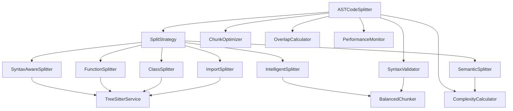

# 模块接口定义

## 📋 概述

本文档定义了ASTCodeSplitter重构后各个模块的接口和职责，确保模块间的清晰边界和良好协作。

## 🎯 核心接口

### SplitStrategy 接口
```typescript
export interface SplitStrategy {
  /**
   * 执行代码分段
   * @param content 源代码内容
   * @param language 编程语言
   * @param filePath 文件路径（可选）
   * @param options 分段选项
   */
  split(
    content: string, 
    language: string, 
    filePath?: string,
    options?: ChunkingOptions
  ): Promise<CodeChunk[]>;
  
  /**
   * 获取策略名称（用于日志和调试）
   */
  getName(): string;
  
  /**
   * 检查是否支持该语言
   * @param language 编程语言
   */
  supportsLanguage(language: string): boolean;
  
  /**
   * 获取策略的优先级（数值越小优先级越高）
   */
  getPriority(): number;
}
```

## 🔧 工具类接口

### ComplexityCalculator 接口
```typescript
export interface ComplexityCalculator {
  /**
   * 计算代码复杂度
   * @param content 代码内容
   */
  calculate(content: string): number;
  
  /**
   * 快速估算复杂度（用于性能优化）
   * @param content 代码内容
   */
  estimate(content: string): number;
  
  /**
   * 计算语义分数
   * @param line 单行代码
   */
  calculateSemanticScore(line: string): number;
}
```

### SyntaxValidator 接口
```typescript
export interface SyntaxValidator {
  /**
   * 验证代码段语法完整性
   * @param content 代码内容
   * @param language 编程语言
   */
  validate(content: string, language: string): boolean;
  
  /**
   * 检查括号平衡
   * @param content 代码内容
   */
  checkBracketBalance(content: string): number;
  
  /**
   * 检查花括号平衡
   * @param content 代码内容
   */
  checkBraceBalance(content: string): number;
  
  /**
   * 检查符号平衡（使用BalancedChunker）
   * @param content 代码内容
   */
  checkSymbolBalance(content: string): boolean;
}
```

### ChunkOptimizer 接口
```typescript
export interface ChunkOptimizer {
  /**
   * 优化块大小
   * @param chunks 代码块数组
   * @param originalCode 原始代码（用于上下文）
   */
  optimize(chunks: CodeChunk[], originalCode: string): CodeChunk[];
  
  /**
   * 检查是否应该合并两个块
   * @param chunk1 第一个块
   * @param chunk2 第二个块
   */
  shouldMerge(chunk1: CodeChunk, chunk2: CodeChunk): boolean;
  
  /**
   * 合并两个代码块
   * @param chunk1 第一个块
   * @param chunk2 第二个块
   */
  merge(chunk1: CodeChunk, chunk2: CodeChunk): CodeChunk;
}
```

### OverlapCalculator 接口
```typescript
export interface OverlapCalculator {
  /**
   * 为代码块添加重叠内容
   * @param chunks 代码块数组
   * @param originalCode 原始代码
   */
  addOverlap(chunks: CodeChunk[], originalCode: string): CodeChunk[];
  
  /**
   * 提取重叠内容
   * @param currentChunk 当前块
   * @param nextChunk 下一个块
   * @param originalCode 原始代码
   */
  extractOverlapContent(
    currentChunk: CodeChunk, 
    nextChunk: CodeChunk, 
    originalCode: string
  ): string;
  
  /**
   * 智能计算重叠
   * @param currentChunk 当前块的行数组
   * @param originalCode 原始代码
   * @param startLine 起始行号
   */
  calculateSmartOverlap(
    currentChunk: string[], 
    originalCode: string,
    startLine: number
  ): string[];
}
```

### PerformanceMonitor 接口
```typescript
export interface PerformanceMonitor {
  /**
   * 记录性能指标
   * @param startTime 开始时间
   * @param linesProcessed 处理的行数
   * @param cacheHit 是否缓存命中
   */
  record(startTime: number, linesProcessed: number, cacheHit: boolean): void;
  
  /**
   * 获取性能统计
   */
  getStats(): PerformanceStats;
  
  /**
   * 重置性能统计
   */
  reset(): void;
}

export interface PerformanceStats {
  totalLines: number;
  totalTime: number;
  averageTimePerLine: number;
  cacheHitRate: number;
  memoryUsage: NodeJS.MemoryUsage;
}
```

## 🎯 分段策略接口

### SyntaxAwareSplitter 接口
```typescript
export interface SyntaxAwareSplitter extends SplitStrategy {
  /**
   * 设置TreeSitter服务
   * @param treeSitterService TreeSitter服务实例
   */
  setTreeSitterService(treeSitterService: TreeSitterService): void;
  
  /**
   * 设置日志服务
   * @param logger 日志服务实例
   */
  setLogger(logger: LoggerService): void;
}
```

### FunctionSplitter 接口
```typescript
export interface FunctionSplitter extends SplitStrategy {
  /**
   * 提取函数块
   * @param content 源代码
   * @param ast AST树
   * @param language 编程语言
   * @param filePath 文件路径
   */
  extractFunctions(
    content: string,
    ast: any,
    language: string,
    filePath?: string
  ): CodeChunk[];
}
```

### ClassSplitter 接口
```typescript
export interface ClassSplitter extends SplitStrategy {
  /**
   * 提取类块
   * @param content 源代码
   * @param ast AST树
   * @param language 编程语言
   * @param filePath 文件路径
   */
  extractClasses(
    content: string,
    ast: any,
    language: string,
    filePath?: string
  ): CodeChunk[];
}
```

### ImportSplitter 接口
```typescript
export interface ImportSplitter extends SplitStrategy {
  /**
   * 提取导入语句块
   * @param content 源代码
   * @param ast AST树
   * @param language 编程语言
   * @param filePath 文件路径
   */
  extractImports(
    content: string,
    ast: any,
    language: string,
    filePath?: string
  ): CodeChunk[];
}
```

### IntelligentSplitter 接口
```typescript
export interface IntelligentSplitter extends SplitStrategy {
  /**
   * 设置符号平衡检查器
   * @param balancedChunker 平衡检查器实例
   */
  setBalancedChunker(balancedChunker: BalancedChunker): void;
  
  /**
   * 设置优化级别
   * @param level 优化级别
   */
  setOptimizationLevel(level: 'low' | 'medium' | 'high'): void;
}
```

### SemanticSplitter 接口
```typescript
export interface SemanticSplitter extends SplitStrategy {
  /**
   * 设置复杂度计算器
   * @param complexityCalculator 复杂度计算器实例
   */
  setComplexityCalculator(complexityCalculator: ComplexityCalculator): void;
  
  /**
   * 设置最大处理行数（内存保护）
   * @param maxLines 最大行数
   */
  setMaxLines(maxLines: number): void;
}
```

## 📊 配置接口

### ChunkingOptions 接口
```typescript
export interface ChunkingOptions {
  maxChunkSize?: number;
  overlapSize?: number;
  preserveFunctionBoundaries?: boolean;
  preserveClassBoundaries?: boolean;
  includeComments?: boolean;
  minChunkSize?: number;
  extractSnippets?: boolean;
  addOverlap?: boolean;
  optimizationLevel?: 'low' | 'medium' | 'high';
  maxLines?: number; // 内存保护：最大处理行数
}

// 默认配置
export const DEFAULT_CHUNKING_OPTIONS: Required<ChunkingOptions> = {
  maxChunkSize: 1000,
  overlapSize: 200,
  preserveFunctionBoundaries: true,
  preserveClassBoundaries: true,
  includeComments: false,
  minChunkSize: 100,
  extractSnippets: true,
  addOverlap: false,
  optimizationLevel: 'medium',
  maxLines: 10000
};
```

## 🔄 依赖关系图



## 🎯 实施指导

1. **接口先行**: 先定义接口，再实现具体类
2. **依赖注入**: 使用构造函数注入依赖
3. **单一职责**: 每个类只负责一个明确的功能
4. **可测试性**: 设计易于mock的接口
5. **错误处理**: 统一的错误处理机制

## 📋 下一步行动

1. 创建接口定义文件
2. 实现各个工具类
3. 实现分段策略
4. 重构主类
5. 编写测试

---

**最后更新**: 2025-10-12
**状态**: 草案