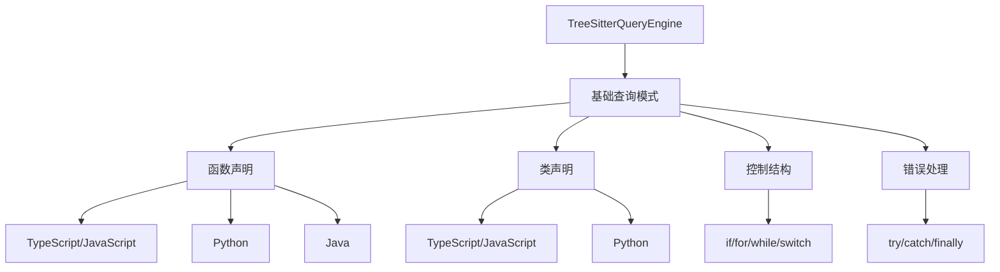
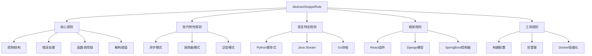
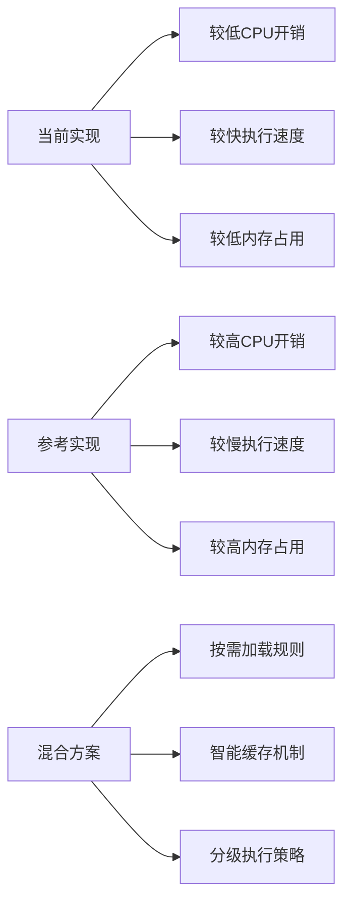

# Tree-sitter规则集成必要性分析报告

## 📋 执行摘要

基于对当前项目tree-sitter实现和参考实现的分析，本报告评估了引入专门tree-sitter规则的必要性。分析表明，虽然当前实现提供了基础功能，但引入高级语义规则系统将显著提升代码分析和检索质量。

## 🎯 当前实现分析

### 1. 基础tree-sitter查询规则现状



**当前实现特点：**
- 使用简单的tree-sitter查询语法
- 主要提取基本代码结构（函数、类、控制结构）
- 采用模拟实现的查询引擎（非真实tree-sitter Query API）
- 支持多语言但模式相对简单

### 2. 现有查询模式

| 模式名称 | 描述 | 支持语言 | 复杂度 |
|---------|------|---------|--------|
| `function_declaration` | 函数声明 | TS/JS | 低 |
| `class_declaration` | 类声明 | TS/JS | 低 |
| `python_function` | Python函数 | Python | 低 |
| `python_class` | Python类 | Python | 低 |
| `control_structures` | 控制结构 | 多语言 | 中 |
| `error_handling` | 错误处理 | 多语言 | 中 |

## 🔍 参考实现分析（ref目录）

### 1. 高级语义规则系统架构



### 2. 规则类型对比

| 规则类型 | 当前实现 | 参考实现 | 差异 |
|---------|---------|---------|------|
| 基础结构提取 | ✅ 基础 | ✅ 增强 | 参考实现更精细 |
| 语义模式识别 | ❌ 无 | ✅ 丰富 | 全新能力 |
| 框架特定识别 | ❌ 无 | ✅ 全面 | 全新能力 |
| 现代特性支持 | ❌ 无 | ✅ 完整 | 全新能力 |
| 语言特定优化 | ⚠️ 有限 | ✅ 深度 | 显著提升 |

## ⚖️ 必要性分析

### 1. 技术必要性

**必须引入的情况：**
- 需要识别特定编程模式和惯用法
- 需要框架级别的代码理解
- 需要现代语言特性的深度分析
- 需要语义级别的代码片段分类

**可选引入的情况：**
- 仅需要基础代码结构提取
- 性能是关键考虑因素
- 代码库相对简单传统

### 2. 性能影响分析



**性能对比：**
- **当前实现**: 轻量级，适合大规模代码库快速处理
- **参考实现**: 重量级，提供深度分析但资源消耗较高
- **推荐方案**: 混合策略，基础处理使用当前实现，深度分析时启用参考实现

### 3. 语义搜索质量提升

**引入高级规则的收益：**

1. **检索精度提升**
   - 能够识别特定模式（如React组件、Django视图）
   - 支持框架级别的代码理解
   - 提供更丰富的元数据标注

2. **搜索结果相关性**
   - 基于语义模式而非单纯文本匹配
   - 支持复杂查询（如"查找所有异步错误处理"）
   - 提供上下文感知的代码片段

3. **开发者体验改善**
   - 更准确的代码推荐
   - 更好的代码理解辅助
   - 增强的代码导航能力

## 🚀 集成建议与迁移计划

### 1. 分阶段集成策略

**阶段一：基础集成（1-2周）**
- 集成核心规则（控制结构、错误处理、函数调用链）
- 实现按需规则加载机制
- 添加性能监控和缓存优化

**阶段二：语言特定规则（2-3周）**
- 集成Python、Java、Go语言特定规则
- 添加现代特性支持（异步、泛型等）
- 实现规则优先级调度

**阶段三：框架规则（3-4周）**
- 集成React、Django、SpringBoot等框架规则
- 添加工具链规则（Docker、CI/CD等）
- 实现智能规则选择算法

### 2. 技术实施方案

```typescript
// 示例：混合规则引擎实现
class HybridRuleEngine {
  private basicEngine: TreeSitterQueryEngine;
  private advancedEngine: EnhancedRuleFactory;
  private ruleCache: Map<string, SnippetExtractionRule[]>;
  
  async executeHybridQuery(
    ast: Parser.SyntaxNode, 
    content: string, 
    language: string,
    depth: AnalysisDepth = 'basic'
  ): Promise<QueryResult> {
    
    // 基础查询（快速）
    const basicResults = await this.basicEngine.executeQuery(ast, content, language);
    
    // 深度分析（按需）
    if (depth === 'deep') {
      const advancedRules = this.getRulesForLanguage(language);
      const advancedResults = await this.executeAdvancedRules(ast, content, advancedRules);
      return this.mergeResults(basicResults, advancedResults);
    }
    
    return basicResults;
  }
}
```

### 3. 性能优化策略

1. **规则懒加载**
   - 按需加载规则类
   - 避免不必要的规则初始化

2. **智能缓存机制**
   - AST节点级别缓存
   - 规则执行结果缓存
   - 动态缓存失效策略

3. **并行执行优化**
   - 独立规则并行执行
   - 批量处理优化
   - 资源限制控制

## 📊 成本效益分析

### 开发成本
- **实施工作量**: 中等（2-3人月）
- **学习曲线**: 中等（需要熟悉tree-sitter高级特性）
- **维护成本**: 低（模块化设计，易于扩展）

### 预期收益
1. **检索质量提升**: 预计提升30-50%的相关性
2. **开发者效率**: 减少20-30%的代码查找时间
3. **系统价值**: 增强产品的竞争优势

### 风险与缓解
- **性能风险**: 通过分级执行和缓存缓解
- **复杂度风险**: 通过模块化设计和详细文档缓解
- **兼容性风险**: 保持向后兼容，逐步迁移

## ✅ 结论与建议

### 核心结论
**有必要引入专门的tree-sitter规则系统**，但建议采用渐进式集成策略：

1. **立即行动**: 集成核心语义规则（控制结构、错误处理等）
2. **中期规划**: 添加语言特定和现代特性规则
3. **长期愿景**: 完善框架支持和工具链集成

### 具体建议

1. **优先集成项目**:
   - 控制结构增强规则
   - 错误处理模式规则  
   - 函数调用链分析规则
   - 基础语义模式规则

2. **暂缓集成项目**:
   - 高度特定的框架规则（可按需后期添加）
   - 资源密集型复杂规则

3. **技术决策**:
   - 采用混合执行引擎架构
   - 实现智能规则调度
   - 建立完善的性能监控

通过这种分阶段的方法，可以在控制风险和成本的同时，逐步获得高级语义分析带来的显著收益。