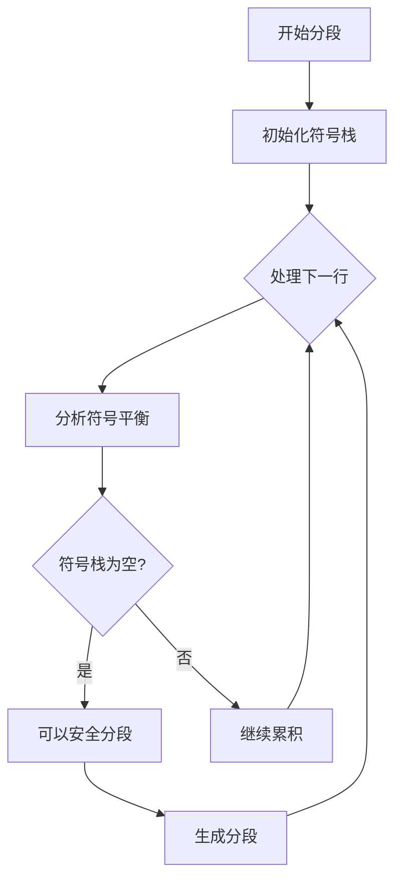

基于我对代码的深入分析，我已经理解了tree-sitter分段问题的根本原因。现在让我为您提供一个详细的优化方案。

## 📋 问题分析

从提供的示例代码可以看出，当前的分段逻辑存在符号闭合问题：

```javascript
return data.data.map((item: any) => {
  // 确保向量数据是纯数字数组
  const embeddingArray = Array.isArray(item.embedding)
    ? item.embedding.map((val: any) => {
        // 转换所有值为数字类型
        const num = Number(val);
        if (isNaN(num)) {
          this.logger.warn('Invalid embedding value found, replacing with 0', {
            originalValue: val,
            type: typeof val
          });
          return 0;
        }
        return num;
      })
```

**主要问题：**
1. 分段在箭头函数中间截断，导致语法不完整
2. 括号和花括号没有正确闭合
3. 重叠机制可能破坏代码结构完整性
4. 没有考虑多行表达式的语法完整性

## 🎯 优化方案设计

### 1. 符号平衡跟踪机制



### 2. 改进的分段决策逻辑

```typescript
interface SymbolStack {
  brackets: number;    // 圆括号 ()
  braces: number;      // 花括号 {}
  squares: number;     // 方括号 []
  templates: number;   // 模板字符串 ``
}

class BalancedChunker {
  private symbolStack: SymbolStack = {
    brackets: 0,
    braces: 0,
    squares: 0,
    templates: 0
  };

  // 分析行中的符号变化
  analyzeLineSymbols(line: string): void {
    for (let i = 0; i < line.length; i++) {
      const char = line[i];
      const nextChar = line[i + 1];
      
      // 处理各种符号
      switch (char) {
        case '(': this.symbolStack.brackets++; break;
        case ')': this.symbolStack.brackets--; break;
        case '{': this.symbolStack.braces++; break;
        case '}': this.symbolStack.braces--; break;
        case '[': this.symbolStack.squares++; break;
        case ']': this.symbolStack.squares--; break;
        case '`': 
          // 处理模板字符串
          if (this.symbolStack.templates > 0) {
            this.symbolStack.templates--;
          } else {
            this.symbolStack.templates++;
          }
          break;
        case '/':
          // 跳过注释
          if (nextChar === '/' || nextChar === '*') {
            return; // 跳过整行注释
          }
          break;
      }
    }
  }

  // 检查是否可以安全分段
  canSafelySplit(): boolean {
    return this.symbolStack.brackets === 0 &&
           this.symbolStack.braces === 0 &&
           this.symbolStack.squares === 0 &&
           this.symbolStack.templates === 0;
  }
}
```

### 3. 智能重叠计算

```typescript
private calculateSmartOverlap(
  currentChunk: string[], 
  originalCode: string,
  startLine: number
): string[] {
  const overlapLines: string[] = [];
  let overlapSize = 0;
  
  // 从当前chunk末尾向前寻找安全的分割点
  for (let i = currentChunk.length - 1; i >= 0; i--) {
    const line = currentChunk[i];
    const tempStack = { ...this.symbolStack };
    
    // 模拟分析这一行
    this.analyzeLineSymbols(line);
    
    // 如果符号平衡，这是一个安全的分割点
    if (this.canSafelySplit()) {
      overlapLines.unshift(...currentChunk.slice(i));
      break;
    } else {
      // 恢复符号栈状态
      this.symbolStack = tempStack;
    }
  }
  
  return overlapLines;
}
```

### 4. 语法验证步骤

```typescript
private validateChunkSyntax(chunkContent: string, language: string): boolean {
  try {
    // 对于JavaScript/TypeScript，使用acorn或其他解析器验证语法
    if (language === 'javascript' || language === 'typescript') {
      // 简单的语法检查 - 确保括号平衡
      const bracketBalance = this.checkBracketBalance(chunkContent);
      const braceBalance = this.checkBraceBalance(chunkContent);
      
      return bracketBalance === 0 && braceBalance === 0;
    }
    
    return true; // 对于其他语言，暂时返回true
  } catch (error) {
    this.logger?.warn(`Syntax validation failed: ${error}`);
    return false;
  }
}

private checkBracketBalance(content: string): number {
  let balance = 0;
  for (const char of content) {
    if (char === '(') balance++;
    if (char === ')') balance--;
  }
  return balance;
}

private checkBraceBalance(content: string): number {
  let balance = 0;
  for (const char of content) {
    if (char === '{') balance++;
    if (char === '}') balance--;
  }
  return balance;
}
```

## 🚀 具体实现建议

### 修改ASTCodeSplitter的createIntelligentChunks方法：

```typescript
private createIntelligentChunks(
  content: string,
  language: string,
  filePath?: string
): CodeChunk[] {
  const chunks: CodeChunk[] = [];
  const lines = content.split('\n');
  let currentChunk: string[] = [];
  let currentLine = 1;
  let currentSize = 0;
  
  const symbolTracker = new BalancedChunker();

  for (let i = 0; i < lines.length; i++) {
    const line = lines[i];
    const lineSize = line.length + 1;

    // 更新符号跟踪
    symbolTracker.analyzeLineSymbols(line);

    // 检查是否需要在逻辑边界处分段
    const shouldSplit = this.shouldSplitAtLineWithSymbols(
      line, 
      currentChunk, 
      currentSize, 
      lineSize,
      symbolTracker
    );
    
    if (shouldSplit && currentChunk.length > 0) {
      const chunkContent = currentChunk.join('\n');
      
      // 验证分段语法
      if (this.validateChunkSyntax(chunkContent, language)) {
        const complexity = this.calculateComplexity(chunkContent);
        
        const metadata: CodeChunkMetadata = {
          startLine: currentLine,
          endLine: currentLine + currentChunk.length - 1,
          language,
          filePath,
          type: 'generic',
          complexity
        };

        chunks.push({
          content: chunkContent,
          metadata
        });
      }

      // 应用智能重叠
      const overlapLines = this.calculateSmartOverlap(
        currentChunk, 
        content, 
        currentLine
      );
      currentChunk = overlapLines;
      currentLine = i - overlapLines.length + 1;
      currentSize = overlapLines.join('\n').length;
    }

    currentChunk.push(line);
    currentSize += lineSize;
  }

  // 处理最后的chunk（省略）
  return chunks;
}
```

### 改进的shouldSplitAtLine方法：

```typescript
private shouldSplitAtLineWithSymbols(
  line: string,
  currentChunk: string[],
  currentSize: number,
  lineSize: number,
  symbolTracker: BalancedChunker
): boolean {
  // 大小限制检查（优先）
  if (currentSize + lineSize > this.options.maxChunkSize) {
    return true;
  }

  // 符号平衡检查 - 只有在符号平衡时才允许分段
  if (!symbolTracker.canSafelySplit()) {
    return false;
  }

  const trimmedLine = line.trim();
  
  // 逻辑边界检查（原有的逻辑）
  if (trimmedLine.match(/^[}\)]\s*$/) && currentChunk.length > 0) {
    return currentSize > this.options.maxChunkSize * 0.3;
  }

  if (trimmedLine.match(/^\s*(}|\)|\]|;)\s*$/)) {
    return currentSize > this.options.maxChunkSize * 0.5;
  }

  if (trimmedLine === '' && currentChunk.length > 5) {
    return currentSize > this.options.maxChunkSize * 0.4;
  }

  if (trimmedLine.match(/^\s*\/\//) || trimmedLine.match(/^\s*\/\*/) || trimmedLine.match(/^\s*\*/)) {
    return currentSize > this.options.maxChunkSize * 0.6;
  }

  return false;
}
```

## 📊 性能考虑

1. **符号跟踪开销**：符号分析是O(n)复杂度，对性能影响有限
2. **缓存机制**：可以缓存符号分析结果，避免重复计算
3. **增量分析**：逐行分析，避免一次性处理整个文件

我需要为性能优化部分提供更具体的实现方案。让我详细设计性能优化策略：

**📊 性能优化具体方案**

### 1. 符号跟踪开销优化

```typescript
class OptimizedSymbolTracker {
  private symbolStack: SymbolStack = { brackets: 0, braces: 0, squares: 0, templates: 0 };
  private lineHashes: Map<number, string> = new Map(); // 行号 -> 符号状态哈希
  private analysisCache: Map<string, SymbolStack> = new Map(); // 行内容 -> 符号变化

  analyzeLineSymbols(line: string, lineNumber: number): void {
    const lineHash = this.simpleHash(line);
    
    // 检查缓存
    if (this.analysisCache.has(lineHash)) {
      const cachedChange = this.analysisCache.get(lineHash)!;
      this.applySymbolChange(cachedChange);
      this.lineHashes.set(lineNumber, lineHash);
      return;
    }

    // 首次分析并缓存
    const originalState = { ...this.symbolStack };
    this.analyzeLineSymbolsInternal(line);
    const symbolChange = this.calculateSymbolChange(originalState, this.symbolStack);
    this.analysisCache.set(lineHash, symbolChange);
    this.lineHashes.set(lineNumber, lineHash);
  }

  private analyzeLineSymbolsInternal(line: string): void {
    // 使用更高效的字符扫描算法
    let inSingleComment = false;
    let inMultiComment = false;
    let inString = false;
    let stringChar = '';

    for (let i = 0; i < line.length; i++) {
      const char = line[i];
      const nextChar = line[i + 1];

      // 跳过注释和字符串内容
      if (inSingleComment) continue;
      if (inMultiComment) {
        if (char === '*' && nextChar === '/') {
          inMultiComment = false;
          i++; // 跳过'*/'
        }
        continue;
      }
      if (inString) {
        if (char === stringChar && line[i - 1] !== '\\') {
          inString = false;
        }
        continue;
      }

      // 处理符号
      switch (char) {
        case '/':
          if (nextChar === '/') inSingleComment = true;
          if (nextChar === '*') inMultiComment = true;
          break;
        case '"': case "'": case '`':
          inString = true;
          stringChar = char;
          if (char === '`') this.symbolStack.templates++;
          break;
        case '(': this.symbolStack.brackets++; break;
        case ')': this.symbolStack.brackets--; break;
        case '{': this.symbolStack.braces++; break;
        case '}': this.symbolStack.braces--; break;
        case '[': this.symbolStack.squares++; break;
        case ']': this.symbolStack.squares--; break;
      }
    }
  }
}
```

### 2. 缓存机制实现

```typescript
class SymbolAnalysisCache {
  private static readonly MAX_CACHE_SIZE = 1000;
  private cache: Map<string, SymbolStackChange> = new Map();
  private accessOrder: string[] = [];

  get(lineHash: string): SymbolStackChange | undefined {
    const result = this.cache.get(lineHash);
    if (result) {
      // 更新访问顺序（LRU）
      this.accessOrder = this.accessOrder.filter(hash => hash !== lineHash);
      this.accessOrder.push(lineHash);
    }
    return result;
  }

  set(lineHash: string, change: SymbolStackChange): void {
    if (this.cache.size >= SymbolAnalysisCache.MAX_CACHE_SIZE) {
      // 移除最久未使用的条目
      const oldestHash = this.accessOrder.shift();
      if (oldestHash) {
        this.cache.delete(oldestHash);
      }
    }
    
    this.cache.set(lineHash, change);
    this.accessOrder.push(lineHash);
  }

  // 批量预缓存常见代码模式
  preCacheCommonPatterns(): void {
    const commonPatterns = [
      'function () {}',
      'if () {}',
      'for () {}',
      'while () {}',
      'try {} catch {}',
      'class {}',
      '[]',
      '{}'
    ];

    commonPatterns.forEach(pattern => {
      const tracker = new OptimizedSymbolTracker();
      tracker.analyzeLineSymbols(pattern, 0);
      // 缓存结果...
    });
  }
}
```

### 3. 增量分析优化

```typescript
class IncrementalSymbolAnalysis {
  private currentState: SymbolStack = { brackets: 0, braces: 0, squares: 0, templates: 0 };
  private stateHistory: Map<number, SymbolStack> = new Map(); // 行号 -> 符号状态

  // 增量分析从指定行开始
  analyzeFromLine(lines: string[], startLine: number): void {
    // 如果有历史状态，从那里恢复
    if (this.stateHistory.has(startLine - 1)) {
      this.currentState = { ...this.stateHistory.get(startLine - 1)! };
    }

    for (let i = startLine; i < lines.length; i++) {
      this.analyzeLine(lines[i]);
      this.stateHistory.set(i, { ...this.currentState });
      
      // 定期清理历史，避免内存占用过大
      if (i % 100 === 0) {
        this.cleanupOldHistory(i - 200);
      }
    }
  }

  private cleanupOldHistory(threshold: number): void {
    for (const [lineNumber] of this.stateHistory) {
      if (lineNumber < threshold) {
        this.stateHistory.delete(lineNumber);
      }
    }
  }

  // 支持回滚到特定行的状态
  rollbackToLine(lineNumber: number): void {
    if (this.stateHistory.has(lineNumber)) {
      this.currentState = { ...this.stateHistory.get(lineNumber)! };
    }
  }
}
```

### 4. 性能监控和调优
需要集成到现有监控系统中，且处理逻辑与其他监控模块对齐
```typescript
class PerformanceMonitor {
  private static readonly SAMPLE_INTERVAL = 1000; // 每1000行采样一次
  private metrics = {
    totalLines: 0,
    cacheHits: 0,
    cacheMisses: 0,
    analysisTime: 0,
    memoryUsage: 0
  };

  recordAnalysis(startTime: number, linesProcessed: number, cacheHit: boolean): void {
    this.metrics.totalLines += linesProcessed;
    if (cacheHit) this.metrics.cacheHits++;
    else this.metrics.cacheMisses++;
    
    this.metrics.analysisTime += Date.now() - startTime;

    // 定期输出性能报告
    if (this.metrics.totalLines % PerformanceMonitor.SAMPLE_INTERVAL === 0) {
      this.logPerformance();
    }
  }

  private logPerformance(): void {
    const cacheHitRate = this.metrics.cacheHits / (this.metrics.cacheHits + this.metrics.cacheMisses) || 0;
    const avgTimePerLine = this.metrics.analysisTime / this.metrics.totalLines;
    
    console.log(`性能报告:
      - 处理行数: ${this.metrics.totalLines}
      - 缓存命中率: ${(cacheHitRate * 100).toFixed(2)}%
      - 平均每行分析时间: ${avgTimePerLine.toFixed(3)}ms
      - 总分析时间: ${this.metrics.analysisTime}ms`);
  }

  // 内存使用监控
  monitorMemoryUsage(): void {
    setInterval(() => {
      const memoryUsage = process.memoryUsage();
      this.metrics.memoryUsage = memoryUsage.heapUsed / 1024 / 1024; // MB
      
      if (this.metrics.memoryUsage > 500) { // 500MB阈值
        console.warn('高内存使用警告，考虑清理缓存');
        SymbolAnalysisCache.getInstance().clear();
      }
    }, 5000); // 每5秒检查一次
  }
}
```

### 5. 自适应性能策略

```typescript
class AdaptivePerformanceStrategy {
  private static complexityThresholds = {
    low: 50,    // 简单文件
    medium: 200, // 中等复杂度
    high: 500    // 高复杂度
  };

  static getOptimizationLevel(content: string): 'low' | 'medium' | 'high' {
    const lines = content.split('\n').length;
    const complexity = this.estimateComplexity(content);

    if (lines < 100 && complexity < this.complexityThresholds.low) {
      return 'low'; // 使用基本符号跟踪
    } else if (lines < 1000 && complexity < this.complexityThresholds.medium) {
      return 'medium'; // 使用缓存优化
    } else {
      return 'high'; // 使用完整优化策略
    }
  }

  private static estimateComplexity(content: string): number {
    // 快速复杂度估算
    let score = 0;
    score += (content.match(/\b(function|class|interface)\b/g) || []).length * 10;
    score += (content.match(/\b(if|else|for|while|switch)\b/g) || []).length * 5;
    score += (content.match(/[{}()[\]]/g) || []).length;
    return score;
  }
}

// 在ASTCodeSplitter中使用
private createIntelligentChunks(content: string, language: string, filePath?: string): CodeChunk[] {
  const optimizationLevel = AdaptivePerformanceStrategy.getOptimizationLevel(content);
  
  switch (optimizationLevel) {
    case 'low':
      return this.createChunksWithBasicTracking(content, language, filePath);
    case 'medium':
      return this.createChunksWithCachedTracking(content, language, filePath);
    case 'high':
      return this.createChunksWithFullOptimization(content, language, filePath);
  }
}
```


## 🔧 实施步骤

1. 首先实现`BalancedChunker`类来处理符号平衡跟踪
2. 修改`createIntelligentChunks`方法使用新的符号跟踪机制
3. 实现`shouldSplitAtLineWithSymbols`替代原有的简单逻辑
4. 添加语法验证步骤确保分段质量
5. 测试各种边界情况，特别是嵌套结构

这个优化方案将显著改善分段质量，确保代码片段语法完整，符号正确闭合。