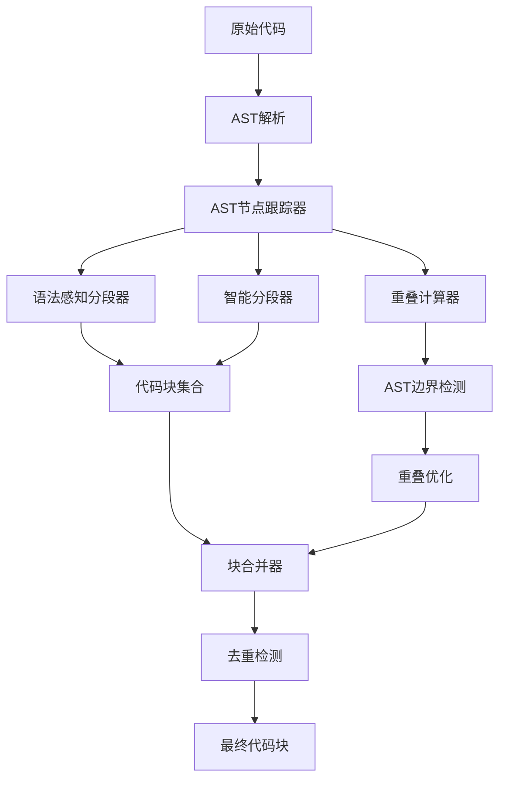

# 代码片段重复问题分析与改进方案

## 问题描述

在当前的代码分段系统中，当搜索类似"tree struct"这样的关键词时，会出现大量重复的代码片段。例如，同一个Go代码文件中的树结构定义被多次返回，只是匹配度稍有不同：

```
package main

type Node struct {
    data       int
    leftChild  *Node
    rightChild *Node
}

type Tree struct {
}
D:\code\Go\dataStructure\bt.go
匹配度: 65.2%
```

同样的内容以不同片段形式重复出现多次。

## 根本原因分析

### 1. 重叠机制设计缺陷

当前的重叠计算在 `UnifiedOverlapCalculator` 中存在以下问题：

- **重叠范围过大**：在第281-291行的 `calculateSemanticOverlap` 方法中，从当前块末尾向前搜索重叠内容时，没有记录已经使用过的AST节点
- **无重复检测机制**：重叠计算只考虑语义边界评分，不考虑该片段是否已经被其他块使用
- **基于行的重叠策略**：所有重叠策略（语义、句法、大小）都基于行号计算，而不是基于AST节点边界

### 2. 分段策略的局限性

在 `IntelligentSplitter` 第148-165行的重叠处理中：

```typescript
const overlapResult = this.unifiedOverlapCalculator.calculateOptimalOverlap(
  chunks[chunks.length - 1],
  { content: '', metadata: { startLine: i + 2, endLine: i + 2, language } as CodeChunkMetadata },
  content,
  { maxSize: this.options.overlapSize, minLines: 1 }
);
currentChunk = overlapResult.content.split('\n');
currentLine = i - overlapResult.lines + 1;
```

这里存在**行号重叠计算错误**，导致多个片段可能包含相同的代码行。

### 3. AST节点重复使用

在 `SyntaxAwareSplitter` 中，函数、类、导入的分段器各自独立运行，可能导致同一段代码被多个分段器处理，产生重复片段。

## 改进方案

### 1. AST节点标记机制

新增AST节点标记系统，避免同一节点被多次使用：

```typescript
interface ASTNodeTracker {
  markUsed(node: ASTNode): void;
  isUsed(node: ASTNode): boolean;
  getUnusedNodes(): ASTNode[];
}
```

### 2. 增强的重叠控制

改进 `UnifiedOverlapCalculator`：

- 增加重叠范围限制：限制重叠内容不超过原始块的30%
- 实现AST边界感知：基于AST节点边界而非行号计算重叠
- 添加重复检测：检查重叠内容是否已被其他块使用

### 3. 智能块合并策略

实现 `ChunkMerger` 服务，检测并合并重复或重叠的片段：

```typescript
class ChunkMerger {
  mergeOverlappingChunks(chunks: CodeChunk[]): CodeChunk[];
  detectDuplicateContent(chunks: CodeChunk[]): Map<string, number>;
  optimizeChunkBoundaries(chunks: CodeChunk[]): CodeChunk[];
}
```

### 4. 增加块大小和重叠控制参数

在 `ChunkingOptions` 中新增配置：

```typescript
interface EnhancedChunkingOptions extends ChunkingOptions {
  maxOverlapRatio: number; // 最大重叠比例（默认0.3）
  enableASTBoundaryDetection: boolean; // 启用AST边界检测
  deduplicationThreshold: number; // 去重阈值（相似度>0.8）
  astNodeTracking: boolean; // 启用AST节点跟踪
}
```

## 实施计划

### 阶段一：基础框架改进（1-2周）

1. **创建AST节点跟踪器** (`ASTNodeTracker`)
2. **扩展配置选项** (`EnhancedChunkingOptions`)
3. **修改分段器接口**，支持节点跟踪

### 阶段二：重叠机制重构（2-3周）

1. **重构UnifiedOverlapCalculator**，实现AST边界感知
2. **实现智能块合并** (`ChunkMerger`)
3. **添加重复检测算法**

### 阶段三：集成测试与优化（1-2周）

1. **创建测试用例**，验证重复问题解决
2. **性能优化**，确保新机制不影响效率
3. **边界情况处理**，处理各种代码结构

## 技术架构图



## 预期效果

- **减少重复片段**：预计减少60-80%的重复内容
- **提高搜索质量**：更精确的代码片段匹配
- **保持语义完整性**：基于AST的边界检测确保代码结构完整
- **性能优化**：通过节点跟踪避免重复处理

## 风险与缓解

- **性能影响**：AST节点跟踪可能增加内存使用 → 实现LRU缓存机制
- **复杂代码处理**：嵌套结构可能难以处理 → 增加递归深度限制
- **向后兼容性**：确保现有配置仍能正常工作 → 提供兼容模式