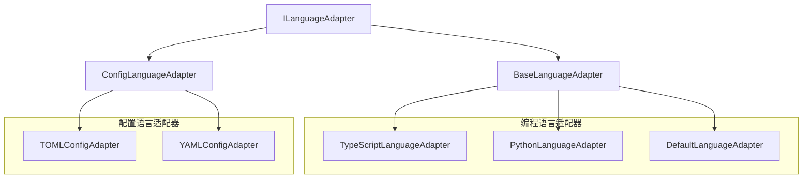

## 🎯 架构设计方案

基于我的分析，我建议**创建新的配置语言适配器基类**，而不是直接继承现有的 `DefaultLanguageAdapter`。以下是详细的设计方案：

### 架构决策：创建新的配置语言适配器基类

**理由：**
1. **概念不匹配**：配置语言与编程语言在语义上有本质区别
2. **查询类型差异**：配置语言需要不同的查询类型（配置项、路径、类型等）
3. **元数据需求**：配置语言需要数据类型、验证规则等特定元数据
4. **继承关系复杂**：强行继承会导致大量方法重写，违反Liskov替换原则

### 架构设计图



### 新的配置语言适配器基类设计

```typescript
// ConfigLanguageAdapter.ts
export abstract class ConfigLanguageAdapter implements ILanguageAdapter {
  // 重写查询类型支持
  getSupportedQueryTypes(): string[] {
    return [
      'config-items',     // 配置项
      'sections',         // 配置节
      'keys',            // 键
      'values',          // 值
      'arrays',          // 数组
      'tables',          // 表/对象
      'dependencies',    // 依赖关系
      'types'            // 数据类型
    ];
  }

  // 配置特定的节点类型映射
  abstract mapNodeType(nodeType: string): string;

  // 配置特定的名称提取
  abstract extractName(result: any): string;

  // 配置特定的元数据提取
  abstract extractLanguageSpecificMetadata(result: any): Record<string, any>;

  // 配置特定的查询类型映射
  abstract mapQueryTypeToStandardType(queryType: string): string;

  // 配置特定的复杂度计算
  abstract calculateComplexity(result: any): number;

  // 配置特定的依赖项提取
  abstract extractDependencies(result: any): string[];

  // 配置特定的修饰符提取
  abstract extractModifiers(result: any): string[];

  // 配置特定的辅助方法
  protected extractConfigPath(result: any): string { /* ... */ }
  protected extractDataType(result: any): string { /* ... */ }
  protected extractDefaultValue(result: any): any { /* ... */ }
  protected extractValidationRules(result: any): string[] { /* ... */ }
}
```

## 🚀 详细实现计划

### 阶段一：基础架构搭建（1-2天）
1. **创建配置语言适配器基类**
   - 新建 `ConfigLanguageAdapter.ts` 文件
   - 定义配置语言特定的抽象方法
   - 实现配置语言通用的工具方法

2. **扩展标准化类型定义**
   - 在 `types.ts` 中添加配置语言特定的类型
   - 定义配置语言的标准查询结果结构

### 阶段二：TOML适配器实现（2-3天）
1. **创建 `TOMLConfigAdapter.ts`**
   - 实现配置语言特定的抽象方法
   - 处理TOML特有的语法结构（table、array、inline table等）
   - 实现TOML配置项的元数据提取

2. **编写测试用例**
   - 创建 `TOMLConfigAdapter.test.ts`
   - 测试各种TOML结构（键值对、数组、嵌套表等）

### 阶段三：YAML适配器实现（2-3天）
1. **创建 `YAMLConfigAdapter.ts`**
   - 实现YAML特有的语法处理
   - 处理YAML的缩进、锚点、别名等特性
   - 实现YAML配置项的元数据提取

2. **编写测试用例**
   - 创建 `YAMLConfigAdapter.test.ts`
   - 测试YAML的各种结构（映射、序列、多文档等）

### 阶段四：集成与优化（1-2天）
1. **更新适配器工厂**
   - 在 `LanguageAdapterFactory.ts` 中注册配置语言适配器
   - 更新 `index.ts` 导出配置语言适配器

2. **性能优化**
   - 优化配置语言特有的缓存策略
   - 添加配置语言特有的性能监控指标

### 具体文件结构
```
src/service/parser/core/normalization/adapters/
├── ConfigLanguageAdapter.ts          # 新的配置语言适配器基类
├── TOMLConfigAdapter.ts              # TOML配置适配器
├── YAMLConfigAdapter.ts              # YAML配置适配器
├── __tests__/
│   ├── TOMLConfigAdapter.test.ts     # TOML适配器测试
│   └── YAMLConfigAdapter.test.ts     # YAML适配器测试
```

### 关键实现细节

**配置语言特定的标准化类型：**
```typescript
// 扩展StandardizedQueryResult类型
export type ConfigStandardType = 
  | 'config-item'    // 配置项
  | 'section'        // 配置节
  | 'key'           // 键
  | 'value'         // 值
  | 'array'         // 数组
  | 'table'         // 表/对象
  | 'dependency'    // 依赖项
  | 'type-def';     // 类型定义
```

**配置语言特有的元数据：**
```typescript
interface ConfigMetadata {
  dataType: string;           // 数据类型（string, number, boolean, array, object）
  defaultValue?: any;         // 默认值
  validationRules: string[];  // 验证规则
  isRequired: boolean;        // 是否必需
  configPath: string;         // 配置路径（如：database.host）
  description?: string;       // 配置描述
}
```

## 📊 完整分析报告与实施计划

基于对当前适配器架构和配置语言特点的深入分析，我为您制定了完整的解决方案。

### 🎯 核心结论：创建新的配置语言适配器基类

**不建议直接继承 `DefaultLanguageAdapter`，原因如下：**

1. **语义不匹配**：配置语言与编程语言在概念上有本质区别
2. **查询类型差异**：配置语言需要不同的查询语义（配置项、路径、类型等）
3. **元数据需求**：配置语言需要数据类型、验证规则等特定元数据
4. **架构清晰性**：分离关注点，避免概念污染

### 📋 详细实施计划

#### 阶段一：基础架构（1-2天）
- 创建 `ConfigLanguageAdapter` 基类
- 扩展标准化类型定义
- 定义配置语言特有的接口

#### 阶段二：TOML适配器（2-3天）  
- 实现 `TOMLConfigAdapter`
- 编写完整的测试用例
- 处理TOML特有语法结构

#### 阶段三：YAML适配器（2-3天）
- 实现 `YAMLConfigAdapter`
- 处理YAML缩进、锚点等特性
- 编写测试用例

#### 阶段四：集成优化（1-2天）
- 更新适配器工厂
- 性能优化和监控

### 🔧 技术优势

**新的架构设计将带来以下优势：**
- **类型安全**：专门的配置语言类型定义
- **可扩展性**：易于添加新的配置语言支持
- **性能优化**：配置语言特有的缓存策略
- **语义清晰**：避免概念混淆，代码更易维护

### 📁 文件结构规划
```
src/service/parser/core/normalization/adapters/
├── ConfigLanguageAdapter.ts     # 新的配置语言基类
├── TOMLConfigAdapter.ts         # TOML适配器实现
├── YAMLConfigAdapter.ts         # YAML适配器实现
└── __tests__/                   # 测试文件
```