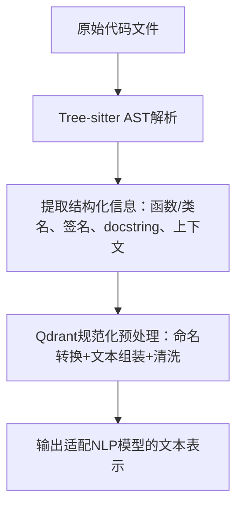

# 基于Tree-sitter AST解析的代码预处理方案（适配Qdrant代码搜索）
当使用Tree-sitter替代传统正则/字符串解析时，核心优势是**精准提取代码结构化信息**（函数名、签名、docstring、上下文等），避免字符串解析的脆弱性。预处理流程可拆分为「AST解析→结构化信息提取→Qdrant规范化文本生成」三步，以下是可直接落地的实现方案（以C语言为例，兼容多语言扩展）。


## 一、核心流程概览


关键差异：Tree-sitter负责「结构化信息提取」（替代Qdrant教程中手动解析的`structures.jsonl`），后续「规范化预处理」复用Qdrant的核心逻辑（命名转换、文本组装等）。


## 二、前置依赖安装
需安装Tree-sitter核心库、对应语言的语法解析器（如C语言），以及命名转换工具：
```bash
# 核心依赖
pip install tree-sitter tree-sitter-c inflection
```

- `tree-sitter`：AST解析核心库；
- `tree-sitter-c`：C语言语法解析器（其他语言替换为`tree-sitter-python`/`tree-sitter-java`等）；
- `inflection`：命名风格转换（驼峰/蛇形→自然语言）。


## 三、完整实现代码（C语言示例）
### 1. 初始化Tree-sitter解析器
首先配置Tree-sitter解析器，加载C语言语法规则：
```python
from tree_sitter import Language, Parser
import inflection
import re
from typing import Dict, List, Optional

# 加载C语言语法（其他语言替换为对应Language路径）
C_LANGUAGE = Language("build/my-languages.so", "c")  # 方式1：本地编译的语法库
# 方式2：动态加载（推荐，无需手动编译）
# C_LANGUAGE = Language.from_path("path/to/tree-sitter-c/build/parser.so")

# 初始化解析器
parser = Parser()
parser.set_language(C_LANGUAGE)
```

> 注：动态加载语法库的便捷方式（以C语言为例）：
> 1. 克隆语法库：`git clone https://github.com/tree-sitter/tree-sitter-c.git`
> 2. 编译生成`parser.so`：进入目录执行`gcc -shared -fPIC -I./src src/parser.c -o parser.so`
> 3. 在代码中指定`parser.so`路径即可。


### 2. 核心工具函数：AST节点查询与信息提取
基于Tree-sitter的查询语法（Query Language），精准提取函数名、签名、docstring等信息（C语言查询规则需适配其语法结构）：

#### （1）AST节点查询函数
```python
def query_ast(root_node, query_string: str) -> List[Dict]:
    """
    用Tree-sitter Query查询AST节点，提取目标信息
    :param root_node: AST根节点
    :param query_string: Tree-sitter查询语句
    :return: 匹配到的节点信息列表（含文本、行号）
    """
    query = C_LANGUAGE.query(query_string)
    captures = query.captures(root_node)
    results = []
    for node, capture_name in captures:
        # 获取节点对应的源代码文本
        text = node.text.decode("utf-8").strip()
        results.append({
            "capture_name": capture_name,
            "text": text,
            "start_line": node.start_point[0] + 1,  # 行号从1开始
            "end_line": node.end_point[0] + 1
        })
    return results
```

#### （2）提取C语言函数的结构化信息
针对C语言语法，编写查询规则，提取函数名、参数列表、返回类型、注释（作为docstring）：
```python
def extract_c_function_info(source_code: str, file_name: str = "unknown.c", module: str = "unknown") -> List[Dict]:
    """
    从C语言源代码中提取函数的结构化信息（基于Tree-sitter AST）
    :param source_code: 原始C语言代码字符串
    :param file_name: 代码所在文件名（上下文元数据）
    :param module: 代码所属模块（上下文元数据）
    :return: 函数结构化信息列表（适配Qdrant预处理输入）
    """
    # 生成AST
    tree = parser.parse(bytes(source_code, "utf-8"))
    root_node = tree.root_node

    # -------------- Tree-sitter查询规则（C语言函数提取）--------------
    # 规则说明：
    # - capture function_declarator：匹配函数声明符（含函数名+参数）
    # - capture identifier：匹配函数名
    # - capture parameter_list：匹配参数列表
    # - capture type_identifier：匹配返回类型
    # - capture comment：匹配函数上方的注释（作为docstring）
    query_string = """
    (function_definition
      type: (type_identifier) @return_type
      declarator: (function_declarator
        declarator: (identifier) @function_name
        parameters: (parameter_list) @params
      )
      body: (compound_statement)
    ) @function_def
    (comment) @docstring
    """

    # 执行查询
    matches = query_ast(root_node, query_string)

    # 整理查询结果：按函数分组，关联函数名、参数、返回类型、注释
    functions = []
    current_function = None
    docstrings = [m["text"] for m in matches if m["capture_name"] == "docstring"]

    for match in matches:
        if match["capture_name"] == "function_name":
            # 提取函数名
            func_name = match["text"]
            # 提取参数列表（从同函数的parameter_list匹配中获取）
            params = next(
                (m["text"] for m in matches if m["capture_name"] == "params" and m["start_line"] == match["start_line"]),
                "()"
            )
            # 提取返回类型
            return_type = next(
                (m["text"] for m in matches if m["capture_name"] == "return_type" and m["start_line"] == match["start_line"]),
                "void"
            )
            # 提取函数上方最近的注释作为docstring
            docstring = ""
            if docstrings:
                # 简单匹配：函数上方的注释（可根据实际代码风格优化）
                func_start_line = match["start_line"]
                for comment in docstrings:
                    comment_line = next(m["start_line"] for m in matches if m["text"] == comment and m["capture_name"] == "docstring")
                    if comment_line < func_start_line:
                        docstring = comment
                        break

            # 构造函数结构化信息（适配Qdrant预处理的输入格式）
            current_function = {
                "name": func_name,
                "signature": f"{return_type} {func_name} {params}",  # 函数签名：返回类型 函数名 (参数)
                "code_type": "Function",
                "docstring": docstring,
                "context": {
                    "module": module,
                    "file_name": file_name,
                    "struct_name": None,  # C语言无struct归属时为None
                    "start_line": match["start_line"],
                    "end_line": match["end_line"]
                },
                "snippet": source_code  # 原始代码片段（可选，用于检索后展示）
            }
            functions.append(current_function)

    return functions
```


### 3. 集成Qdrant规范化预处理
复用之前的`textify`函数，将Tree-sitter提取的结构化信息转换为适配NLP模型的文本：
```python
def textify(chunk: Dict[str, any]) -> str:
    """Qdrant规范化预处理：命名转换+文本组装+清洗"""
    # 1. 命名风格转换（C语言蛇形/驼峰→自然语言）
    name = inflection.humanize(inflection.underscore(chunk["name"]))
    # 2. 签名规范化（去除语法符号，转换为自然语言）
    signature = inflection.humanize(inflection.underscore(chunk["signature"]))
    # 3. 清洗docstring（去除//、/*等注释符号）
    docstring = ""
    if chunk.get("docstring"):
        clean_doc = re.sub(r'[/\*]+', '', chunk["docstring"]).strip()
        docstring = f"that does {clean_doc} " if clean_doc else ""
    # 4. 补充上下文元数据
    context = f"module {chunk['context']['module']} file {chunk['context']['file_name']} line {chunk['context']['start_line']}"
    # 5. 组装并清洗特殊字符
    text_representation = (
        f"{chunk['code_type']} {name} {docstring}defined as {signature} {context}"
    )
    # 过滤非字母数字字符，保留空格
    tokens = re.split(r"\W+", text_representation)
    tokens = filter(lambda x: x.strip() != "", tokens)
    return " ".join(tokens)
```


### 4. 端到端测试：从原始代码到预处理结果
```python
# 测试用C语言代码（含函数、注释、参数）
test_c_code = """
#include <stdio.h>
#include <stdlib.h>

/*
 * 计算两个整数的最大公约数
 * 输入：a - 整数1，b - 整数2
 * 输出：最大公约数（int类型）
 */
int gcd_calculator(int a, int b) {
    while (b != 0) {
        int temp = b;
        b = a % b;
        a = temp;
    }
    return a;
}

// 计算数组元素的平均值（忽略负数）
float array_avg_filtered(int arr[], int length) {
    int sum = 0;
    int count = 0;
    for (int i = 0; i < length; i++) {
        if (arr[i] >= 0) {
            sum += arr[i];
            count++;
        }
    }
    return count == 0 ? 0.0f : (float)sum / count;
}
"""

# 步骤1：Tree-sitter提取结构化信息
function_info_list = extract_c_function_info(
    source_code=test_c_code,
    file_name="math_utils.c",
    module="math"
)

# 步骤2：Qdrant规范化预处理
preprocessed_texts = [textify(func) for func in function_info_list]

# 输出结果
print("=== 预处理结果 ===")
for i, (func, text) in enumerate(zip(function_info_list, preprocessed_texts)):
    print(f"\n【函数{i+1}】{func['name']}")
    print(f"原始签名：{func['signature']}")
    print(f"预处理后文本：{text}")
```


## 四、处理结果示例（输入→输出对比）
### 输入：C语言原始代码
```c
/*
 * 计算两个整数的最大公约数
 * 输入：a - 整数1，b - 整数2
 * 输出：最大公约数（int类型）
 */
int gcd_calculator(int a, int b) { ... }
```

### 中间输出：Tree-sitter提取的结构化信息
```python
{
    "name": "gcd_calculator",
    "signature": "int gcd_calculator (int a, int b)",
    "code_type": "Function",
    "docstring": "计算两个整数的最大公约数 输入：a - 整数1，b - 整数2 输出：最大公约数（int类型）",
    "context": {
        "module": "math",
        "file_name": "math_utils.c",
        "struct_name": None,
        "start_line": 7,
        "end_line": 13
    },
    "snippet": "int gcd_calculator(int a, int b) { ... }"
}
```

### 最终输出：Qdrant规范化文本
```
Function Gcd Calculator that does 计算两个整数的最大公约数 输入 a  整数1 b  整数2 输出 最大公约数 int类型 defined as int gcd calculator  int a int b module math file math_utils.c line 7
```

## 五、关键优化点（生产环境适配）
1. **docstring精准匹配**：  
   目前采用「函数上方最近注释」匹配，可优化为：通过行号范围关联函数与注释（如`docstring_line < func_start_line`且`docstring_line > 上一个函数_end_line`）。

2. **复杂语法支持**：  
   处理C语言的`struct`嵌套函数、函数指针、宏定义等，需扩展Tree-sitter查询规则（例如匹配`struct_declaration`提取`struct_name`，补充到上下文元数据）。

3. **性能优化**：  
   批量处理代码文件时，可缓存解析器实例，避免重复初始化；对大型代码库，按文件分块解析（Tree-sitter支持增量解析）。

4. **错误处理**：  
   增加代码语法错误捕获（`tree.root_node.has_error`），跳过无法解析的代码块，避免流程中断。
