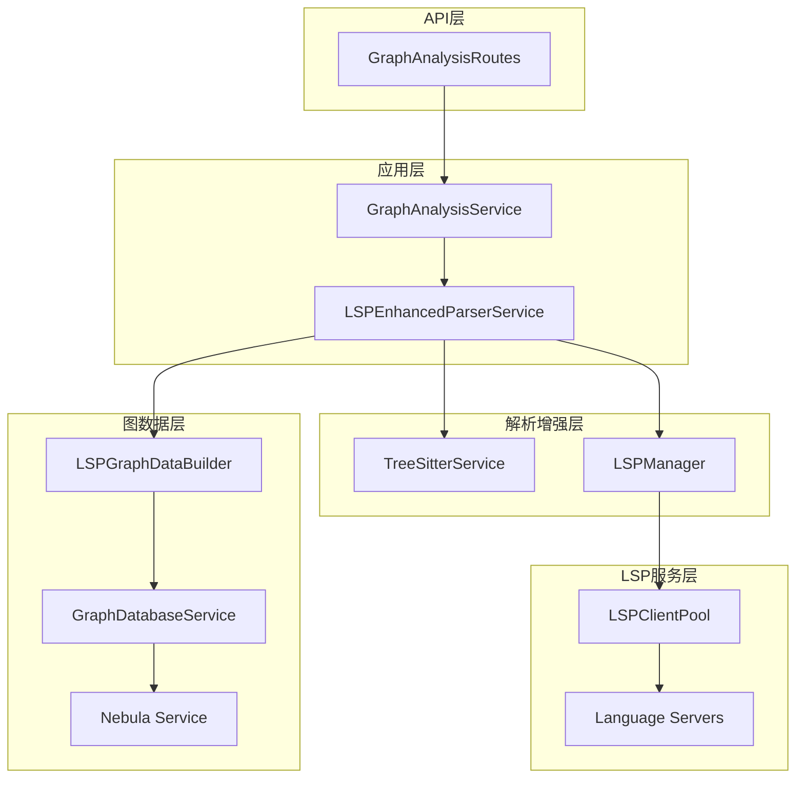

# LSP + Tree-sitter 与 Nebula 图分析模块整合实施方案

## 1. 概述

本文档详细描述了将LSP（Language Server Protocol）和Tree-sitter与现有图分析+nebula模块整合的实施方案。该方案旨在通过引入语义分析能力来提升代码图分析的准确性、完整性和实用性。

## 2. 项目背景

### 2.1 当前状态

- **图分析模块**：已实现基于语法的图分析功能，使用Nebula Graph存储代码图数据
- **Tree-sitter集成**：已集成Tree-sitter进行语法解析和代码分段
- **LSP参考实现**：在ref目录中存在完整的LSP功能实现，可作为整合参考

### 2.2 目标

通过整合LSP和Tree-sitter功能到图分析模块中，实现：

1. 更精确的代码语义分析
2. 更丰富的图节点和边关系
3. 更准确的依赖和影响分析
4. 更强大的代码查询能力

## 3. 整合架构设计

### 3.1 整体架构图



### 3.2 核心组件

#### 3.2.1 LSPEnhancedParserService

作为核心解析服务，结合Tree-sitter和LSP功能：

- 使用Tree-sitter进行语法解析
- 使用LSP获取语义信息（符号、引用、类型等）
- 提供统一的增强解析接口

#### 3.2.2 LSPManager

管理LSP连接和请求：

- LSP客户端连接池
- 语言服务器生命周期管理
- LSP请求的缓存和优化

#### 3.2.3 LSPGraphDataBuilder

将LSP信息转换为图数据：

- 构建包含语义信息的图节点
- 创建基于引用和依赖的边关系
- 验证图数据的一致性

### 3.3 数据结构设计

#### 3.3.1 增强的解析结果类型

```typescript
interface LSPEnhancedParseResult extends ParseResult {
  lspSymbols?: LSPSymbol[];
  lspDiagnostics?: LSPDiagnostic[];
  typeDefinitions?: LSPTypeDefinition[];
  references?: LSPReference[];
  lspMetadata?: {
    languageServer?: string;
    processingTime?: number;
    hasErrors?: boolean;
    symbolCount?: number;
    diagnosticCount?: number;
  };
}
```

#### 3.3.2 语义增强的图节点

```typescript
interface SemanticCodeGraphNode extends GraphNode {
  semanticInfo?: {
    symbolKind: SymbolKind;
    typeDefinition?: string;
    documentation?: string;
    containerName?: string;
    visibility?: 'public' | 'private' | 'protected';
    modifiers?: string[];
  };
  location: {
    uri: string;
    startLine: number;
    endLine: number;
    startCharacter: number;
    endCharacter: number;
  };
}
```

#### 3.3.3 语义增强的图边

```typescript
interface SemanticCodeGraphEdge extends GraphEdge {
  semanticRelationship?: {
    type: 'reference' | 'definition' | 'implementation' | 'inheritance' | 'call' | 'import' | 'dependency';
    referenceType?: string;
    confidence?: number; // 1-10
    context?: string; // 定义上下文
  };
  location: {
    uri: string;
    startLine: number;
    endLine: number;
    startCharacter: number;
    endCharacter: number;
  };
}
```

## 4. 详细实施步骤

### 4.1 第一阶段：基础设施准备 (1-2周)

#### 4.1.1 迁移LSP相关模块

**任务**：
- 将ref/src/service/lsp目录中的所有内容迁移到src/service/lsp目录
- 调整导入路径和依赖注入配置

**具体操作**：
```typescript
// 创建src/service/lsp目录
// 迁移以下文件：
- LSPClient.ts
- LSPClientPool.ts
- LSPManager.ts
- LSPIntegrationService.ts
- LSPSearchService.ts
- types.ts
- utils.ts
- LanguageServerRegistry.ts
- LSPErrorHandler.ts
```

#### 4.1.2 配置依赖注入

**任务**：
- 在src/service/lsp目录中创建LSPModule.ts
- 配置LSP相关服务的依赖注入

**示例代码**：
```typescript
import { ContainerModule } from 'inversify';
import { TYPES } from '../../types';
import { LSPManager } from './LSPManager';
import { LSPClientPool } from './LSPClientPool';
import { LSPIntegrationService } from './LSPIntegrationService';

export const LSPModule = new ContainerModule((bind) => {
  bind(TYPES.LSPManager).to(LSPManager).inSingletonScope();
  bind(TYPES.LSPClientPool).to(LSPClientPool).inSingletonScope();
  bind(TYPES.LSPIntegrationService).to(LSPIntegrationService).inSingletonScope();
});
```

#### 4.1.3 更新配置服务

**任务**：
- 在ConfigService中添加LSP相关配置选项
- 支持LSP功能的启用/禁用和参数配置

### 4.2 第二阶段：核心LSP服务实现 (2-3周)

#### 4.2.1 实现LSPManager

**任务**：
- 实现LSPManager类，管理语言服务器连接
- 包括连接池、错误处理和生命周期管理

**关键功能**：
- 支持多种语言服务器
- 自动检测项目语言
- 连接复用和管理

#### 4.2.2 创建LSPEnhancedParserService

**任务**：
- 创建结合Tree-sitter和LSP功能的解析服务
- 实现解析结果的缓存和合并

**关键功能**：
- 使用Tree-sitter进行语法解析
- 使用LSP获取语义信息
- 合并两种解析结果

#### 4.2.3 实现LSPGraphDataBuilder

**任务**：
- 创建基于LSP信息的图数据构建器
- 实现语义增强节点和边的构建

**关键功能**：
- 构建语义增强的图节点
- 创建精确的图边关系
- 处理跨文件依赖

### 4.3 第三阶段：图分析服务增强 (3-4周)

#### 4.3.1 修改GraphAnalysisService

**任务**：
- 修改GraphAnalysisService以使用LSP增强解析
- 更新依赖分析和影响分析算法

**关键功能**：
- 使用LSP信息进行更精确的依赖分析
- 实现基于语义的图遍历算法
- 改进图查询和搜索功能

#### 4.3.2 增强图数据存储

**任务**：
- 修改图数据存储以支持语义信息
- 更新Nebula Graph的数据模型

**关键功能**：
- 存储节点的语义信息
- 存储边的语义关系
- 支持语义查询

#### 4.3.3 扩展图分析功能

**任务**：
- 实现基于LSP的高级分析功能
- 增强图搜索和查询能力

**关键功能**：
- 类型依赖分析
- 调用图分析
- 实现查找功能

### 4.4 第四阶段：性能优化和质量保证 (2-3周)

#### 4.4.1 性能优化

**任务**：
- 实现LSP请求的缓存策略
- 优化连接池配置
- 实现批量请求处理

**关键功能**：
- 多层缓存机制（LRU、文件级、项目级）
- 智能连接管理
- 批量LSP请求处理

#### 4.4.2 测试和验证

**任务**：
- 编写单元测试验证LSP功能
- 进行集成测试验证端到端流程
- 实施性能和稳定性测试

**关键功能**：
- LSP功能单元测试
- 端到端集成测试
- 性能基准测试

## 5. 配置和参数

### 5.1 LSP配置选项

```yaml
lsp:
  enabled: true
  batchSize: 20
  timeout: 30000
  cache:
    enabled: true
    size: 1000
    ttl: 300000
  connection:
    maxConnections: 10
    idleTimeout: 300000
    initialConnections: 2
  errorHandling:
    maxRestarts: 5
    fallbackToTreesitter: true
```

### 5.2 集成参数

```typescript
interface LSPIntegrationOptions {
  enableLSP?: boolean;
  lspTimeout?: number;
  includeTypes?: boolean;
  includeReferences?: boolean;
  includeDiagnostics?: boolean;
  cacheLSP?: boolean;
}
```

## 6. 性能考虑

### 6.1 缓存策略

- **LRU缓存**：缓存解析结果，减少重复LSP请求
- **分层缓存**：基于文件修改时间的缓存
- **智能失效**：当文件被修改时自动失效缓存

### 6.2 连接管理

- **连接池**：复用LSP客户端连接
- **健康检查**：定期检查连接健康状态
- **自动重连**：连接失败时自动重连

### 6.3 批量处理

- **请求合并**：将多个LSP请求合并为批量请求
- **异步处理**：使用异步方式处理LSP请求

## 7. 错误处理和回退机制

### 7.1 LSP错误处理

- **连接错误**：自动重连或使用备用连接
- **请求超时**：使用缓存数据或回退到Tree-sitter
- **服务器崩溃**：重启服务器或禁用LSP功能

### 7.2 回退机制

- **LSP不可用时**：自动回退到基础Tree-sitter解析
- **性能问题时**：动态调整LSP请求频率
- **错误率过高时**：临时禁用LSP功能

## 8. 监控和日志

### 8.1 关键指标

- LSP请求成功率
- 缓存命中率
- 响应时间
- 连接池状态

### 8.2 日志策略

- LSP请求日志
- 性能指标日志
- 错误和异常日志
- 用户行为日志

## 9. 部署和维护

### 9.1 部署要求

- 支持的语言服务器必须预先安装
- 系统资源分配（内存、CPU）
- 网络连接和防火墙配置

### 9.2 维护策略

- 定期更新语言服务器
- 监控系统性能
- 处理兼容性问题

## 10. 总结

本实施方案提供了将LSP和Tree-sitter与现有图分析模块整合的详细路线图。通过分阶段实施策略，可以在保持系统稳定性的同时逐步引入语义分析能力，显著提升代码图分析的质量和准确性。该方案采用模块化设计，确保系统的可维护性和扩展性。