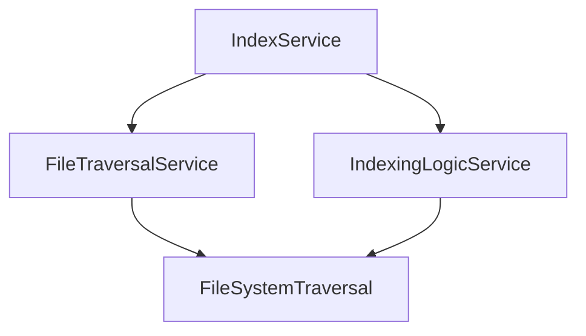

# FileTraversalService 与 FileSystemTraversal 模块分析

## 📖 概述

本文档分析 `src/service/index/shared/FileTraversalService.ts` 和 `src/service/filesystem/FileSystemTraversal.ts` 两个模块的功能关系，评估是否存在功能重叠，并提出优化建议。

## 🎯 模块功能对比

### FileSystemTraversal (文件系统遍历核心服务)

**位置**: `src/service/filesystem/FileSystemTraversal.ts`

**核心功能**:
- ✅ **递归目录遍历**: 完整的文件系统遍历能力
- ✅ **文件元数据收集**: 包括路径、大小、哈希、修改时间、语言类型等
- ✅ **智能过滤**: 支持include/exclude模式、gitignore集成、文件大小限制
- ✅ **二进制文件检测**: 自动识别并跳过二进制文件
- ✅ **文件哈希计算**: SHA256哈希用于变更检测
- ✅ **语言检测**: 根据文件扩展名识别编程语言
- ✅ **统计功能**: 提供目录统计信息（文件数、大小、语言分布等）
- ✅ **变更检测**: 基于哈希比较识别文件变更

**接口方法**:
- `traverseDirectory()` - 完整目录遍历
- `findChangedFiles()` - 变更文件检测
- `getFileContent()` - 文件内容读取
- `getDirectoryStats()` - 目录统计
- `isBinaryFile()` - 二进制文件检测
- `calculateFileHash()` - 哈希计算

### FileTraversalService (索引遍历服务)

**位置**: `src/service/index/shared/FileTraversalService.ts`

**核心功能**:
- ✅ **项目文件获取**: 封装文件遍历为简单接口
- ✅ **代码文件过滤**: 简单的文件扩展名检查
- ✅ **日志记录**: 添加索引相关的日志信息

**接口方法**:
- `getProjectFiles()` - 获取项目文件路径列表
- `isCodeFile()` - 检查是否为代码文件

## 🔄 功能重叠分析

### 重叠功能
1. **文件遍历**: 两个模块都提供文件遍历功能
2. **文件过滤**: 都支持基于扩展名的文件过滤
3. **模式匹配**: 都支持include/exclude模式

### 差异功能
| 功能 | FileSystemTraversal | FileTraversalService |
|------|---------------------|---------------------|
| 完整文件元数据 | ✅ 丰富元数据 | ❌ 仅路径信息 |
| 哈希计算 | ✅ SHA256哈希 | ❌ 无哈希功能 |
| 变更检测 | ✅ 基于哈希比较 | ❌ 无变更检测 |
| 二进制检测 | ✅ 智能检测 | ❌ 无二进制检测 |
| Gitignore集成 | ✅ 完整支持 | ❌ 无集成 |
| 统计功能 | ✅ 详细统计 | ❌ 无统计功能 |
| 语言识别 | ✅ 自动识别 | ❌ 简单扩展名检查 |
| 业务逻辑封装 | ❌ 通用工具 | ✅ 索引专用接口 |

## 🏗️ 架构关系

### 当前依赖关系


### 使用模式分析

**FileTraversalService 使用场景**:
- `VectorIndexService`: 获取文件路径列表进行向量索引
- `GraphIndexService`: 获取文件路径列表进行图索引  
- `IndexService`: 重新遍历检测被忽略的文件

**FileSystemTraversal 使用场景**:
- `IndexingLogicService`: 完整文件遍历和元数据收集
- 变更检测服务
- 文件监控服务

## ⚠️ 问题识别

### 1. 功能冗余
`FileTraversalService.getProjectFiles()` 本质上是对 `FileSystemTraversal.traverseDirectory()` 的简单封装，仅提取路径信息，丢弃了丰富的元数据。

### 2. 重复的过滤逻辑
两个模块都有文件过滤功能：
- `FileSystemTraversal`: 复杂的模式匹配和gitignore集成
- `FileTraversalService`: 简单的扩展名检查

### 3. 架构复杂性
增加了不必要的抽象层，导致：
- 代码重复维护
- 性能开销（额外的函数调用）
- 理解复杂度增加

### 4. 实际需求分析
根据使用场景分析，FileTraversalService 主要用于：
- **VectorIndexService**: 获取文件路径列表进行进度统计
- **GraphIndexService**: 获取文件路径列表进行进度统计
- **IndexService**:
  - 主索引流程中获取文件列表
  - 忽略规则更新后重新检测需要移除的文件

## 💡 优化建议

### 方案一：合并模块（推荐）
将 `FileTraversalService` 的功能合并到 `FileSystemTraversal` 中：

```typescript
// 在 FileSystemTraversal 中添加简化方法
async getProjectFiles(rootPath: string, options?: TraversalOptions): Promise<string[]> {
  const result = await this.traverseDirectory(rootPath, options);
  return result.files.map(file => file.path);
}

isCodeFile(filename: string): boolean {
  // 复用现有的扩展名检测逻辑
  const ext = path.extname(filename).toLowerCase();
  return this.defaultOptions.supportedExtensions.includes(ext);
}
```

### 方案二：明确职责划分
保持现有结构但明确分工：
- `FileSystemTraversal`: 提供底层文件系统操作
- `FileTraversalService`: 提供索引特定的业务逻辑

### 方案三：重构为工具类
将通用功能提取到工具类中：
```typescript
// FileFilterUtils.ts
export class FileFilterUtils {
  static isCodeFile(filename: string, supportedExtensions: string[]): boolean {
    const ext = path.extname(filename).toLowerCase();
    return supportedExtensions.includes(ext);
  }
  
  static extractFilePaths(traversalResult: TraversalResult): string[] {
    return traversalResult.files.map(file => file.path);
  }
}
```

## 📊 影响评估

### 正面影响
- ✅ 减少代码重复
- ✅ 简化架构
- ✅ 提高维护性
- ✅ 性能优化（减少抽象层）

### 风险考虑
- ⚠️ 需要更新所有使用 `FileTraversalService` 的代码
- ⚠️ 需要充分的测试覆盖

## 🚀 实施计划

### 阶段一：需求分析（1天）
1. 详细分析所有使用场景的具体需求
2. 确定业务逻辑封装的最佳方式
3. 设计增强功能的接口

### 阶段二：架构设计（1天）
1. 设计FileTraversalService的新架构
2. 确定缓存策略和性能优化方案
3. 制定向后兼容的迁移计划

### 阶段三：代码重构（2-3天）
1. 重构FileTraversalService实现
2. 添加索引专用功能方法
3. 实现智能缓存机制
4. 更新所有使用代码

### 阶段四：测试验证（1-2天）
1. 单元测试（覆盖所有新功能）
2. 集成测试（验证索引流程）
3. 性能测试（缓存效果评估）
4. 回归测试（确保现有功能正常）

## 📋 结论

基于实际需求分析，`FileTraversalService` 确实与 `FileSystemTraversal` 存在功能重叠，但其主要价值在于为索引服务提供专门的业务逻辑封装。

**建议采用方案一：业务逻辑重构**
- 保留FileTraversalService作为索引专用的文件服务
- 重构实现，专注于索引业务需求
- 添加索引特定的高级功能（缓存、优化过滤等）
- 保持清晰的职责分离

这样既能消除冗余，又能为索引服务提供更好的专用支持，最终实现：
- ✅ 消除功能冗余，减少代码重复
- ✅ 增强索引专用功能，提高业务适应性
- ✅ 保持架构清晰，职责分离明确
- ✅ 提供性能优化（缓存、专用过滤等）
- ✅ 更好的可维护性和扩展性