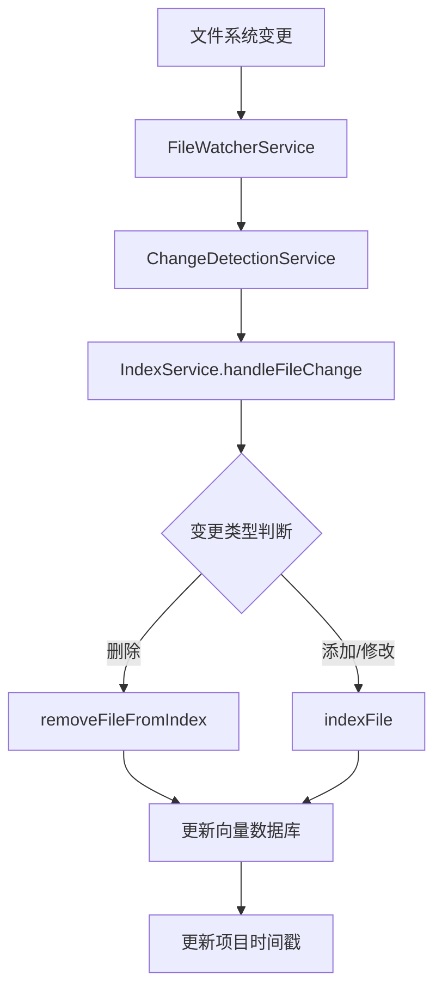

# 代码库索引热更新功能分析报告

## 📋 概述

本文档对当前代码库索引项目的热更新功能进行全面分析，包括现有实现、问题识别和改进建议。

## 🔍 当前热更新实现分析

### 1. 核心组件架构

项目已经具备了完整的热更新基础架构：

#### FileWatcherService (`src/service/filesystem/FileWatcherService.ts`)
- 基于chokidar库实现文件系统监控
- 支持多种文件事件：添加、修改、删除、目录变化
- 提供事件队列和防抖机制
- 支持忽略模式配置

#### ChangeDetectionService (`src/service/filesystem/ChangeDetectionService.ts`)
- 文件变更检测核心服务
- 哈希比较机制确保只处理实际内容变化
- 防抖处理和批量处理优化
- 文件历史跟踪功能

#### IndexService (`src/service/index/IndexService.ts`)
- 集成了文件变更监听回调
- 提供`handleFileChange`方法处理文件变化
- 支持增量索引更新

### 2. 热更新工作流程



### 3. 技术特性

- **防抖处理**: 500ms防抖间隔，避免频繁变更
- **哈希极比较**: MD5哈希验证，确保只处理实际内容变化
- **批量处理**: 支持批量文件处理优化性能
- **错误恢复**: 完善的错误处理和重试机制
- **内存管理**: 内存使用监控和GC优化

## ⚠️ 当前存在的问题

### 1. 核心问题：热更新功能未激活

**关键发现**: ChangeDetectionService的initialize方法只在测试中被调用，**主应用启动流程中未启动文件监视**。

具体表现：
- `main.ts`应用启动流程未初始化ChangeDetectionService
- MCP服务器和API服务器均未集成热更新功能
- 文件监视器仅在测试环境中启动

### 2. 架构集成问题

- IndexService虽然设置了文件变更回调，但File极WatcherService未启动
- 项目索引完成后未自动启动文件监视
- 缺少项目级别的热更新配置管理

### 3. 功能完整性问题

- 缺少项目热更新状态管理
- 无热更新配置选项（启用/禁用、监控范围等）
- 缺少热更新统计和监控功能

### 4. 错误处理机制分析

#### 当前错误处理实现
- ✅ 使用统一的ErrorHandlerService (`src/utils/ErrorHandlerService.ts`)
- ✅ 支持错误报告生成和存储
- ✅ 提供错误统计和分类功能
- ✅ 集成到FileWatcherService和ChangeDetectionService

#### 存在的问题
- ❌ 热更新特定错误类型缺失
- ❌ 缺少自动恢复机制
- ❌ 无错误报警和通知功能
- ❌ 错误历史持久化存储缺失

## 🎯 改进建议

### 1. 立即修复：激活热更新功能

**修改main.ts应用启动流程**：
```typescript
// 在main.ts的start方法中添加
await this.changeDetectionService.initialize([watchRootPath], {
  debounceInterval: 500,
  enableHashComparison: true
});
```

**修改IndexService的indexProject方法**：
```typescript
// 在索引完成后启动项目文件监视
async indexProject(projectPath: string, options?: IndexSyncOptions): Promise<void> {
  // ...现有索引逻辑
  
  // 索引完成后启动文件监视
  if (options?.enableHotReload !== false) {
    await this.startProjectWatching(projectPath);
  }
}
```

### 2. 增强错误处理机制

#### 新增热更新特定错误类型
```typescript
// 新增文件: src/service/filesystem/HotReloadError.ts
export enum HotReloadErrorCode {
  FILE_WATCH_FAILED = 'FILE_WATCH_FAILED',
  CHANGE_DETECTION_FAILED = 'CHANGE_DETECTION_FAILED',
  INDEX_UPDATE_FAILED = 'INDEX_UPDATE_FAILED',
  PERMISSION_DENIED = 'PERMISSION_DENIED',
  FILE_TOO_LARGE = 'FILE_TOO_LARGE'
}

export class HotReloadError extends Error {
  constructor(
    public code: HotReloadErrorCode,
    message: string,
    public context?: Record<string, any>
  ) {
    super(message);
    this.name = 'HotReloadError';
  }
}
```

#### 增强ErrorHandlerService
```typescript
// 修改: src/utils/ErrorHandlerService.ts
export interface ErrorReport {
  // 现有字段...
  errorCode?: string; // 新增错误代码字段
  retryCount?: number; // 重试次数
  autoRecovered?: boolean; // 是否自动恢复
}

// 添加热更新错误处理专用方法
handleHotReloadError(error: HotReloadError, context: ErrorContext): ErrorReport {
  const report = this.handleError(error, context);
  report.errorCode = error.code;
  
  // 特定错误类型的处理逻辑
  switch (error.code) {
    case HotReloadErrorCode.PERMISSION_DENIED:
      // 权限错误特殊处理
      break;
    case HotReloadErrorCode.FILE_TOO_LARGE:
      // 大文件错误处理
      break;
  }
  
  return report;
}
```

### 3. 新增自动恢复服务

```typescript
// 新增文件: src/service/filesystem/HotReloadRecoveryService.ts
@injectable()
export class HotReloadRecoveryService {
  private recoveryStrategies: Map<string, RecoveryStrategy> = new Map();
  
  constructor(
    @inject(TYPES.ErrorHandlerService) private errorHandler: ErrorHandlerService,
    @inject(TYPES.LoggerService) private logger: LoggerService
  ) {
    this.setupRecoveryStrategies();
  }
  
  private setupRecoveryStrategies(): void {
    // 文件监视失败恢复策略
    this.recoveryStrategies.set(HotReloadErrorCode.FILE_WATCH_FAILED, {
      maxRetries: 3,
      retryDelay: 1000,
      shouldRetry: (error) => true,
      recoveryAction: async (error, context) => {
        // 重新启动文件监视
      }
    });
    
    // 权限错误恢复策略
    this.recoveryStrategies.set(HotReloadErrorCode.PERMISSION_DENIED, {
      maxRetries: 1,
      retryDelay: 0,
      shouldRetry: (error) => false, // 权限错误不重试
      recoveryAction: async (error, context) => {
        // 记录错误并通知用户
        this.logger.warn('Permission denied for file monitoring', context);
      }
    });
  }
  
  async handleError(error: HotReloadError, context: ErrorContext): Promise<void> {
    const strategy = this.recoveryStrategies.get(error.code);
    if (strategy) {
      await strategy.recoveryAction(error, context);
    }
  }
}
```

### 4. 文件修改清单

#### 需要修改的文件：
1. **`src/main.ts`** - 应用启动时初始化ChangeDetectionService
2. **`src/service/index/IndexService.ts`** - 索引完成后启动文件监视
3. **`src/utils/ErrorHandlerService.ts`** - 添加热更新错误处理支持
4. **`src/service/filesystem/FileWatcherService.ts`** - 集成新的错误处理
5. **`src/service/filesystem/ChangeDetectionService.ts`** - 集成新的错误处理

#### 需要新增的文件：
1. **`src/service/filesystem/HotReloadError.ts`** - 热更新错误类型定义
2. **`src/service/filesystem/HotReloadRecoveryService.ts`** - 自动恢复服务
3. **`src/service/filesystem/types/HotReloadTypes.ts`** - 类型定义
4. **`src/service/filesystem/__tests__/HotReloadRecoveryService.test.ts`** - 测试文件

### 5. 增强架构设计

#### 新增ProjectHotReloadService
```typescript
// 新增文件: src/service/filesystem/ProjectHotReloadService.ts
interface ProjectHotReloadConfig {
  enabled: boolean;
  debounceInterval: number;
  watchPatterns: string[];
  ignorePatterns: string[];
  maxFileSize: number;
  errorHandling: {
    maxRetries: number;
    alertThreshold: number;
    autoRecovery: boolean;
  };
}

class ProjectHotReloadService {
  private projectConfigs: Map<string, ProjectHotReloadConfig> = new Map();
  private activeWatchers: Map<string, FSWatcher> = new Map();
  
  async enableForProject(projectPath: string, config?: Partial<ProjectHotReloadConfig>): Promise<void>;
  async disableForProject(projectPath: string): Promise<void>;
  getProjectStatus(projectPath: string): HotReloadStatus;
}
```

#### 集成到现有服务
- 在ProjectStateManager中管理热更新状态
- 在IndexingRoutes中添加热更新控制端点
- 在前端界面中添加热更新配置选项

### 6. 功能增强建议

#### 监控统计功能
```typescript
interface HotReloadMetrics {
  filesProcessed: number;
  changesDetected: number;
  averageProcessingTime: number;
  lastUpdated: Date;
  errorCount: number;
  errorBreakdown: Record<string, number>; // 按错误类型分类
  recoveryStats: {
    autoRecovered: number;
    manualIntervention: number;
    failedRecoveries: number;
  };
}
```

#### 配置管理
- 项目级热更新启用/禁用
- 自定义监控模式和忽略规则
- 性能调优参数配置
- 错误处理策略配置

#### 状态管理
- 热更新运行状态监控
- 错误报警和自动恢复
- 资源使用限制

## 🔧 实施计划

### 阶段一：基础功能激活和错误处理增强（2-3天）
1. 修改main.ts启动ChangeDetectionService
2. 在IndexService中集成项目监视启动
3. 实现HotReloadError和错误处理增强
4. 实现HotReloadRecoveryService

### 阶段二：增强功能开发（3-5天）
1. 实现ProjectHotReloadService
2. 添加配置管理功能
3. 实现监控统计功能
4. 添加错误持久化存储

### 阶段三：前端集成和测试（2-3天）
1. 前端热更新配置界面
2. 实时状态显示和错误监控
3. 操作日志查看
4. 完整测试覆盖

## 📊 预期效果

### 功能完善度
- ✅ 文件变更检测（现有）
- ✅ 增量索引更新（现有）
- ✅ 增强错误处理机制
- ✅ 自动恢复功能
- ⬜ 项目级配置管理
- ⬜ 实时状态监控
- ⬜ 前端管理界面

### 错误处理能力
- 错误分类和统计
- 自动恢复机制
- 错误报警和通知
- 错误历史持久化

## 🚨 风险提示

1. **性能影响**: 文件监视可能增加系统负载，需要监控资源使用
2. **并发处理**: 大量文件变更时的并发控制需要优化
3. **错误处理**: 需要完善的错误恢复机制，避免影响主索引功能
4. **配置复杂性**: 过多的配置选项可能增加使用复杂度

## 总结

当前项目已经具备了优秀的热更新技术基础，但核心功能处于未激活状态。通过系统的架构调整和错误处理机制增强，可以快速实现完整的代码库索引热更新功能，大幅提升用户体验和系统可靠性。

**建议优先级**: 高 - 热更新是代码库索引工具的核心价值功能之一，完善的错误处理是生产环境使用的必要条件。