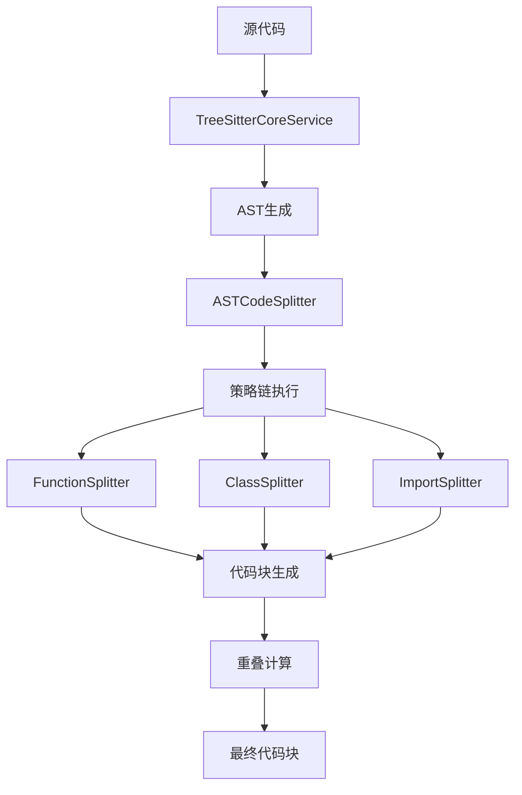

# Parser 模块工作流程分析报告

## 📋 概述

本文档详细分析 `src/service/parser` 模块的工作流程，重点关注 tree-sitter 规则、AST 生成逻辑、分块逻辑及其相互联系。该模块是代码搜索助手的核心组件，负责代码解析、分析和智能分块。

## 🏗️ 架构设计

### 模块结构
```
src/service/parser/
├── core/                    # 核心解析服务
│   ├── parse/              # 解析服务实现
│   │   ├── TreeSitterCoreService.ts    # 核心解析服务
│   │   └── TreeSitterService.ts        # 对外服务接口
│   ├── strategy/           # 分段策略定义
│   ├── config/             # 配置管理
│   └── query/             # 查询引擎
├── splitting/              # 代码分割模块
│   ├── ASTCodeSplitter.ts              # 主分割器
│   ├── strategies/         # 分段策略实现
│   ├── utils/             # 工具类
│   ├── config/           # 配置管理
│   └── types/            # 类型定义
└── universal/            # 通用处理模块
```

## 🔍 Tree-sitter 规则与AST生成

### 1. 多语言解析器集成

**TreeSitterCoreService** 集成了多种编程语言的解析器：
- TypeScript/JavaScript
- Python
- Java
- Go
- Rust
- C/C++
- C# (计划中)
- Scala (计划中)

### 2. AST 生成逻辑

```typescript
// 核心解析流程
async parseCode(code: string, language: string): Promise<ParseResult> {
    // 1. 语言检测和验证
    const parserLang = this.parsers.get(language.toLowerCase());
    
    // 2. 缓存机制（基于代码哈希）
    const cacheKey = `${language.toLowerCase()}:${this.hashCode(code)}`;
    let tree = this.astCache.get(cacheKey);
    
    // 3. 解析执行
    if (!tree) {
        const parser = parserLang.parser;
        tree = parser.parse(code);  // Tree-sitter 核心解析
        this.astCache.set(cacheKey, tree);
    }
    
    // 4. 结果封装
    return {
        ast: tree.rootNode,
        language: parserLang,
        parseTime: Date.now() - startTime,
        success: true,
        fromCache: !!tree
    };
}
```

### 3. 缓存机制
- **AST缓存**: 基于代码哈希的解析结果缓存
- **节点缓存**: 查询结果的缓存机制
- **性能统计**: 解析时间、缓存命中率等监控

## 🧩 代码分块逻辑

### 1. 分层分块策略

**ASTCodeSplitter** 采用策略模式，支持多种分块策略：

```typescript
// 策略执行顺序（优先级从高到低）
const strategyTypes = [
    'ImportSplitter',      // 导入语句分割
    'ClassSplitter',       // 类定义分割
    'FunctionSplitter',    // 函数/方法分割
    'SyntaxAwareSplitter', // 语法感知分割
    'IntelligentSplitter', // 智能分割
    'SemanticSplitter'     // 语义分割
];
```

### 2. 主要分块策略

#### a) FunctionSplitter - 函数分割
- 提取函数声明、函数定义、方法定义
- 支持箭头函数、生成器函数
- 复杂度计算和边界检测

#### b) ClassSplitter - 类分割  
- 提取类定义、接口定义
- 保持方法完整性
- 类头重叠处理

#### c) ImportSplitter - 导入分割
- 提取导入/导出语句
- 模块边界识别
- 依赖关系分析

### 3. 协调机制

**ChunkingCoordinator** 统一管理分块策略：
- 策略优先级管理
- 重复内容检测
- 区域处理状态跟踪
- 智能合并和去重

## 🔗 组件间联系与数据流

### 1. 核心数据流



### 2. 依赖关系

```
ASTCodeSplitter 
    → TreeSitterService 
    → TreeSitterCoreService
    → 各种分块策略
    → 协调器和工具类
```

### 3. 配置管理

**ChunkingConfigManager** 提供分层配置：
- 全局默认配置
- 语言特定配置  
- 策略特定配置
- 动态调整参数

## 🎯 分块算法特点

### 1. 语法感知分块
- 基于AST节点边界的分块
- 保持语法结构完整性
- 避免切断重要代码结构

### 2. 智能重叠机制
- 语义边界检测
- 上下文感知重叠
- 重复内容避免

### 3. 性能优化
- 缓存机制减少重复解析
- 批量节点查询优化
- 内存使用监控和保护

## ⚙️ 关键配置参数

### 分块大小控制
```typescript
maxChunkSize: 1000,        // 最大块大小
overlapSize: 200,          // 重叠大小
minChunkSize: 100,         // 最小块大小
```

### 边界保护
```typescript
preserveFunctionBoundaries: true,    // 保护函数边界
preserveClassBoundaries: true,       // 保护类边界
```

### 重叠策略
```typescript
overlapStrategy: {
    preferredStrategy: 'semantic',    // 首选语义策略
    enableContextOptimization: true,  // 启用上下文优化
    qualityThreshold: 0.8            // 质量阈值
}
```

### 重复检测
```typescript
enableChunkDeduplication: true,       // 启用块去重
deduplicationThreshold: 0.8,         // 去重阈值
maxOverlapRatio: 0.3,                // 最大重叠比例
```

## 🚀 工作流程总结

### 1. 解析阶段
- 代码输入和语言检测
- Tree-sitter AST生成
- 缓存查询和性能监控

### 2. 分块阶段  
- 多策略顺序执行
- 区域处理和状态跟踪
- 智能合并和优化

### 3. 后处理阶段
- 重叠计算和应用
- 质量评估和验证
- 最终块输出

## 📊 性能特征

### 优点
- ✅ 多级缓存显著提升性能
- ✅ 策略模式支持灵活扩展
- ✅ 语法感知保持代码完整性
- ✅ 智能重叠避免内容重复

### 注意事项  
- ⚠️ 大文件处理需要内存保护
- ⚠️ 未支持语言的fallback处理
- ⚠️ 复杂配置需要仔细调优

## 🔮 扩展建议

### 短期改进
1. 完善C#和Scala语言支持
2. 增强错误处理和日志
3. 优化内存使用策略

### 长期规划
1. 机器学习驱动的分块优化
2. 跨文件上下文分析
3. 实时配置热更新

---

**分析完成时间**: 2025-10-13  
**分析版本**: 当前实现版本  
**相关文档**: 
- [Tree-sitter集成设计](../design/treesitter-integration.md)
- [代码分段机制分析](../design/代码分段机制分析.md)
- [重复问题解决方案](../implementation/tree-sitter-duplicate-resolution-implementation.md)