# NebulaService 架构图说明

## 📊 当前架构（问题状态）

### 架构图
```mermaid
graph TB
    subgraph "NebulaService (单体服务 - 1000+ 行)"
        NS[NebulaService]
        
        subgraph "内部职责混杂"
            CM[连接管理]
            QE[查询执行]
            DO[数据操作]
            PM[项目管理]
            EH[错误处理]
            LH[日志处理]
            EV[事件处理]
            HC[健康检查]
        end
        
        NS --> CM
        NS --> QE
        NS --> DO
        NS --> PM
        NS --> EH
        NS --> LH
        NS --> EV
        NS --> HC
    end
    
    subgraph "依赖注入 (14个依赖)"
        D1[DatabaseLoggerService]
        D2[ErrorHandlerService]
        D3[ConfigService]
        D4[NebulaConnectionManager]
        D5[NebulaDataService]
        D6[NebulaSpaceService]
        D7[NebulaQueryBuilder]
        D8[NebulaProjectManager]
        D9[NebulaEventManager]
        D10[INebulaQueryService]
        D11[INebulaTransactionService]
        D12[INebulaDataOperations]
        D13[INebulaSchemaManager]
        D14[INebulaIndexManager]
    end
    
    NS -.-> D1
    NS -.-> D2
    NS -.-> D3
    NS -.-> D4
    NS -.-> D5
    NS -.-> D6
    NS -.-> D7
    NS -.-> D8
    NS -.-> D9
    NS -.-> D10
    NS -.-> D11
    NS -.-> D12
    NS -.-> D13
    NS -.-> D14
```

### 当前问题分析
- **🟥 违反单一职责原则**: 一个类承担8个不同职责
- **🟥 代码重复严重**: `executeReadQuery` 和 `executeWriteQuery` 90%+ 重复
- **🟥 依赖过多**: 14个依赖项，耦合度高
- **🟥 可测试性差**: 难以进行单元测试
- **🟥 维护困难**: 任何修改都可能影响多个功能

## 🎯 优化后架构（目标状态）

### 架构图
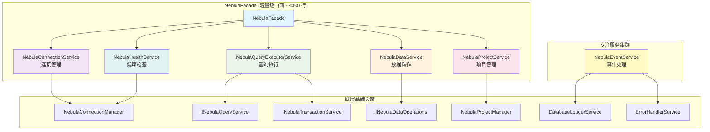

### 优化后优势
- **🟩 单一职责**: 每个服务只负责一个明确领域
- **🟩 代码复用**: 消除重复逻辑，提高代码复用率
- **🟩 依赖清晰**: 依赖关系明确，耦合度降低
- **🟩 易于测试**: 每个服务都可以独立测试
- **🟩 维护简单**: 修改一个功能只需修改一个服务

## 🔄 服务职责划分

### 1. NebulaConnectionService (连接服务)
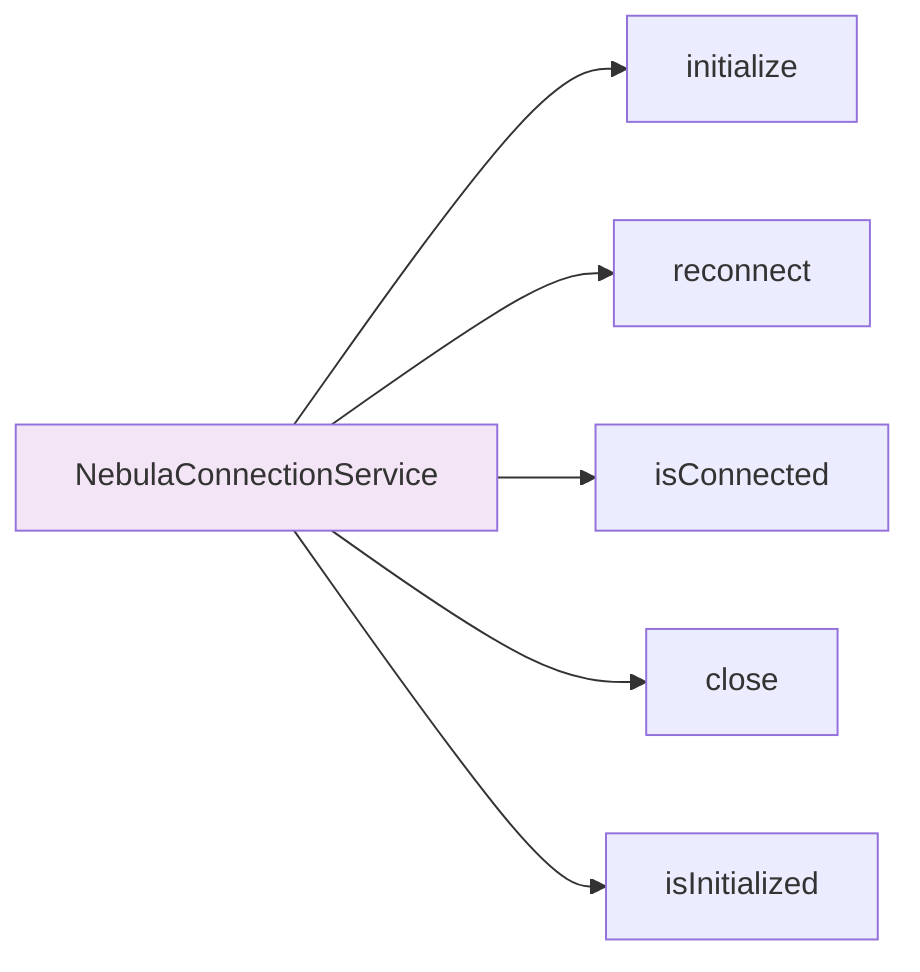

**职责**: 专负责连接状态管理、重连逻辑、连接健康检查

### 2. NebulaQueryExecutorService (查询执行服务)
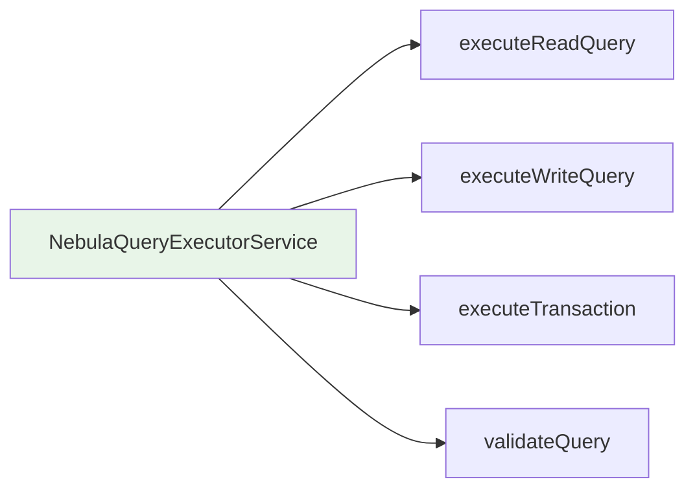

**职责**: 专负责所有查询执行、事务处理、查询验证

### 3. NebulaDataService (数据服务)
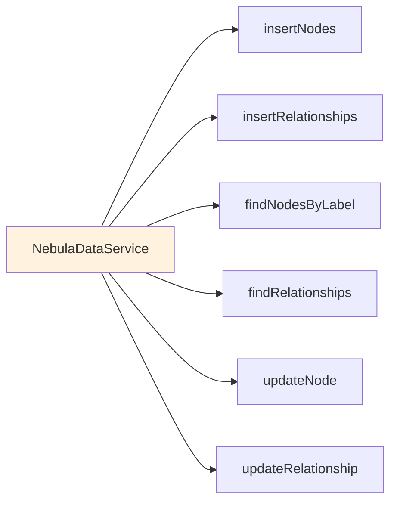

**职责**: 专负责数据CRUD操作、批量数据处理

### 4. NebulaProjectService (项目服务)
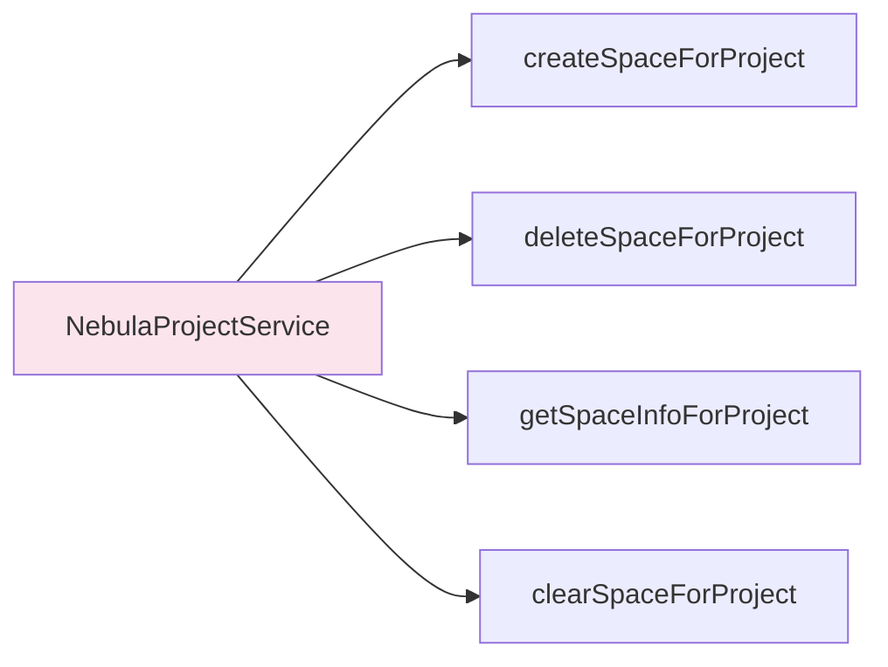

**职责**: 专负责项目空间管理、项目相关操作

### 5. NebulaHealthService (健康服务)
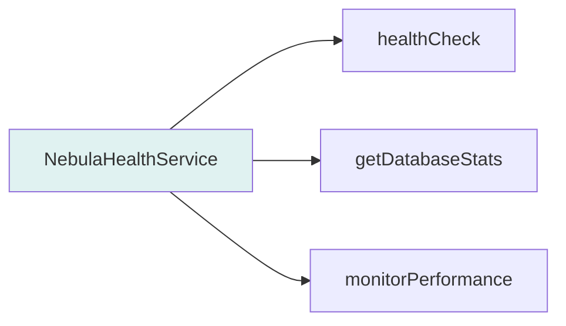

**职责**: 专负责健康检查、性能监控、统计信息

### 6. NebulaEventService (事件服务)
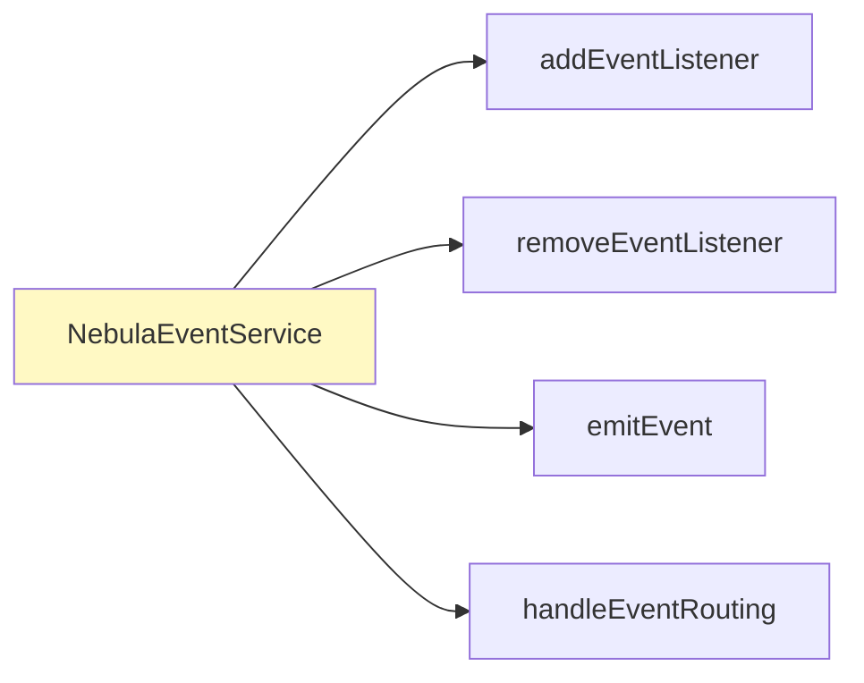

**职责**: 专负责事件处理、事件路由、监听器管理

## 📈 架构迁移路线图

### 阶段1: 基础架构搭建 (Week 1)
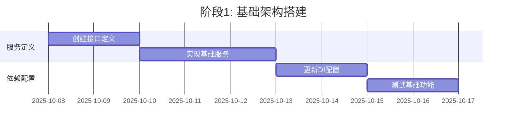

### 阶段2: 核心功能迁移 (Week 2-3)
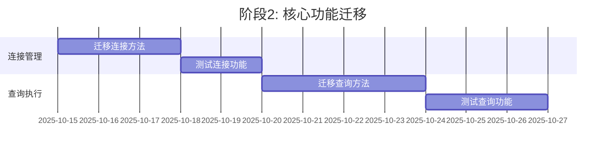

### 阶段3: 数据操作迁移 (Week 4)
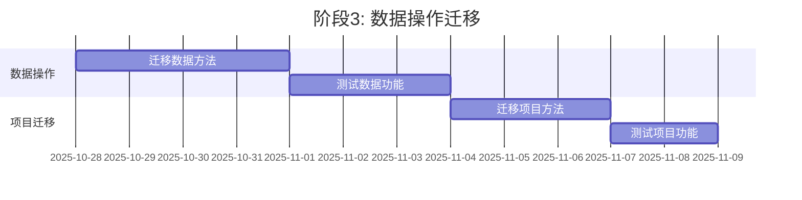

### 阶段4: 收尾优化 (Week 5)
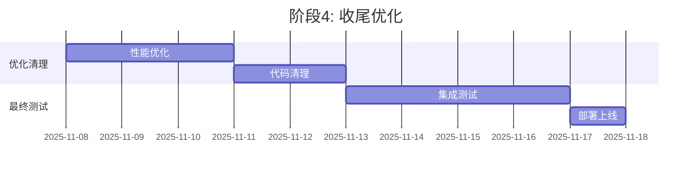

## 🎨 架构色彩说明

- **🔵 蓝色**: 门面/协调层服务
- **🟣 紫色**: 连接相关服务
- **🟢 绿色**: 查询相关服务
- **🟠 橙色**: 数据相关服务
- **🔴 红色**: 项目相关服务
- **🔵 淡蓝**: 健康相关服务
- **🟡 黄色**: 事件相关服务

## 📊 预期指标对比

| 指标 | 当前架构 | 优化后架构 | 改善幅度 |
|------|---------|-----------|---------|
| 代码行数 | 1000+ | <300 | 70%+ |
| 依赖数量 | 14 | 4-5 | 64-71% |
| 单元测试覆盖率 | 低 | >90% | 显著提升 |
| 代码重复率 | 高 | <5% | 显著降低 |
| 平均方法行数 | 30+ | 10-15 | 50-67% |
| 可维护性指数 | 低 | 高 | 大幅提升 |

## ✅ 架构验证检查点

### 1. 依赖关系验证
- [ ] 无循环依赖
- [ ] 依赖数量合理
- [ ] 依赖方向正确（高层不依赖低层）

### 2. 接口设计验证
- [ ] 接口职责单一
- [ ] 方法签名合理
- [ ] 参数设计规范

### 3. 实现质量验证
- [ ] 代码行数符合目标
- [ ] 单元测试覆盖全面
- [ ] 性能指标达标

### 4. 集成验证
- [ ] 服务间协作正常
- [ ] 错误处理一致
- [ ] 日志格式统一

---

**文档版本**: 1.0  
**最后更新**: 2025-10-08  
**负责人**: 架构评审委员会