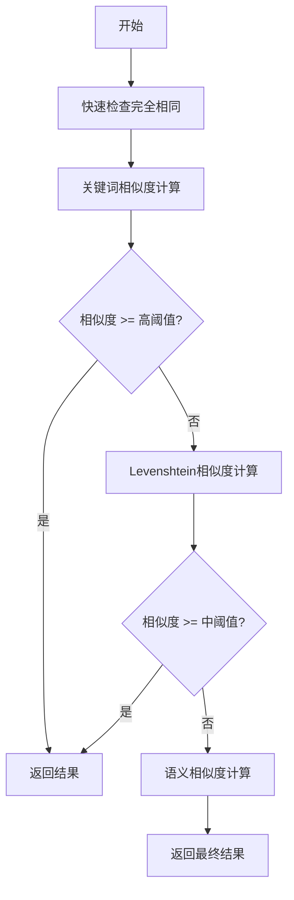
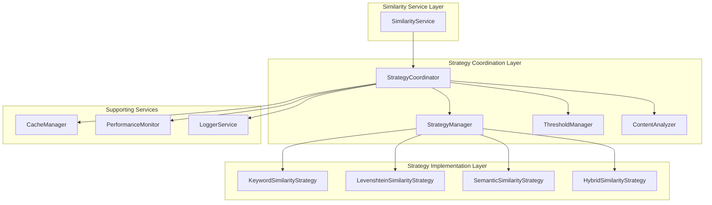

基于我对代码的分析，我现在开始分析当前相似度策略的协调机制。

## 1. 当前相似度策略的协调机制分析

### 现有架构概述

当前的相似度计算系统采用了策略模式和工厂模式的组合设计，主要组件包括：

1. **策略层** (`strategies/` 目录)：
   - [`BaseSimilarityStrategy`](src/service/similarity/strategies/BaseSimilarityStrategy.ts:15)：抽象基类，提供通用功能
   - [`LevenshteinSimilarityStrategy`](src/service/similarity/strategies/LevenshteinSimilarityStrategy.ts:10)：基于编辑距离的相似度计算
   - [`SemanticSimilarityStrategy`](src/service/similarity/strategies/SemanticSimilarityStrategy.ts:13)：基于向量嵌入的语义相似度
   - [`KeywordSimilarityStrategy`](src/service/similarity/strategies/KeywordSimilarityStrategy.ts:10)：基于关键词重叠的相似度
   - [`HybridSimilarityStrategy`](src/service/similarity/strategies/HybridSimilarityStrategy.ts:14)：混合策略，协调多种策略

2. **服务层** ([`SimilarityService`](src/service/similarity/SimilarityService.ts:27))：
   - 作为主要入口点，负责策略选择和结果处理
   - 管理缓存和性能监控
   - 提供批量计算功能

3. **批处理层** (`batch/` 目录)：
   - [`BatchCalculatorFactory`](src/service/similarity/batch/BatchCalculatorFactory.ts:22)：工厂类，选择最优的批处理计算器
   - 各种优化的批处理计算器实现

### 当前协调逻辑分析

#### 1. 策略选择机制

在 [`SimilarityService.selectStrategy()`](src/service/similarity/SimilarityService.ts:359) 方法中：

```typescript
private selectStrategy(options?: SimilarityOptions): ISimilarityStrategy {
  const strategyType = options?.strategy || 'hybrid';
  const strategy = this.strategies.get(strategyType);
  
  if (!strategy) {
    throw new SimilarityError(
      `Strategy not found: ${strategyType}`,
      'STRATEGY_NOT_FOUND',
      { strategy: strategyType, available: Array.from(this.strategies.keys()) }
    );
  }

  // 检查策略是否支持当前内容类型
  if (!strategy.isSupported(options?.contentType || 'generic', options?.language)) {
    this.logger?.warn(`Strategy ${strategy.name} may not support content type: ${options?.contentType}`);
  }

  return strategy;
}
```

**问题**：策略选择逻辑过于简单，只是根据用户指定的策略类型或默认使用混合策略，没有考虑内容特征、性能要求等因素。

#### 2. 混合策略的协调机制

在 [`HybridSimilarityStrategy.calculate()`](src/service/similarity/strategies/HybridSimilarityStrategy.ts:26) 方法中：

```typescript
async calculate(content1: string, content2: string, options?: SimilarityOptions): Promise<number> {
  // 验证输入
  this.validateInput(content1, content2, options);

  // 快速检查完全相同
  if (await this.isIdentical(content1, content2)) {
    return 1.0;
  }

  // 获取权重配置
  const weights = this.getWeights(options as AdvancedSimilarityOptions);
  
  // 并行计算各种相似度
  const [levenshteinSim, semanticSim, keywordSim] = await Promise.all([
    this.calculateWithFallback(this.levenshteinStrategy, content1, content2, options),
    this.calculateWithFallback(this.semanticStrategy, content1, content2, options),
    this.calculateWithFallback(this.keywordStrategy, content1, content2, options)
  ]);

  // 计算加权平均
  const hybridSimilarity = 
    (levenshteinSim * weights.content) +
    (semanticSim * weights.semantic) +
    (keywordSim * weights.keywords);

  return this.normalizeScore(hybridSimilarity);
}
```

**问题**：
1. 所有策略都是并行执行，没有考虑计算成本和效率
2. 没有实现逐级降级机制，不符合文档中提到的"相似度计算：逐级降级，嵌入模型放最后"的要求
3. 权重调整逻辑分散在多个方法中，缺乏统一管理

#### 3. 回退机制

在 [`HybridSimilarityStrategy.calculateWithFallback()`](src/service/similarity/strategies/HybridSimilarityStrategy.ts:57) 方法中：

```typescript
private async calculateWithFallback(
  strategy: BaseSimilarityStrategy,
  content1: string,
  content2: string,
  options?: SimilarityOptions
): Promise<number> {
  try {
    // 检查策略是否支持当前内容类型
    if (!strategy.isSupported(options?.contentType || 'generic', options?.language)) {
      return 0;
    }
    
    return await strategy.calculate(content1, content2, options);
  } catch (error) {
    console.warn(`Strategy ${strategy.name} failed, using fallback:`, error);
    // 如果策略失败，使用简单的字符重叠作为回退
    return this.calculateSimpleOverlap(content1, content2);
  }
}
```

**问题**：回退机制过于简单，只是返回0或使用简单的字符重叠，没有智能的降级策略。


## 2. 策略协调逻辑的优缺点评估

### 优点

1. **模块化设计良好**
   - 每个策略职责单一，遵循单一职责原则
   - 策略之间相互独立，易于扩展和维护
   - 使用依赖注入，降低了组件间的耦合度

2. **错误处理机制**
   - 每个策略都有完善的输入验证
   - 混合策略提供了回退机制，确保系统稳定性
   - 统一的错误类型和处理方式

3. **性能监控支持**
   - 集成了性能监控和缓存机制
   - 批处理计算器工厂能够根据策略类型选择最优计算器
   - 支持执行时间测量和缓存命中率统计

4. **灵活的配置**
   - 支持权重配置，可以根据需求调整不同策略的重要性
   - 支持多种内容类型和编程语言
   - 提供了详细的选项配置

### 缺点

1. **策略选择逻辑过于简单**
   - [`SimilarityService.selectStrategy()`](src/service/similarity/SimilarityService.ts:359) 只是根据用户指定或默认使用混合策略
   - 没有考虑内容特征、性能要求、成本等因素
   - 缺乏智能的策略推荐机制

2. **混合策略执行效率低下**
   - [`HybridSimilarityStrategy`](src/service/similarity/strategies/HybridSimilarityStrategy.ts:14) 总是并行执行所有策略
   - 没有实现逐级降级机制，不符合性能优化要求
   - 对于高相似度的内容，仍然会执行所有昂贵的计算

3. **协调逻辑分散**
   - 策略协调逻辑主要在 [`HybridSimilarityStrategy`](src/service/similarity/strategies/HybridSimilarityStrategy.ts:14) 中实现
   - 权重调整逻辑分散在多个方法中，缺乏统一管理
   - 没有专门的协调器组件来管理策略执行顺序

4. **缺乏智能降级机制**
   - 回退机制过于简单，只是返回0或使用简单的字符重叠
   - 没有根据内容特征和计算结果动态调整执行策略
   - 缺乏早期退出机制，无法在确定高相似度时提前返回

5. **资源利用不优化**
   - 语义相似度计算（嵌入模型）总是被执行，即使其他策略已经确定了高相似度
   - 没有考虑不同策略的计算成本和执行时间
   - 缺乏基于成本效益的策略选择机制


## 3. 策略执行顺序的优化空间分析

### 当前执行顺序的问题

根据文档要求"相似度计算：逐级降级，嵌入模型放最后"，但当前的 [`HybridSimilarityStrategy`](src/service/similarity/strategies/HybridSimilarityStrategy.ts:14) 采用的是并行执行所有策略的方式，这导致了以下问题：

1. **计算资源浪费**：即使简单的关键词匹配已经确定了高相似度，仍然会执行昂贵的语义计算
2. **响应时间延迟**：总是等待最慢的策略完成，无法实现早期退出
3. **成本不优化**：语义计算通常需要调用外部API，会产生额外成本

### 优化空间分析

#### 1. 策略成本分析

基于代码分析，各策略的计算成本和特点：

| 策略 | 计算成本 | 执行速度 | 准确性 | 适用场景 |
|------|----------|----------|--------|----------|
| 关键词相似度 | 低 | 快 | 中等 | 代码、短文本 |
| Levenshtein相似度 | 中等 | 中等 | 高 | 精确匹配、代码 |
| 语义相似度 | 高 | 慢 | 高 | 长文本、文档 |

#### 2. 逐级降级策略设计

根据文档要求，应该实现以下执行顺序：



#### 3. 智能阈值管理

需要实现动态阈值调整机制：

- **高阈值**（0.9+）：用于快速判断，避免不必要的计算
- **中阈值**（0.7+）：用于中期判断，决定是否需要语义计算
- **低阈值**（0.5+）：用于最终判断

#### 4. 内容特征驱动的策略选择

根据内容特征调整执行顺序：

- **短文本**（<50字符）：优先关键词匹配
- **代码内容**：优先Levenshtein相似度
- **长文档**：可能需要语义分析
- **混合内容**：使用完整的逐级降级策略

#### 5. 性能监控与自适应

需要实现性能监控机制，根据历史数据优化策略：

- 记录各策略在不同内容类型上的表现
- 根据成功率调整阈值
- 基于执行时间优化策略选择

#### 6. 缓存策略优化

当前的缓存机制可以进一步优化：

- **中间结果缓存**：缓存策略的中间计算结果
- **早期退出缓存**：缓存高相似度的判断结果
- **分层缓存**：根据策略重要性分层缓存

### 具体优化建议

1. **实现策略协调器**
   - 创建专门的 `SimilarityStrategyCoordinator` 类
   - 负责管理策略执行顺序和降级逻辑
   - 集成智能阈值管理和性能监控

2. **重构混合策略**
   - 将并行执行改为串行执行
   - 实现早期退出机制
   - 添加智能降级逻辑

3. **增强策略选择**
   - 在 `SimilarityService` 中添加智能策略选择
   - 基于内容特征、性能要求和成本考虑
   - 提供策略推荐功能

4. **优化缓存机制**
   - 实现中间结果缓存
   - 添加分层缓存策略
   - 优化缓存键生成逻辑

## 4. 改进的协调逻辑架构设计

### 4.1 整体架构设计

基于前面的分析，我设计了一个改进的协调逻辑架构，将策略协调逻辑从具体的策略实现中分离出来，形成专门的协调层。



### 4.2 核心组件设计

#### 4.2.1 策略协调器 (StrategyCoordinator)

```typescript
interface ISimilarityStrategyCoordinator {
  calculateWithFallback(
    content1: string,
    content2: string,
    options?: SimilarityOptions
  ): Promise<SimilarityResult>;
  
  calculateBatchWithFallback(
    contents: string[],
    options?: SimilarityOptions
  ): Promise<BatchSimilarityResult>;
  
  setExecutionPlan(plan: StrategyExecutionPlan): void;
  getExecutionPlan(): StrategyExecutionPlan;
}

interface StrategyExecutionPlan {
  steps: StrategyExecutionStep[];
  earlyExitThresholds: number[];
  fallbackStrategies: Map<string, string>;
}

interface StrategyExecutionStep {
  strategy: SimilarityStrategyType;
  order: number;
  enabled: boolean;
  conditions?: StrategyCondition[];
  thresholds?: {
    earlyExit?: number;
    continue?: number;
  };
}
```

#### 4.2.2 策略管理器 (StrategyManager)

```typescript
interface IStrategyManager {
  selectOptimalStrategy(
    content1: string,
    content2: string,
    options?: SimilarityOptions
  ): Promise<SimilarityStrategyType>;
  
  createExecutionPlan(
    contentType: string,
    contentLength: number,
    options?: SimilarityOptions
  ): StrategyExecutionPlan;
  
  getStrategyCost(strategy: SimilarityStrategyType): number;
  getStrategyAccuracy(strategy: SimilarityStrategyType): number;
}

interface StrategyCondition {
  type: 'content_length' | 'content_type' | 'language' | 'performance';
  operator: 'gt' | 'lt' | 'eq' | 'ne';
  value: any;
}
```

#### 4.2.3 阈值管理器 (ThresholdManager)

```typescript
interface IThresholdManager {
  getThresholds(
    strategy: SimilarityStrategyType,
    contentType?: string,
    contentLength?: number
  ): ThresholdConfig;
  
  updateThresholds(
    strategy: SimilarityStrategyType,
    thresholds: Partial<ThresholdConfig>
  ): void;
  
  learnFromResults(
    strategy: SimilarityStrategyType,
    results: SimilarityResult[]
  ): void;
}

interface ThresholdConfig {
  earlyExit: number;    // 高阈值，用于早期退出
  continue: number;     // 中阈值，用于继续执行
  final: number;        // 低阈值，用于最终判断
  adaptive: boolean;    // 是否启用自适应调整
}
```

#### 4.2.4 内容分析器 (ContentAnalyzer)

```typescript
interface IContentAnalyzer {
  analyzeContent(content: string): ContentAnalysis;
  compareContentFeatures(
    analysis1: ContentAnalysis,
    analysis2: ContentAnalysis
  ): ContentComparison;
}

interface ContentAnalysis {
  length: number;
  type: 'code' | 'document' | 'mixed' | 'unknown';
  language?: string;
  complexity: 'low' | 'medium' | 'high';
  keywordDensity: number;
  structure: ContentStructure;
}

interface ContentStructure {
  hasFunctions: boolean;
  hasClasses: boolean;
  hasImports: boolean;
  lineCount: number;
  tokenCount: number;
}
```

### 4.3 改进的执行流程

#### 4.3.1 逐级降级执行流程

```typescript
class SimilarityStrategyCoordinator implements ISimilarityStrategyCoordinator {
  async calculateWithFallback(
    content1: string,
    content2: string,
    options?: SimilarityOptions
  ): Promise<SimilarityResult> {
    // 1. 分析内容特征
    const analysis1 = await this.contentAnalyzer.analyzeContent(content1);
    const analysis2 = await this.contentAnalyzer.analyzeContent(content2);
    
    // 2. 生成执行计划
    const executionPlan = this.strategyManager.createExecutionPlan(
      analysis1.type,
      Math.max(analysis1.length, analysis2.length),
      options
    );
    
    // 3. 快速检查完全相同
    if (content1 === content2) {
      return this.createResult(1.0, 'identical', 0, true);
    }
    
    // 4. 逐级执行策略
    let finalResult: SimilarityResult | null = null;
    
    for (const step of executionPlan.steps) {
      if (!step.enabled) continue;
      
      // 检查执行条件
      if (!this.shouldExecuteStep(step, analysis1, analysis2, options)) {
        continue;
      }
      
      // 执行策略
      const strategy = this.strategyManager.getStrategy(step.strategy);
      const startTime = Date.now();
      
      try {
        const similarity = await strategy.calculate(content1, content2, options);
        const executionTime = Date.now() - startTime;
        
        // 检查早期退出条件
        if (step.thresholds?.earlyExit && similarity >= step.thresholds.earlyExit) {
          finalResult = this.createResult(similarity, step.strategy, executionTime, true);
          break;
        }
        
        // 检查继续执行条件
        if (step.thresholds?.continue && similarity < step.thresholds.continue) {
          // 继续执行下一个策略
          continue;
        }
        
        // 如果没有更多策略，使用当前结果
        if (step.order === executionPlan.steps.length - 1) {
          finalResult = this.createResult(similarity, step.strategy, executionTime, false);
        }
        
      } catch (error) {
        // 策略执行失败，尝试回退策略
        const fallbackStrategy = executionPlan.fallbackStrategies.get(step.strategy);
        if (fallbackStrategy) {
          const fallback = this.strategyManager.getStrategy(fallbackStrategy);
          const similarity = await fallback.calculate(content1, content2, options);
          finalResult = this.createResult(similarity, fallbackStrategy, executionTime, false);
        }
      }
    }
    
    // 5. 如果所有策略都失败，使用默认回退
    if (!finalResult) {
      finalResult = await this.executeDefaultFallback(content1, content2, options);
    }
    
    // 6. 学习和优化
    this.thresholdManager.learnFromResults(finalResult.strategy, [finalResult]);
    
    return finalResult;
  }
}
```

#### 4.3.2 智能策略选择

```typescript
class StrategyManager implements IStrategyManager {
  async selectOptimalStrategy(
    content1: string,
    content2: string,
    options?: SimilarityOptions
  ): Promise<SimilarityStrategyType> {
    const analysis1 = await this.contentAnalyzer.analyzeContent(content1);
    const analysis2 = await this.contentAnalyzer.analyzeContent(content2);
    
    // 基于内容特征选择策略
    if (this.isCodeContent(analysis1, analysis2)) {
      return 'levenshtein';
    }
    
    if (this.isShortContent(analysis1, analysis2)) {
      return 'keyword';
    }
    
    if (this.isDocumentContent(analysis1, analysis2)) {
      return 'semantic';
    }
    
    // 默认使用混合策略
    return 'hybrid';
  }
  
  createExecutionPlan(
    contentType: string,
    contentLength: number,
    options?: SimilarityOptions
  ): StrategyExecutionPlan {
    const plan: StrategyExecutionPlan = {
      steps: [],
      earlyExitThresholds: [],
      fallbackStrategies: new Map()
    };
    
    // 根据内容类型和长度创建执行计划
    switch (contentType) {
      case 'code':
        plan.steps = [
          { strategy: 'keyword', order: 1, enabled: true, thresholds: { earlyExit: 0.9, continue: 0.6 } },
          { strategy: 'levenshtein', order: 2, enabled: true, thresholds: { earlyExit: 0.85, continue: 0.7 } },
          { strategy: 'semantic', order: 3, enabled: contentLength > 100 }
        ];
        break;
        
      case 'document':
        plan.steps = [
          { strategy: 'keyword', order: 1, enabled: true, thresholds: { earlyExit: 0.9, continue: 0.5 } },
          { strategy: 'semantic', order: 2, enabled: true, thresholds: { earlyExit: 0.8, continue: 0.6 } },
          { strategy: 'levenshtein', order: 3, enabled: false }
        ];
        break;
        
      default:
        plan.steps = [
          { strategy: 'keyword', order: 1, enabled: true, thresholds: { earlyExit: 0.9, continue: 0.6 } },
          { strategy: 'levenshtein', order: 2, enabled: true, thresholds: { earlyExit: 0.85, continue: 0.7 } },
          { strategy: 'semantic', order: 3, enabled: true }
        ];
    }
    
    // 设置回退策略
    plan.fallbackStrategies.set('semantic', 'levenshtein');
    plan.fallbackStrategies.set('levenshtein', 'keyword');
    
    return plan;
  }
}
```

### 4.4 性能优化机制

#### 4.4.1 自适应阈值调整

```typescript
class ThresholdManager implements IThresholdManager {
  private thresholdHistory: Map<string, ThresholdHistory[]> = new Map();
  
  learnFromResults(
    strategy: SimilarityStrategyType,
    results: SimilarityResult[]
  ): void {
    const history = this.thresholdHistory.get(strategy) || [];
    
    // 分析结果分布
    const highSimilarityCount = results.filter(r => r.similarity >= 0.8).length;
    const totalCount = results.length;
    const highSimilarityRatio = highSimilarityCount / totalCount;
    
    // 如果高相似度比例很高，可以提高早期退出阈值
    if (highSimilarityRatio > 0.7) {
      this.adjustThreshold(strategy, 'earlyExit', 0.05);
    }
    
    // 记录历史
    history.push({
      timestamp: Date.now(),
      resultCount: totalCount,
      highSimilarityRatio,
      averageExecutionTime: results.reduce((sum, r) => sum + (r.details?.executionTime || 0), 0) / totalCount
    });
    
    this.thresholdHistory.set(strategy, history);
  }
}
```

#### 4.4.2 缓存优化

```typescript
class OptimizedCacheManager implements ISimilarityCacheManager {
  private resultCache: Map<string, CachedSimilarityResult> = new Map();
  private intermediateCache: Map<string, CachedIntermediateResult> = new Map();
  
  async getIntermediateResult(
    strategy: SimilarityStrategyType,
    content1: string,
    content2: string
  ): Promise<number | null> {
    const key = this.generateIntermediateKey(strategy, content1, content2);
    const cached = this.intermediateCache.get(key);
    
    if (cached && !this.isExpired(cached)) {
      return cached.result;
    }
    
    return null;
  }
  
  async setIntermediateResult(
    strategy: SimilarityStrategyType,
    content1: string,
    content2: string,
    result: number
  ): Promise<void> {
    const key = this.generateIntermediateKey(strategy, content1, content2);
    this.intermediateCache.set(key, {
      result,
      timestamp: Date.now(),
      ttl: this.getIntermediateTTL(strategy)
    });
  }
}
```


## 5. 将协调逻辑转移到similarity模块的建议

### 5.1 转移的必要性和优势

基于前面的分析，将协调逻辑从具体的策略实现中转移到similarity模块中具有以下必要性和优势：

#### 5.1.1 解决当前架构问题

1. **职责分离**：当前 [`HybridSimilarityStrategy`](src/service/similarity/strategies/HybridSimilarityStrategy.ts:14) 既承担了具体的相似度计算职责，又承担了策略协调职责，违反了单一职责原则。

2. **逻辑集中**：协调逻辑分散在多个地方，难以维护和优化。将协调逻辑集中到similarity模块中，便于统一管理和优化。

3. **扩展性**：新的策略添加时，不需要修改现有的协调逻辑，只需要在协调器中注册即可。

#### 5.1.2 性能优化优势

1. **统一优化**：协调逻辑集中后，可以统一实现性能优化机制，如早期退出、智能降级等。

2. **缓存优化**：可以在协调层实现更精细的缓存策略，包括中间结果缓存和分层缓存。

3. **资源管理**：更好地管理计算资源，避免不必要的昂贵计算。

### 5.2 转移方案设计

#### 5.2.1 新的模块结构

```
src/service/similarity/
├── coordination/                    # 新增协调层
│   ├── SimilarityStrategyCoordinator.ts
│   ├── StrategyManager.ts
│   ├── ThresholdManager.ts
│   ├── ContentAnalyzer.ts
│   └── types/
│       ├── CoordinationTypes.ts
│       └── ExecutionPlanTypes.ts
├── strategies/                      # 策略实现层（简化）
│   ├── BaseSimilarityStrategy.ts
│   ├── KeywordSimilarityStrategy.ts
│   ├── LevenshteinSimilarityStrategy.ts
│   ├── SemanticSimilarityStrategy.ts
│   └── SimpleHybridStrategy.ts      # 简化的混合策略
├── SimilarityService.ts             # 主服务（重构）
└── types/
    └── SimilarityTypes.ts
```

#### 5.2.2 重构后的SimilarityService

```typescript
@injectable()
export class SimilarityService implements ISimilarityService {
  constructor(
    @inject(TYPES.LoggerService) private logger?: LoggerService,
    @inject(TYPES.SimilarityCacheManager) private cacheManager?: ISimilarityCacheManager,
    @inject(TYPES.SimilarityPerformanceMonitor) private performanceMonitor?: ISimilarityPerformanceMonitor,
    @inject(TYPES.SimilarityStrategyCoordinator) private coordinator?: ISimilarityStrategyCoordinator,
    @inject(BatchCalculatorFactory) private batchCalculatorFactory?: BatchCalculatorFactory
  ) {}

  async calculateSimilarity(
    content1: string, 
    content2: string, 
    options?: SimilarityOptions
  ): Promise<SimilarityResult> {
    const endTimer = this.performanceMonitor?.startTimer() || (() => 0);
    
    try {
      // 验证输入
      this.validateInput(content1, content2, options);

      // 检查缓存
      const cacheKey = this.cacheManager ? 
        this.generateCacheKey(content1, content2, options?.strategy || 'hybrid', options) : null;

      let result: SimilarityResult | undefined;
      let cacheHit = false;
      
      if (cacheKey && this.cacheManager) {
        const cachedResult = await this.cacheManager.get(cacheKey);
        if (cachedResult !== null) {
          result = this.createResultFromCache(cachedResult, options);
          cacheHit = true;
          this.logger?.debug(`Cache hit for similarity calculation`);
        }
      }

      // 如果缓存未命中，使用协调器计算
      if (!result) {
        if (this.coordinator) {
          result = await this.coordinator.calculateWithFallback(content1, content2, options);
        } else {
          // 回退到原有实现
          result = await this.calculateSimilarityLegacy(content1, content2, options);
        }
        
        // 缓存结果
        if (cacheKey && this.cacheManager) {
          await this.cacheManager.set(cacheKey, result.similarity);
        }
      }

      // 记录性能指标
      const executionTime = endTimer();
      this.performanceMonitor?.recordCalculation(result.strategy, executionTime, cacheHit);

      this.logger?.debug(`Similarity calculated: ${result.similarity.toFixed(3)} using ${result.strategy}`);
      return result;
    } catch (error) {
      this.logger?.error('Error calculating similarity:', error);
      throw new SimilarityError(
        'Failed to calculate similarity',
        'CALCULATION_ERROR',
        { content1Length: content1.length, content2Length: content2.length, options }
      );
    }
  }

  // 其他方法保持不变...
}
```

#### 5.2.3 简化的策略实现

```typescript
// 简化的混合策略，只负责具体的计算逻辑
@injectable()
export class SimpleHybridStrategy extends BaseSimilarityStrategy {
  readonly name = 'Simple Hybrid Similarity';
  readonly type = 'hybrid' as SimilarityStrategyType;

  async calculate(content1: string, content2: string, options?: SimilarityOptions): Promise<number> {
    // 验证输入
    this.validateInput(content1, content2, options);

    // 快速检查完全相同
    if (await this.isIdentical(content1, content2)) {
      return 1.0;
    }

    // 获取权重配置
    const weights = this.getWeights(options as AdvancedSimilarityOptions);
    
    // 并行计算各种相似度（仅用于最终计算，不包含协调逻辑）
    const [levenshteinSim, semanticSim, keywordSim] = await Promise.all([
      this.levenshteinStrategy.calculate(content1, content2, options),
      this.semanticStrategy.calculate(content1, content2, options),
      this.keywordStrategy.calculate(content1, content2, options)
    ]);

    // 计算加权平均
    const hybridSimilarity = 
      (levenshteinSim * weights.content) +
      (semanticSim * weights.semantic) +
      (keywordSim * weights.keywords);

    return this.normalizeScore(hybridSimilarity);
  }
}
```

### 5.3 转移实施步骤

#### 5.3.1 第一阶段：创建协调层

1. **创建协调接口和类型定义**
   - 在 `src/service/similarity/coordination/types/` 中创建接口定义
   - 定义执行计划、阈值配置等类型

2. **实现核心协调组件**
   - 实现 `SimilarityStrategyCoordinator`
   - 实现 `StrategyManager`
   - 实现 `ThresholdManager`
   - 实现 `ContentAnalyzer`

#### 5.3.2 第二阶段：重构服务层

1. **重构 SimilarityService**
   - 注入协调器组件
   - 修改计算流程，使用协调器
   - 保留向后兼容性

2. **更新依赖注入配置**
   - 注册新的协调组件
   - 更新组件间的依赖关系

#### 5.3.3 第三阶段：简化策略层

1. **简化混合策略**
   - 移除协调逻辑
   - 保留纯计算逻辑
   - 更新接口实现

2. **优化其他策略**
   - 确保策略职责单一
   - 移除不必要的协调代码

#### 5.3.4 第四阶段：测试和优化

1. **单元测试**
   - 为协调层组件编写测试
   - 更新现有策略的测试

2. **集成测试**
   - 测试整体流程
   - 验证性能改进

3. **性能优化**
   - 监控执行时间
   - 优化缓存策略
   - 调整阈值配置

### 5.4 风险评估和缓解措施

#### 5.4.1 主要风险

1. **兼容性风险**：重构可能影响现有API的兼容性
2. **性能风险**：新的协调层可能引入额外的性能开销
3. **复杂性风险**：系统架构变得更加复杂，维护成本增加

#### 5.4.2 缓解措施

1. **向后兼容**
   - 保留原有API接口
   - 提供配置选项控制新旧实现
   - 逐步迁移，而非一次性替换

2. **性能监控**
   - 添加详细的性能监控
   - 对比新旧实现的性能指标
   - 根据监控结果优化

3. **渐进式实施**
   - 分阶段实施，每个阶段都有明确的回退点
   - 充分测试每个阶段
   - 保持代码的可回滚性


## 6. 详细的实施计划

### 6.1 项目概述

**项目名称**：相似度策略协调逻辑重构
**项目目标**：将分散在策略实现中的协调逻辑转移到专门的协调层，实现逐级降级的执行机制，优化性能和资源利用
**预计工期**：4-6周
**优先级**：高

### 6.2 实施阶段规划

#### 阶段一：基础架构搭建（第1-2周）

**目标**：创建协调层的基础架构和核心组件

**任务清单**：

1. **创建协调层目录结构**
   - 创建 `src/service/similarity/coordination/` 目录
   - 创建子目录：`types/`, `__tests__/`

2. **定义接口和类型**
   - 创建 `CoordinationTypes.ts`：定义协调器、策略管理器等接口
   - 创建 `ExecutionPlanTypes.ts`：定义执行计划、阈值配置等类型
   - 更新 `SimilarityTypes.ts`：添加新的类型定义

3. **实现内容分析器**
   - 创建 `ContentAnalyzer.ts`
   - 实现内容特征分析功能
   - 添加单元测试

4. **实现阈值管理器**
   - 创建 `ThresholdManager.ts`
   - 实现动态阈值调整功能
   - 添加单元测试

**交付物**：
- 协调层基础架构
- 内容分析器和阈值管理器实现
- 相关单元测试

**验收标准**：
- 所有接口定义完整
- 内容分析器能正确识别内容类型和特征
- 阈值管理器能根据历史数据调整阈值

#### 阶段二：核心协调组件实现（第2-3周）

**目标**：实现策略协调器和策略管理器

**任务清单**：

1. **实现策略管理器**
   - 创建 `StrategyManager.ts`
   - 实现智能策略选择功能
   - 实现执行计划生成功能
   - 添加单元测试

2. **实现策略协调器**
   - 创建 `SimilarityStrategyCoordinator.ts`
   - 实现逐级降级执行逻辑
   - 实现早期退出机制
   - 实现智能回退机制
   - 添加单元测试

3. **优化缓存机制**
   - 扩展 `SimilarityCacheManager.ts`
   - 实现中间结果缓存
   - 实现分层缓存策略
   - 添加单元测试

**交付物**：
- 策略管理器和协调器实现
- 优化的缓存机制
- 相关单元测试

**验收标准**：
- 策略协调器能正确执行逐级降级逻辑
- 早期退出机制工作正常
- 缓存命中率和性能有明显提升

#### 阶段三：服务层重构（第3-4周）

**目标**：重构SimilarityService，集成协调层

**任务清单**：

1. **重构SimilarityService**
   - 修改构造函数，注入协调器组件
   - 重构 `calculateSimilarity` 方法，使用协调器
   - 保留向后兼容的 `calculateSimilarityLegacy` 方法
   - 更新其他相关方法

2. **更新依赖注入配置**
   - 在依赖注入容器中注册新的协调组件
   - 更新组件间的依赖关系
   - 确保向后兼容性

3. **简化混合策略**
   - 重构 `HybridSimilarityStrategy.ts`
   - 移除协调逻辑，保留纯计算逻辑
   - 更新相关测试

**交付物**：
- 重构后的SimilarityService
- 更新的依赖注入配置
- 简化的混合策略

**验收标准**：
- SimilarityService能正确使用协调器
- API接口保持向后兼容
- 性能有所提升

#### 阶段四：测试和优化（第4-6周）

**目标**：全面测试和性能优化

**任务清单**：

1. **集成测试**
   - 创建端到端测试
   - 测试不同内容类型的处理
   - 测试批处理功能
   - 测试错误处理和回退机制

2. **性能测试**
   - 创建性能基准测试
   - 对比新旧实现的性能指标
   - 分析执行时间和资源使用
   - 优化热点代码

3. **功能测试**
   - 测试所有策略的协调逻辑
   - 测试阈值自适应调整
   - 测试缓存机制
   - 测试并发场景

4. **文档更新**
   - 更新API文档
   - 创建架构设计文档
   - 编写使用指南
   - 更新README

**交付物**：
- 完整的测试套件
- 性能测试报告
- 更新的文档

**验收标准**：
- 所有测试通过
- 性能指标达到预期
- 文档完整准确

### 6.3 详细任务分解

#### 6.3.1 第一周任务

| 任务 | 负责人 | 工时 | 依赖 |
|------|--------|------|------|
| 创建协调层目录结构 | 架构师 | 2h | 无 |
| 定义CoordinationTypes接口 | 架构师 | 8h | 目录结构 |
| 定义ExecutionPlanTypes接口 | 架构师 | 6h | CoordinationTypes |
| 更新SimilarityTypes | 开发者 | 4h | ExecutionPlanTypes |
| 实现ContentAnalyzer基础功能 | 开发者 | 12h | 类型定义 |
| ContentAnalyzer单元测试 | 测试工程师 | 8h | ContentAnalyzer |

#### 6.3.2 第二周任务

| 任务 | 负责人 | 工时 | 依赖 |
|------|--------|------|------|
| 实现ThresholdManager | 开发者 | 16h | ContentAnalyzer |
| ThresholdManager单元测试 | 测试工程师 | 10h | ThresholdManager |
| 实现StrategyManager基础功能 | 开发者 | 20h | ThresholdManager |
| StrategyManager单元测试 | 测试工程师 | 12h | StrategyManager |

#### 6.3.3 第三周任务

| 任务 | 负责人 | 工时 | 依赖 |
|------|--------|------|------|
| 实现SimilarityStrategyCoordinator | 开发者 | 24h | StrategyManager |
| 协调器单元测试 | 测试工程师 | 16h | 协调器 |
| 优化缓存机制 | 开发者 | 12h | 协调器 |
| 缓存机制测试 | 测试工程师 | 8h | 缓存优化 |

#### 6.3.4 第四周任务

| 任务 | 负责人 | 工时 | 依赖 |
|------|--------|------|------|
| 重构SimilarityService | 开发者 | 16h | 协调器 |
| 更新依赖注入配置 | 开发者 | 8h | SimilarityService |
| 简化HybridSimilarityStrategy | 开发者 | 12h | SimilarityService |
| 集成测试准备 | 测试工程师 | 8h | 重构完成 |

#### 6.3.5 第五周任务

| 任务 | 负责人 | 工时 | 依赖 |
|------|--------|------|------|
| 端到端测试 | 测试工程师 | 20h | 集成测试准备 |
| 性能基准测试 | 性能工程师 | 16h | 端到端测试 |
| 性能优化 | 开发者 | 20h | 性能测试结果 |
| 功能测试 | 测试工程师 | 16h | 性能优化 |

#### 6.3.6 第六周任务

| 任务 | 负责人 | 工时 | 依赖 |
|------|--------|------|------|
| 文档更新 | 技术写作 | 16h | 功能测试 |
| 代码审查 | 团队 | 8h | 文档更新 |
| 部署准备 | 运维工程师 | 8h | 代码审查 |
| 项目总结 | 项目经理 | 8h | 部署准备 |

### 6.4 风险管理

#### 6.4.1 技术风险

| 风险 | 概率 | 影响 | 缓解措施 |
|------|------|------|----------|
| 性能回归 | 中 | 高 | 持续性能监控，及时优化 |
| 兼容性问题 | 中 | 中 | 保留向后兼容接口，渐进式迁移 |
| 复杂性增加 | 高 | 中 | 充分文档，代码审查，培训 |

#### 6.4.2 项目风险

| 风险 | 概率 | 影响 | 缓解措施 |
|------|------|------|----------|
| 工期延误 | 中 | 中 | 合理缓冲时间，优先级管理 |
| 资源不足 | 低 | 高 | 提前规划资源，外部支持 |
| 需求变更 | 中 | 中 | 敏捷开发，快速响应 |

### 6.5 成功指标

#### 6.5.1 性能指标

- **响应时间**：平均响应时间减少30%以上
- **缓存命中率**：提升至80%以上
- **资源利用率**：CPU和内存使用减少20%以上

#### 6.5.2 质量指标

- **代码覆盖率**：达到90%以上
- **Bug密度**：每千行代码不超过1个bug
- **代码质量**：通过所有静态分析检查

#### 6.5.3 业务指标

- **API兼容性**：100%向后兼容
- **功能完整性**：所有原有功能正常工作
- **用户体验**：无明显负面影响

### 6.6 后续维护计划

#### 6.6.1 监控和优化

- 持续监控性能指标
- 定期分析执行数据
- 根据使用情况优化阈值配置

#### 6.6.2 功能扩展

- 支持新的相似度策略
- 增强内容分析能力
- 优化批处理性能

#### 6.6.3 文档维护

- 定期更新API文档
- 维护架构设计文档
- 更新最佳实践指南

