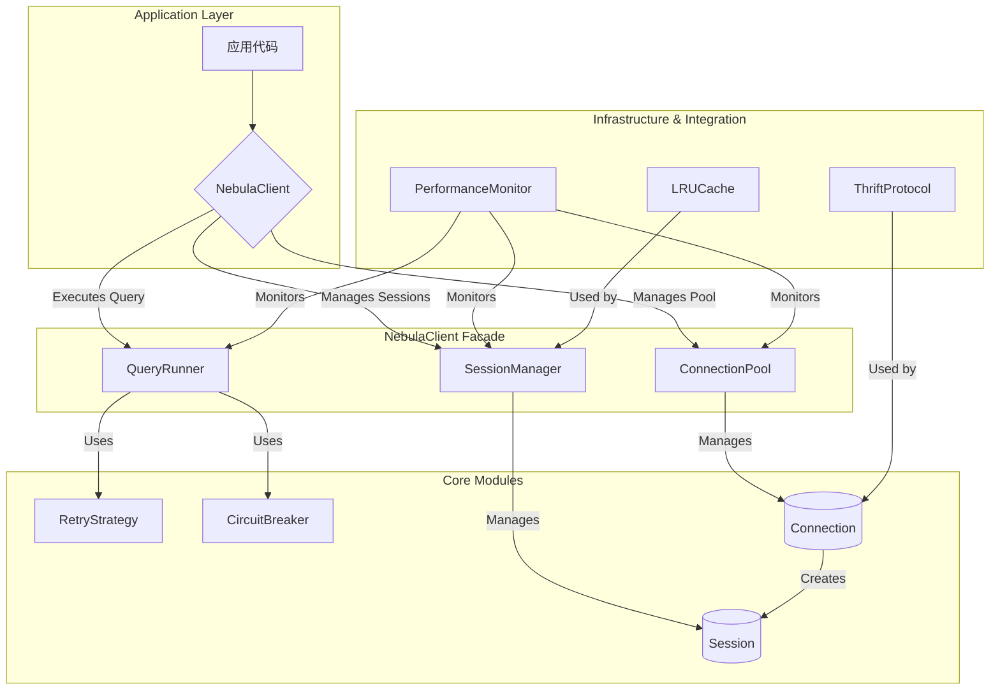

好的，经过对`nebula-nodejs`模块的深入分析以及对项目现有基础设施的了解，我已经准备好了一份详细的分析报告和重构方案。

这确实是一个比较复杂的任务，我将按照之前创建的待办事项清单，一步步地进行。首先，我将向您呈报我的分析结果和设计方案，以确保我的理解和计划符合您的预期。

### `nebula-nodejs` 客户端缺陷分析与重构方案

#### 1. `nebula-nodejs` 核心缺陷分析

在分析了`nebula-nodejs`的源代码、相关文档和测试用例后，我识别出以下几个核心设计缺陷，这些缺陷严重影响了客户端的稳定性、性能和可维护性：

*   **致命的会话管理问题**:
    *   **会话泄露**: 这是最严重的问题。`Connection.js`中的`close`方法只有在连接`isReady`时才会尝试登出(`signout`)会话。在网络不稳定或连接异常关闭时，这会导致服务器端的会g话无法释放，最终耗尽服务器资源并导致服务拒绝。
    *   **无效的重连机制**: 自动重连会创建新的会话，但并不会清理旧的、已失效的会话，加剧了会话泄露问题。
    *   **僵尸会话监控**: `Client.js`中引入的`startSessionMonitor`机制是一种“事后补救”措施，它试图被动地清理僵尸会话，但无法从根本上阻止其产生，且增加了系统的复杂性。

*   **架构设计陈旧且耦合度高**:
    *   **职责混淆**: `Connection.js`承担了连接管理、会话管理、认证、心跳和命令执行等多种职责，违反了单一职责原则，导致代码难以理解和维护。
    *   **紧密耦合**: `Client.js`作为连接池，直接管理`Connection`实例的生命周期，两者紧密耦合。这种设计使得引入更高级的连接池策略（如动态调整池大小、健康检查）或替换会话管理策略变得异常困难。
    *   **缺乏扩展性**: 整个模块缺乏清晰的抽象和接口定义，难以进行功能扩展，例如集成断路器、请求重试策略等高级功能。

*   **资源管理和性能效率低下**:
    *   **简陋的连接池**: 连接池从可用连接中随机选择一个执行命令，未考虑连接的健康状况、延迟或负载，在高并发场景下性能不佳。
    *   **低效的心跳检测**: 为每个连接实例都创建一个`setInterval`定时器来执行`ping`操作，当连接池规模较大时，会造成不必要的资源开销和定时器管理混乱。

*   **异步流程和状态管理混乱**:
    *   **状态不一致风险**: `isReady`和`isBusy`这两个状态完全由手动管理，在复杂的异步流程中极易出现状态不一致的问题，导致连接“假死”或请求处理异常。
    *   **过时的异步处理**: 代码依赖于老旧的`async_hooks`来传递异步上下文，这不仅增加了复杂性，还可能存在版本兼容性问题。

#### 2. 重新设计 `Nebula` 客户端架构

为了彻底解决上述问题并构建一个现代化、高可用的Nebula客户端，我设计了一套全新的、分层解耦的架构。

#### 3. 新架构组件职责说明

新的客户端将由以下几个核心模块组成：

*   **`NebulaClient` (客户端入口)**:
    *   作为整个客户端的统一入口（Facade），为应用层提供简洁的`execute()` API。
    *   协调`QueryRunner`、`ConnectionPool`和`SessionManager`来完成查询任务。
    *   负责初始化和配置所有底层模块。

*   **`ConnectionPool` (连接池)**:
    *   **职责**: 专门负责管理底层的Thrift TCP连接。维护一个健康、可用的连接队列。
    *   **功能**:
        *   实现连接的创建、销毁和复用。
        *   对连接进行定期的健康检查（替换原有的`ping`机制）。
        *   支持动态调整连接池大小（最小/最大连接数）。
        *   集成`PerformanceMonitor`，上报连接池状态指标（如活动连接数、空闲连接数）。

*   **`SessionManager` (会话管理器)**:
    *   **职责**: 彻底将会话管理与连接管理解耦。负责会话的生命周期，包括获取、释放和续期。
    *   **功能**:
        *   实现一个**会话池**，与连接池解耦。
        *   当执行查询时，从池中获取一个有效会话。如果会话无效，则负责重新创建。
        *   实现健壮的会ip话释放逻辑(`signout`)，确保无论连接状态如何都能被调用。
        *   (可选) 利用项目现有的`LRUCache`缓存`space`和会话的映射关系，避免频繁执行`USE SPACE`。
        *   集成`PerformanceMonitor`，上报会话相关的指标（如会话命中率、创建/销毁次数）。

*   **`QueryRunner` (查询执行器)**:
    *   **职责**: 封装单次查询的完整执行逻辑。
    *   **功能**:
        *   从`ConnectionPool`获取一个健康连接。
        *   从`SessionManager`获取一个有效会话。
        *   执行查询，并处理返回结果或异常。
        *   集成**重试策略 (`RetryStrategy`)** 和 **断路器 (`CircuitBreaker`)** 模块，以处理临时性故障，提高系统韧性。
        *   集成`PerformanceMonitor`，记录每次查询的执行时间、成功率等关键指标。

*   **`Connection` & `Session` (实体对象)**:
    *   `Connection`: 一个轻量级的对象，仅封装底层的Thrift连接，并维护其状态（如`connected`, `lastHeartbeat`）。
    *   `Session`: 封装会话ID (`sessionId`) 及其状态（如`active`, `createdAt`, `lastUsedAt`）。

#### 4. 与现有基础设施的集成方案

新客户端将深度集成项目已有的`monitoring`和`cache`模块，而不是重复造轮子。

*   **监控 (`PerformanceMonitor`)**:
    *   `ConnectionPool`将上报：活动连接数、空闲连接数、等待队列长度、连接创建/销毁次数。
    *   `SessionManager`将上报：会话命中率、会话创建/销毁次数、僵尸会话清理次数。
    *   `QueryRunner`将上报：查询QPS、平均延迟、错误率、重试次数、断路器状态（开启/关闭）。
    *   这将使我们能够在一个统一的监控面板中观察到数据库客户端的全部健康状况。

*   **缓存 (`LRUCache`)**:
    *   `SessionManager`可以利用`LRUCache`来缓存`space`与`sessionId`的映射。当应用需要切换`space`时，可以先在缓存中查找可复用的会话，从而减少与Nebula服务器的交互，提高性能。
