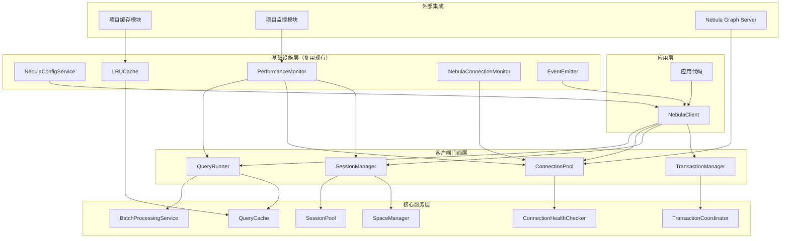

# Nebula Graph Node.js 客户端重新实现设计文档

## 概述

本文档描述了新一代Nebula Graph Node.js客户端的详细设计方案。新客户端采用分层解耦的架构设计，解决了现有实现中的会话泄露、连接池管理不当、架构陈旧等核心问题，并提供了更好的性能、可维护性和扩展性。

**设计原则**:
- 复用现有基础设施组件，避免重复开发
- 移除为适配旧客户端而创建的额外抽象层
- 直接集成项目现有的配置、缓存、监控和批处理模块
- 确保与sqlite和项目管理模块的兼容性

## 现有组件分析与复用策略

### 1. 可复用的现有组件

#### 配置服务组件
- **NebulaConfigService**: 已存在完善的配置管理，支持环境变量和配置验证
- **GraphConfigService**: 提供容错配置选项
- **GraphCacheConfigService**: 提供缓存配置管理

#### 批处理组件
- **BatchProcessingService**: 提供统一的批处理框架
- **NebulaBatchStrategy**: 针对Nebula图数据库的批处理策略
- **性能优化机制**: 自适应批大小调整和内存管理

#### 监控组件
- **NebulaConnectionMonitor**: 现有的连接监控机制
- **PerformanceMonitor**: 通用性能监控服务
- **事件系统**: 基于EventEmitter的事件通知机制

#### 缓存组件
- **LRUCache**: 项目现有的LRU缓存实现
- **GraphMappingCache**: 图相关的缓存服务

### 2. 需要移除的抽象层和具体文件

#### 需要移除的抽象层
- 过度复杂的连接管理抽象
- 为适配旧客户端而创建的中间层
- 不必要的接口隔离

#### 需要修改的具体文件
- **src/database/nebula/NebulaConnectionManager.ts**
  - 移除复杂的连接状态管理逻辑
  - 移除手动会话管理代码
  - 移除过度的事件处理抽象
  - 保留基本的配置管理接口

- **src/database/nebula/query/NebulaQueryService.ts**
  - 移除复杂的查询预处理逻辑
  - 移除重复的错误处理代码
  - 简化参数插值逻辑
  - 保留基本的查询执行接口

- **src/database/nebula/NebulaTypes.ts**
  - 移除不必要的类型定义
  - 简化配置接口
  - 保留核心数据类型

### 3. 需要重新实现的核心组件

#### 连接池管理 (解决会话泄露和连接管理问题)
- **新文件**: src/database/nebula/connection/ConnectionPool.ts
- **新文件**: src/database/nebula/connection/Connection.ts
- **新文件**: src/database/nebula/connection/ConnectionHealthChecker.ts
- **目标**: 替换NebulaConnectionManager中的连接管理逻辑

#### 会话管理 (实现正确的会话生命周期管理)
- **新文件**: src/database/nebula/session/SessionManager.ts
- **新文件**: src/database/nebula/session/Session.ts
- **新文件**: src/database/nebula/session/SessionPool.ts
- **目标**: 独立的会话管理，与连接管理解耦

#### 查询执行器 (集成批处理和缓存机制)
- **新文件**: src/database/nebula/query/QueryRunner.ts
- **新文件**: src/database/nebula/query/QueryCache.ts
- **修改文件**: src/database/nebula/query/NebulaQueryService.ts (重构为使用新QueryRunner)
- **目标**: 集成现有批处理服务和缓存机制

## 架构设计

### 整体架构



## 组件设计

### 1. NebulaClient (客户端门面)

**职责**: 作为整个客户端的统一入口，集成现有配置和监控服务

**核心接口**:
```typescript
interface INebulaClient {
  // 连接管理
  connect(): Promise<void>;
  disconnect(): Promise<void>;
  isConnected(): boolean;
  
  // 查询执行
  execute(query: string, params?: Record<string, any>): Promise<NebulaQueryResult>;
  executeBatch(queries: QueryBatch[]): Promise<NebulaQueryResult[]>;
  
  // 事务管理
  beginTransaction(): Promise<ITransaction>;
  
  // 配置管理（复用现有服务）
  updateConfig(config: Partial<NebulaConfig>): void;
  getConfig(): NebulaConfig;
  
  // 事件订阅（复用现有EventEmitter）
  on(event: string, listener: Function): void;
  off(event: string, listener: Function): void;
}
```

**设计要点**:
- 直接集成现有的NebulaConfigService
- 复用PerformanceMonitor进行性能监控
- 使用现有的EventEmitter进行事件管理
- 移除不必要的配置抽象层

### 2. ConnectionPool (连接池)

**职责**: 管理底层TCP连接，解决现有连接管理问题

**核心接口**:
```typescript
interface IConnectionPool {
  // 连接池管理
  initialize(config: ConnectionConfig): Promise<void>;
  getConnection(): Promise<IConnection>;
  releaseConnection(connection: IConnection): void;
  close(): Promise<void>;
  
  // 健康检查（集成现有监控）
  startHealthCheck(): void;
  stopHealthCheck(): void;
  
  // 状态监控（复用现有监控服务）
  getPoolStats(): ConnectionPoolStats;
}
```

**设计要点**:
- 集成现有的NebulaConnectionMonitor进行连接监控
- 复用PerformanceMonitor记录连接池指标
- 解决现有实现中的会话泄露问题
- 实现正确的连接生命周期管理

### 3. SessionManager (会话管理器)

**职责**: 管理会话生命周期，与连接管理解耦

**核心接口**:
```typescript
interface ISessionManager {
  // 会话管理
  getSession(spaceName?: string): Promise<ISession>;
  releaseSession(session: ISession): void;
  invalidateSession(sessionId: string): void;
  
  // 会话池管理
  startSessionCleanup(): void;
  stopSessionCleanup(): void;
  
  // 空间管理（复用现有配置）
  switchSpace(session: ISession, spaceName: string): Promise<void>;
  
  // 状态监控
  getSessionStats(): SessionStats;
}
```

**设计要点**:
- 复用现有的LRUCache缓存space与session的映射
- 集成NebulaConfigService的空间配置管理
- 解决会话泄露问题，确保资源正确释放
- 支持会话级别的空间切换

### 4. QueryRunner (查询执行器)

**职责**: 封装单次查询的完整执行逻辑，集成批处理服务

**核心接口**:
```typescript
interface IQueryRunner {
  // 查询执行
  execute(query: string, params?: Record<string, any>, options?: QueryOptions): Promise<NebulaQueryResult>;
  executeBatch(queries: QueryBatch[]): Promise<NebulaQueryResult[]>;
  
  // 查询缓存（复用现有缓存）
  getCachedResult(queryKey: string): Promise<NebulaQueryResult | null>;
  setCachedResult(queryKey: string, result: NebulaQueryResult): Promise<void>;
  
  // 性能监控（复用现有监控）
  recordQueryMetrics(query: string, duration: number, success: boolean): void;
}
```

**设计要点**:
- 集成现有的BatchProcessingService进行批处理优化
- 复用NebulaBatchStrategy的批处理策略
- 使用现有的LRUCache实现查询结果缓存
- 集成PerformanceMonitor进行查询性能监控

### 5. TransactionManager (事务管理器)

**职责**: 管理事务生命周期，确保数据一致性

**核心接口**:
```typescript
interface ITransactionManager {
  // 事务管理
  beginTransaction(): Promise<ITransaction>;
  commitTransaction(transaction: ITransaction): Promise<void>;
  rollbackTransaction(transaction: ITransaction): Promise<void>;
  
  // 事务监控
  getActiveTransactions(): ITransaction[];
  cleanupExpiredTransactions(): void;
}
```

**设计要点**:
- 集成批处理服务进行事务优化
- 支持事务分割策略（复用NebulaBatchStrategy）
- 使用现有监控服务记录事务指标

## 与现有基础设施的集成

### 1. 配置管理集成

```typescript
// 直接使用现有的NebulaConfigService
import { NebulaConfigService } from '../../../config/service/NebulaConfigService';

class NebulaClient implements INebulaClient {
  constructor(
    @inject(TYPES.NebulaConfigService) private configService: NebulaConfigService,
    // 其他依赖...
  ) {
    // 直接使用现有配置服务，无需额外抽象
  }
  
  getConfig(): NebulaConfig {
    return this.configService.loadConfig();
  }
}
```

### 2. 批处理服务集成

```typescript
// 集成现有的BatchProcessingService
import { BatchProcessingService } from '../../../infrastructure/batching/BatchProcessingService';
import { NebulaBatchStrategy } from '../../../infrastructure/batching/strategies/NebulaBatchStrategy';

class QueryRunner implements IQueryRunner {
  constructor(
    @inject(TYPES.BatchProcessingService) private batchService: BatchProcessingService,
    @inject(TYPES.NebulaBatchStrategy) private batchStrategy: NebulaBatchStrategy
  ) {}
  
  async executeBatch(queries: QueryBatch[]): Promise<NebulaQueryResult[]> {
    return this.batchService.processDatabaseBatch(
      queries,
      DatabaseType.NEBULA,
      {
        batchSize: this.batchStrategy.calculateOptimalBatchSize(queries.length),
        operationType: 'mixed'
      }
    );
  }
}
```

### 3. 监控服务集成

```typescript
// 集成现有的PerformanceMonitor
import { PerformanceMonitor } from '../../../infrastructure/monitoring/PerformanceMonitor';

class NebulaMetrics {
  constructor(private monitor: PerformanceMonitor) {}
  
  recordQueryDuration(query: string, duration: number): void {
    this.monitor.recordOperation('nebula_query_duration', duration, {
      query_type: this.getQueryType(query)
    });
  }
}
```

### 4. 缓存服务集成

```typescript
// 使用项目现有的LRUCache
import { LRUCache } from '../../../utils/cache/LRUCache';

class QueryCache implements IQueryCache {
  private cache: LRUCache<string, NebulaQueryResult>;
  
  constructor(config: CacheConfig) {
    this.cache = new LRUCache({
      maxSize: config.maxSize,
      ttl: config.ttl
    });
  }
}
```

## 测试策略

### 1. 单元测试

- 每个组件都有独立的单元测试
- 使用模拟对象隔离外部依赖
- 测试覆盖率不低于90%
- 包含正常流程和异常流程的测试

### 2. 集成测试

- 测试组件间的协作
- **使用真实的Nebula Graph测试环境**
- 测试连接池、会话池的并发场景
- 测试故障恢复和容错机制

### 3. 性能测试

- 连接池性能测试
- 查询执行性能测试
- 内存使用监控
- 并发压力测试

### 4. 端到端测试

- **完整业务流程测试，确保与sqlite和项目管理模块适配**
- 多服务器集群测试
- 故障转移测试
- 长时间稳定性测试

### 5. 数据库操作测试

```typescript
// 实际使用nebula数据库执行操作的测试示例
describe('NebulaClient Integration Tests', () => {
  let client: NebulaClient;
  let testSpace: string;
  
  beforeAll(async () => {
    client = new NebulaClient();
    await client.connect();
    testSpace = `test_space_${Date.now()}`;
  });
  
  afterAll(async () => {
    // 清理测试数据
    await client.execute(`DROP SPACE IF EXISTS ${testSpace}`);
    await client.disconnect();
  });
  
  it('should create and use space', async () => {
    await client.execute(`CREATE SPACE IF NOT EXISTS ${testSpace} (partition_num=10, replica_factor=1)`);
    await client.execute(`USE ${testSpace}`);
    
    // 创建标签
    await client.execute(`CREATE TAG IF NOT EXISTS person(name string, age int)`);
    
    // 插入数据
    await client.execute(`INSERT VERTEX person(name, age) VALUES "test1":("Alice", 30)`);
    
    // 查询数据
    const result = await client.execute(`MATCH (v:person) RETURN v.name, v.age LIMIT 1`);
    
    expect(result.data).toHaveLength(1);
    expect(result.data[0]).toEqual({
      'v.name': 'Alice',
      'v.age': 30
    });
  });
  
  it('should work with project management module', async () => {
    // 测试与项目管理模块的集成
    const projectId = 'test_project_001';
    const projectSpace = client.getConfig().getSpaceNameForProject(projectId);
    
    await client.execute(`USE ${projectSpace}`);
    
    // 执行项目相关的图操作
    const result = await client.execute(`
      INSERT VERTEX file(name, path) VALUES "file1":("test.js", "/src/test.js")
    `);
    
    expect(result.error).toBeUndefined();
  });
});
```

## 实施计划

### 阶段一：核心框架重构 (1-2周)
1. **移除现有NebulaConnectionManager和NebulaQueryService中的问题代码**
2. **实现新的ConnectionPool，解决会话泄露问题**
3. **实现SessionManager，集成现有配置服务**
4. **实现基础的QueryRunner，集成批处理服务**

### 阶段二：高级功能集成 (2-3周)
1. **集成现有的BatchProcessingService和NebulaBatchStrategy**
2. **实现TransactionManager，支持事务分割**
3. **集成现有的LRUCache和PerformanceMonitor**
4. **实现错误处理和重试机制**

### 阶段三：性能优化和测试 (1-2周)
1. **性能测试和调优**
2. **集成测试，特别是与sqlite和项目管理模块的适配测试**
3. **实际nebula数据库操作测试**
4. **内存使用优化和监控**

### 阶段四：部署和迁移 (1周)
1. **迁移现有代码到新实现**
2. **文档更新和代码审查**
3. **部署验证和监控设置**
4. **旧代码清理和重构**

## 迁移策略

### 1. 向后兼容性

- 保持现有API接口不变
- 逐步迁移内部实现
- 提供迁移指南和工具

### 2. 渐进式替换

```typescript
// 阶段1：保持现有接口，内部使用新实现
@injectable()
export class NebulaConnectionManager implements INebulaConnectionManager {
  private newClient: NebulaClient;
  
  constructor(/* 现有依赖 */) {
    // 初始化新的客户端实现
    this.newClient = new NebulaClient(/* 配置 */);
  }
  
  async executeQuery(nGQL: string, parameters?: Record<string, any>): Promise<NebulaQueryResult> {
    // 委托给新实现
    return this.newClient.execute(nGQL, parameters);
  }
  
  // 其他方法类似...
}
```

### 3. 测试验证

- 确保所有现有测试通过
- 添加新功能的测试
- 性能基准测试

## 总结

本设计方案充分利用了项目现有的基础设施，通过复用配置服务、批处理服务、监控服务和缓存服务，避免了重复开发。同时，新设计解决了现有实现中的核心问题，特别是会话泄露和连接池管理问题。通过与现有组件的深度集成，确保了与sqlite和项目管理模块的兼容性，为项目的长期发展奠定了坚实的基础。