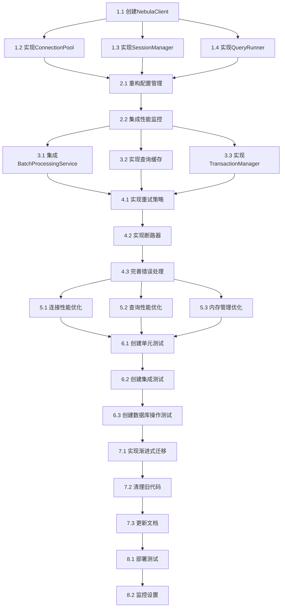

# Nebula Graph Node.js 客户端重新实施计划

## 概述

本文档将Nebula Graph Node.js客户端重新实现的设计转化为具体的、可执行的任务清单。所有任务都专注于代码实现、修改和测试，按照逻辑顺序组织，确保每个步骤都建立在前一步的基础上。

## 实施任务清单

### 阶段一：核心框架重构 (1-2周)

#### 1. 清理现有代码和创建新架构基础
- [ ] 1.1 清理现有NebulaConnectionManager.ts
  - 移除复杂的连接状态管理逻辑 (第803-1033行)
  - 移除手动会话管理代码 (第964-1033行)
  - 移除过度的事件处理抽象 (第391行的事件监听逻辑)
  - 保留基本的配置管理接口 (第776-786行)
  - *参考需求*: 移除不必要的抽象层

- [ ] 1.2 清理现有NebulaQueryService.ts
  - 移除复杂的查询预处理逻辑 (第74-80行的格式化逻辑)
  - 移除重复的错误处理代码 (第144-172行和第245-274行)
  - 简化参数插值逻辑 (第277-291行)
  - 保留基本的查询执行接口 (第70-173行)
  - *参考需求*: 移除不必要的抽象层

- [ ] 1.3 清理现有NebulaTypes.ts
  - 移除不必要的类型定义
  - 简化配置接口
  - 保留核心数据类型
  - *参考需求*: 移除不必要的抽象层

- [ ] 1.4 创建新的NebulaClient门面类
  - 新文件: src/database/nebula/client/NebulaClient.ts
  - 实现基础的INebulaClient接口
  - 集成现有的NebulaConfigService
  - 集成现有的PerformanceMonitor
  - 实现基础的连接管理方法
  - *参考需求*: 核心连接管理 (需求1.1-1.6)

- [ ] 1.5 实现新的ConnectionPool连接池
  - 新文件: src/database/nebula/connection/ConnectionPool.ts
  - 新文件: src/database/nebula/connection/Connection.ts
  - 新文件: src/database/nebula/connection/ConnectionHealthChecker.ts
  - 创建IConnectionPool接口和实现类
  - 解决现有会话泄露问题
  - 实现连接健康检查机制
  - 集成现有的NebulaConnectionMonitor
  - 实现连接生命周期管理
  - *参考需求*: 核心连接管理 (需求1.3-1.4)

- [ ] 1.6 实现SessionManager会话管理器
  - 新文件: src/database/nebula/session/SessionManager.ts
  - 新文件: src/database/nebula/session/Session.ts
  - 新文件: src/database/nebula/session/SessionPool.ts
  - 创建ISessionManager接口和实现类
  - 实现会话池管理
  - 集成现有的LRUCache缓存space-session映射
  - 实现会话清理和生命周期管理
  - 支持会话级别的空间切换
  - *参考需求*: 会话管理 (需求2.1-2.6)

- [ ] 1.7 实现基础QueryRunner查询执行器
  - 新文件: src/database/nebula/query/QueryRunner.ts
  - 新文件: src/database/nebula/query/QueryCache.ts
  - 创建IQueryRunner接口和实现类
  - 实现基础的查询执行逻辑
  - 集成参数化查询支持
  - 实现基础的错误处理
  - *参考需求*: 查询执行 (需求3.1-3.4)

#### 2. 集成现有配置和监控服务
- [ ] 2.1 重构配置管理集成
  - 修改文件: src/database/nebula/NebulaConnectionManager.ts
  - 移除重复的配置逻辑 (第59-61行的配置加载)
  - 直接使用现有的NebulaConfigService (第28-33行的依赖注入)
  - 集成GraphConfigService的容错配置
  - 实现配置热更新支持
  - *参考需求*: 配置管理 (需求7.1-7.6)

- [ ] 2.2 集成性能监控服务
  - 修改文件: src/database/nebula/connection/ConnectionPool.ts
  - 修改文件: src/database/nebula/session/SessionManager.ts
  - 修改文件: src/database/nebula/query/QueryRunner.ts
  - 集成现有的PerformanceMonitor
  - 实现连接池状态监控
  - 实现会话池状态监控
  - 实现查询性能监控
  - *参考需求*: 监控和诊断 (需求6.1-6.6)

### 阶段二：高级功能集成 (2-3周)

#### 3. 集成批处理和缓存服务
- [ ] 3.1 集成BatchProcessingService
  - 在QueryRunner中集成现有的BatchProcessingService
  - 使用NebulaBatchStrategy进行批处理优化
  - 实现批量查询执行
  - 实现自适应批大小调整
  - *参考需求*: 查询执行 (需求3.5-3.6)

- [ ] 3.2 实现查询结果缓存
  - 集成现有的LRUCache
  - 实现查询结果缓存机制
  - 集成GraphCacheConfigService的缓存配置
  - 实现缓存失效和更新策略
  - *参考需求*: 查询执行 (需求3.5)

#### 4. 实现错误处理和容错机制
- [ ] 4.1 实现重试策略
  - 创建IRetryStrategy接口和ExponentialBackoffRetryStrategy实现
  - 集成BatchProcessingService的重试机制
  - 实现智能重试逻辑
  - *参考需求*: 错误处理和容错 (需求5.3)

- [ ] 4.2 实现断路器模式
  - 创建ICircuitBreaker接口和实现类
  - 集成到QueryRunner中
  - 实现断路器状态管理
  - *参考需求*: 错误处理和容错 (需求5.1)

- [ ] 4.3 完善错误处理机制
  - 实现详细的错误分类和错误码
  - 集成现有的ErrorHandlerService
  - 实现错误恢复机制
  - 支持自定义错误处理策略
  - *参考需求*: 错误处理和容错 (需求5.2, 5.4-5.6)

### 阶段三：性能优化和测试 (1-2周)

#### 5. 性能优化实现
- [ ] 5.1 实现连接性能优化
  - 实现连接预热机制
  - 优化连接复用策略
  - 实现智能负载均衡
  - *参考需求*: 性能优化重点 (连接性能优化)

- [ ] 5.2 实现查询性能优化
  - 优化序列化和反序列化性能
  - 实现查询管道化
  - 支持并行查询执行
  - *参考需求*: 性能优化重点 (查询性能优化)

- [ ] 5.3 实现内存管理优化
  - 实现对象池模式
  - 优化大结果集的内存使用
  - 实现智能缓存淘汰策略
  - 集成内存监控
  - *参考需求*: 性能优化重点 (内存管理优化)

#### 6. 测试实现
- [ ] 6.1 创建单元测试
  - 为NebulaClient创建单元测试
  - 为ConnectionPool创建单元测试
  - 为SessionManager创建单元测试
  - 为QueryRunner创建单元测试
  - 为TransactionManager创建单元测试
  - 确保测试覆盖率达到90%以上

- [ ] 6.2 创建集成测试
  - 测试组件间的协作
  - 测试与现有配置服务的集成
  - 测试与批处理服务的集成
  - 测试与监控服务的集成
  - 测试与缓存服务的集成

- [ ] 6.3 创建实际数据库操作测试
  - 创建使用真实Nebula Graph数据库的测试
  - 测试空间创建和切换
  - 测试数据插入、查询、更新、删除
  - 测试事务操作
  - 测试与项目管理模块的适配
  - 测试与sqlite模块的兼容性

### 阶段四：部署和迁移 (1周)

#### 7. 代码迁移和清理
- [ ] 7.1 实现渐进式迁移
  - 修改文件: src/database/nebula/NebulaConnectionManager.ts
  - 在executeQuery方法中委托给新的QueryRunner (第717-758行)
  - 保持现有API接口不变
  - 修改文件: src/database/nebula/query/NebulaQueryService.ts
  - 在executeQuery方法中使用新的QueryRunner (第70-173行)
  - 确保向后兼容性

- [ ] 7.2 清理旧代码
  - 删除文件: src/database/nebula/NebulaConnectionManager.ts 中的旧实现 (保留接口)
  - 删除文件: src/database/nebula/query/NebulaQueryService.ts 中的重复逻辑
  - 更新文件: src/database/nebula/NebulaTypes.ts 简化类型定义
  - 更新文件: src/core/DIContainer.ts 中的依赖注入配置

- [ ] 7.3 更新文档和示例
  - 更新API文档
  - 创建迁移指南
  - 更新使用示例
  - 创建最佳实践指南

#### 8. 部署验证
- [ ] 8.1 部署测试
  - 在测试环境部署新实现
  - 运行完整的测试套件
  - 验证性能改进
  - 检查内存使用情况

- [ ] 8.2 监控设置
  - 配置性能监控
  - 设置告警规则
  - 验证日志记录
  - 测试故障恢复

## 任务依赖关系

## 风险评估和缓解策略

### 高风险任务
1. **1.2 实现ConnectionPool** - 核心组件，影响所有功能
   - 缓解策略：分阶段实现，先实现基础功能，再添加高级特性
   
2. **7.1 实现渐进式迁移** - 影响现有系统稳定性
   - 缓解策略：充分测试，保持向后兼容，准备回滚方案

### 中风险任务
1. **3.3 实现TransactionManager** - 事务逻辑复杂
   - 缓解策略：参考现有实现，充分测试各种场景
   
2. **6.3 创建数据库操作测试** - 需要真实环境
   - 缓解策略：使用Docker容器搭建测试环境，自动化测试流程

## 成功标准

### 功能标准
- [ ] 所有现有功能正常工作
- [ ] 解决会话泄露问题
- [ ] 解决连接池管理问题
- [ ] 与现有组件无缝集成
- [ ] 支持所有需求文档中的功能

### 性能标准
- [ ] 连接建立时间 < 1秒
- [ ] 查询执行延迟 < 100毫秒
- [ ] 内存使用稳定，无内存泄露
- [ ] 支持1000+并发连接

### 质量标准
- [ ] 单元测试覆盖率 ≥ 90%
- [ ] 所有集成测试通过
- [ ] 所有数据库操作测试通过
- [ ] 代码符合项目规范

## 交付物

### 代码交付物
- [ ] 新的Nebula Graph客户端实现
- [ ] 更新的依赖注入配置
- [ ] 迁移后的现有服务
- [ ] 完整的测试套件

### 文档交付物
- [ ] API文档
- [ ] 迁移指南
- [ ] 使用示例
- [ ] 最佳实践指南
- [ ] 故障排查指南

### 部署交付物
- [ ] 部署脚本
- [ ] 监控配置
- [ ] 告警规则
- [ ] 性能基准报告

## 总结

本实施计划将Nebula Graph Node.js客户端的重新实现分解为具体的、可执行的任务。通过充分利用现有基础设施，解决现有实现的核心问题，并确保与项目其他模块的兼容性，新实现将为项目提供更稳定、更高性能的图数据库支持。