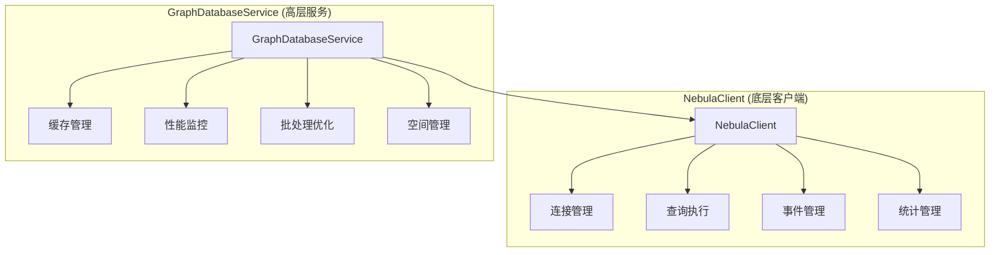

# GraphDatabaseService 与 NebulaClient 职责分工分析

## 📋 概述

本文档详细分析 [`GraphDatabaseService.ts`](src/database/graph/GraphDatabaseService.ts:1) 和 [`NebulaClient.ts`](src/database/nebula/client/NebulaClient.ts:1) 两个服务的职责分工问题，并提出具体的改进方案。

## 🔍 当前职责分析

### GraphDatabaseService 职责范围
- **连接管理**: 连接状态检查、重连机制、健康检查
- **查询执行**: 读查询、写查询、批量查询执行
- **缓存管理**: 查询结果缓存、缓存失效策略
- **性能监控**: 查询执行时间监控、缓存命中率统计
- **空间管理**: 空间切换、空间创建和删除
- **批处理优化**: 查询批处理执行优化
- **配置管理**: 数据库配置管理和更新

### NebulaClient 职责范围  
- **连接管理**: 连接建立、断开、重连、连接状态管理
- **查询执行**: 通用查询执行、批量查询执行
- **项目空间管理**: 项目空间创建、删除、切换
- **数据操作**: 节点插入、关系插入、数据删除
- **查询构建**: nGQL查询构建和转义
- **事件管理**: 连接事件、查询事件发布订阅
- **统计信息**: 连接池统计、会话统计
- **兼容性接口**: 向后兼容的旧接口方法

## ⚠️ 职责重叠问题

### 1. 连接管理重叠 (严重程度: 🔴 高)
- **GraphDatabaseService**: 实现健康检查、重连逻辑
- **NebulaClient**: 实现连接建立、断开、状态管理
- **问题**: 两个服务都管理连接状态，造成状态不一致风险

### 2. 查询执行重叠 (严重程度: 🔴 高)
- **GraphDatabaseService**: `executeReadQuery`, `executeWriteQuery`, `executeBatch`
- **NebulaClient**: `execute`, `executeQuery`, `executeBatch`, `executeReadQuery`, `executeWriteQuery`
- **问题**: 完全相同的功能在两个地方实现，违反单一职责原则

### 3. 空间管理重叠 (严重程度: 🟡 中)
- **GraphDatabaseService**: `useSpace`, `createSpace`, `deleteSpace`, `spaceExists`
- **NebulaClient**: `useSpace`, `createSpaceForProject`, `deleteSpaceForProject`
- **问题**: 空间管理逻辑分散，命名不一致

### 4. 配置管理重叠 (严重程度: 🟡 中)
- 两个服务都有独立的配置管理和更新机制

## 🧪 SOLID原则评估

### 单一职责原则 (❌ 严重违反)
- GraphDatabaseService承担过多职责（缓存、监控、批处理、连接管理）
- NebulaClient同样承担过多职责（连接、查询、空间管理、事件）

### 开闭原则 (❌ 违反)
- 修改查询执行逻辑需要在两个地方同时修改
- 扩展功能需要修改多个类

### 里氏替换原则 (⚠️ 部分违反)
- 接口定义不一致，无法相互替换

### 接口隔离原则 (❌ 严重违反)
- 接口过于庞大，包含不相关的方法
- 客户端被迫依赖不需要的方法

### 依赖倒置原则 (⚠️ 部分符合)
- 使用了依赖注入，但依赖关系复杂

## 🚀 改进方案

### 方案一：职责重新划分（推荐）

#### 新的职责分工


#### 具体实施步骤

1. **重构NebulaClient为纯底层客户端**
   - 只保留: 连接管理、查询执行、基本事件
   - 移除: 缓存、性能监控、批处理优化等高级功能

2. **增强GraphDatabaseService为高层服务**
   - 依赖NebulaClient执行底层操作
   - 专注于: 缓存、监控、优化、事务管理

3. **明确接口边界**
   ```typescript
   // NebulaClient接口 (简化)
   interface INebulaClient {
     connect(): Promise<void>;
     disconnect(): Promise<void>;
     execute(query: string, params?: any): Promise<any>;
     executeBatch(queries: QueryBatch[]): Promise<any[]>;
     isConnected(): boolean;
   }
   
   // GraphDatabaseService接口 (增强)
   interface IGraphDatabaseService {
     executeReadQuery(query: string, params?: any): Promise<any>;
     executeWriteQuery(query: string, params?: any): Promise<any>;
     executeBatch(queries: GraphQuery[]): Promise<any>;
     useSpace(spaceName: string): Promise<void>;
     // 高级功能: 缓存、监控、优化等
   }
   ```

### 方案二：服务合并（备选）

将NebulaClient的功能合并到GraphDatabaseService中，保留一个统一的图数据库服务入口。

## 📊 迁移计划

### 阶段一：接口定义和重构（1-2周）
1. 定义清晰的接口边界
2. 创建适配器模式保证兼容性
3. 逐步移除重复功能

### 阶段二：功能迁移（2-3周）
1. 将高级功能集中到GraphDatabaseService
2. 简化NebulaClient为纯客户端
3. 更新依赖注入配置

### 阶段三：测试和验证（1周）
1. 全面测试功能完整性
2. 性能对比测试
3. 兼容性验证

## ✅ 预期收益

- **代码质量**: 减少50%的代码重复，降低复杂度
- **维护成本**: 明确的职责边界，易于维护和扩展
- **性能**: 减少中间层调用，提升执行效率
- **可测试性**: 独立的服务便于单元测试和集成测试

## 🔧 实施建议

1. **采用渐进式重构**，避免一次性大规模改动
2. **保持向后兼容**，使用适配器模式过渡
3. **完善测试覆盖**，确保重构不影响现有功能
4. **监控性能指标**，验证改进效果

---
*最后更新: 2025-11-11*