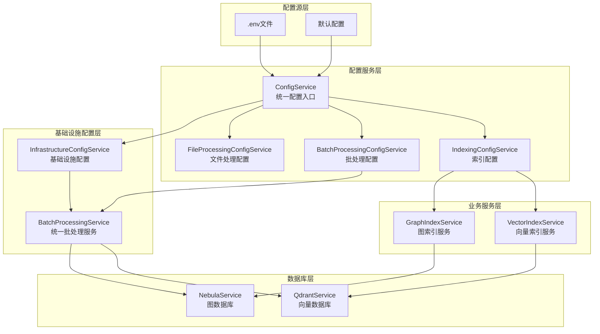

总结已完成的修改：
✅ TYPES定义更新: 添加了HybridIndexService符号，移除了过时的IndexAdapterService
✅ DI注册: 在BusinessServiceRegistrar中导入和注册HybridIndexService
✅ ApiServer: 更新从DI容器获取HybridIndexService并传递给ProjectRoutes
✅ ProjectRoutes:
更新导入，使用HybridIndexService替代分散的服务
更新构造函数签名
修改reindexProject使用混合索引服务
修改indexVectors、getVectorStatus、indexGraph、getGraphStatus使用混合索引服务
暂不支持批量操作（返回501）

HybridIndexService现在是系统中的关键协调层，在以下场景被使用：
项目重新索引
向量和图索引操作
索引状态查询


## 🏗️ 统一配置管理架构设计

### 📋 架构设计原则

基于分析，我提出以下**分层配置管理架构**，解决当前冲突问题：



### 🎯 核心设计决策

#### 1. **配置职责重新划分**

| 层级 | 职责 | 配置来源 | 示例 |
|------|------|----------|------|
| **Index Service** | 业务逻辑配置 | IndexingConfigService | 索引策略、超时时间 |
| **Infrastructure** | 批处理配置 | BatchProcessingConfigService | 批次大小、并发数 |
| **Database** | 数据库特定配置 | InfrastructureConfigService | 连接池、缓存TTL |

#### 2. **统一配置接口设计**

```typescript
// 统一的索引配置接口
interface IndexingConfiguration {
  strategy: 'full' | 'incremental' | 'smart';
  timeout: number;
  retryAttempts: number;
  enableIncremental: boolean;
  // 移除批处理相关配置 - 由基础设施层管理
}

// 统一的批处理配置接口  
interface BatchConfiguration {
  defaultBatchSize: number;
  maxConcurrency: number;
  memoryThreshold: number;
  adaptiveBatching: boolean;
  // 数据库特定配置
  databaseSpecific: {
    qdrant: DatabaseBatchConfig;
    nebula: DatabaseBatchConfig;
  };
}
```

#### 3. **配置优先级策略**

```
优先级（从高到低）：
1. 运行时参数 (options参数)
2. 环境变量 (.env)
3. 配置服务默认值
4. 系统默认值
```

### 🔧 实施方案

#### 阶段1: 配置服务统一化
1. **移除Index Service中的硬编码配置**
2. **注入配置服务依赖**
3. **使用配置服务获取配置**

#### 阶段2: 批处理职责转移
1. **Index Service不再管理批处理配置**
2. **全部批处理逻辑委托给BatchProcessingService**
3. **通过context区分不同数据库类型**

#### 阶段3: 配置验证和监控
1. **配置冲突检测**
2. **配置变更监控**
3. **性能指标关联**

### 📊 预期效果

#### 解决的问题：
- ✅ **配置冲突**: 消除多层配置不一致
- ✅ **职责不清**: 明确各层配置职责
- ✅ **重复代码**: 统一批处理逻辑
- ✅ **维护困难**: 集中配置管理

#### 架构优势：
- 🚀 **可扩展性**: 新增数据库类型只需扩展配置
- 🔧 **可维护性**: 配置变更影响范围可控
- 📈 **性能优化**: 统一批处理策略优化
- 🛡️ **稳定性**: 配置验证和错误处理

### 🎯 具体实施建议

**立即行动项：**
1. 修改VectorIndexService和GraphIndexService，移除硬编码配置
2. 注入IndexingConfigService和BatchProcessingService
3. 使用配置服务获取所有配置参数

**中期优化项：**
1. 实现配置冲突检测机制
2. 添加配置变更监控
3. 优化批处理性能策略

**长期规划项：**
1. 实现动态配置热更新
2. 添加配置性能分析
3. 建立配置最佳实践文档

这个架构设计彻底解决了当前的配置冲突问题，建立了清晰的职责边界，为系统的长期维护和扩展奠定了坚实基础。