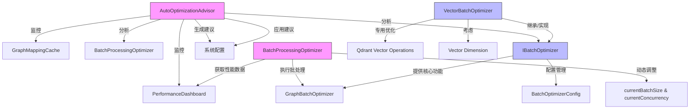

# Optimization Service Analysis

经过对 `src/service/optimization/` 目录下四个核心文件的代码分析，现将它们的作用及协作关系总结如下：

## 1. AutoOptimizationAdvisor (自动优化顾问)

**核心作用**:
- **系统级性能监控与分析**: 作为系统的“大脑”，`AutoOptimizationAdvisor` 负责持续监控整个应用的性能指标，包括缓存性能、批处理吞吐量、系统错误率和响应时间。
- **智能化优化建议生成**: 基于监控数据，它会主动分析性能瓶颈，并生成结构化的优化建议 (`OptimizationRecommendation`)。这些建议包含置信度、优先级和预期改进效果，为系统提供决策依据。
- **自动应用与反馈闭环**: 它不仅能生成建议，还可以根据配置自动应用这些建议（如调整缓存大小或批处理参数），并跟踪应用后的效果，形成一个完整的监控-分析-优化-反馈闭环。

**关键特性**:
- **多维度分析**: 分别分析缓存、批处理和系统整体性能。
- **定期运行**: 通过 `setInterval` 实现定期（默认5分钟）的性能分析。
- **依赖注入**: 依赖 `PerformanceDashboard` (获取指标)、`PerformanceMetricsCollector` (收集指标) 和 `GraphBatchOptimizer` (获取批处理统计)。

## 2. BatchOptimizerService (批处理优化器服务)

**核心作用**:
- **通用批处理逻辑的实现**: `BatchOptimizerService` 是一个实现了 `IBatchOptimizer` 接口的具体类，它提供了批处理操作的核心功能，如计算最优批处理大小、基于性能动态调整批大小、重试机制和资源监控。
- **配置中心**: 它持有一个可动态更新的 `BatchOptimizerConfig` 配置对象，管理着批处理操作的所有参数（如最大并发数、默认批大小、内存阈值等）。
- **跨数据库支持**: 其配置支持 `databaseSpecific` 字段，允许为不同类型的数据库（如 `NEBULA`, `QDRANT`）设置特定的批处理参数。

**关键特性**:
- **自适应批处理**: `calculateOptimalBatchSize` 方法根据项目总数动态计算批大小。
- **性能反馈调节**: `adjustBatchSizeBasedOnPerformance` 方法根据上一次执行时间来增加或减少批大小。
- **容错机制**: `shouldRetry` 方法提供了带指数退避的重试机制，确保操作的可靠性。
- **资源感知**: `hasSufficientResources` 方法检查内存使用情况，避免因资源不足导致系统崩溃。

## 3. BatchProcessingOptimizer (批处理性能优化器)

**核心作用**:
- **运行时参数的动态调优**: 与 `BatchOptimizerService` 作为通用工具不同，`BatchProcessingOptimizer` 更侧重于在运行时对批处理的**参数**（批大小和并发数）进行精细化、自动化的调整。
- **基于历史数据的学习**: 它通过 `performanceHistory` 数组记录每次批处理操作的性能指标（处理时间、吞吐量、成功率），并利用这些历史数据来分析和预测最优参数。
- **自动调优引擎**: 通过 `performAutoTuning` 方法，它会定期（默认1分钟）检查历史数据，并根据分析结果（如处理时间过长、成功率过低）自动调整 `currentBatchSize` 和 `currentConcurrency`。

**关键特性**:
- **自动调优循环**: `startAutoTuning` 启动一个定时任务，持续优化批处理参数。
- **策略驱动**: 支持不同的优化策略（吞吐量优先、延迟优先、平衡）。
- **与外部优化器协作**: 它不直接执行批处理，而是将计算出的最优参数传递给一个外部的 `GraphBatchOptimizer` 实例来执行。

## 4. VectorBatchOptimizer (向量批处理优化器)

**核心作用**:
- **领域特定的批处理优化**: `VectorBatchOptimizer` 是 `BatchOptimizerService` 的一个“特化”版本，专门针对**向量数据库操作**（特别是Qdrant）进行优化。
- **领域知识集成**: 它在通用批处理逻辑的基础上，融入了向量操作的特定知识。例如，其 `calculateOptimalVectorBatchSize` 方法会考虑向量的**维度**（dimension）来调整批大小（维度越高，批大小越小），这在处理高维向量时至关重要。
- **专用API**: 提供了 `optimizeVectorInsertions` 和 `optimizeVectorSearches` 等专用方法，为向量的插入和搜索操作提供开箱即用的优化方案。

**关键特性**:
- **向量感知**: 批大小的计算与向量维度和数量直接相关。
- **Qdrant 特化**: 在其配置中，为 `QDRANT` 数据库类型设置了专门的默认值（如更大的 `maxBatchSize`）。
- **接口一致性**: 与 `BatchOptimizerService` 一样，它也实现了 `IBatchOptimizer` 接口，保证了接口的一致性。

## 协作关系图

## 总结

- **`AutoOptimizationAdvisor`** 是**决策层**，负责宏观的性能分析和优化决策。
- **`BatchProcessingOptimizer`** 是**调优层**，负责在运行时微调批处理参数，它依赖于 `BatchOptimizerService` 提供的基础能力。
- **`BatchOptimizerService`** 和 **`VectorBatchOptimizer`** 是**执行层**的基础工具。
  - `BatchOptimizerService` 提供**通用**的批处理优化能力。
  - `VectorBatchOptimizer` 提供**领域特定**（向量操作）的批处理优化能力，是对通用服务的扩展和特化。

它们共同构成了一个从底层执行到上层决策的完整优化体系。