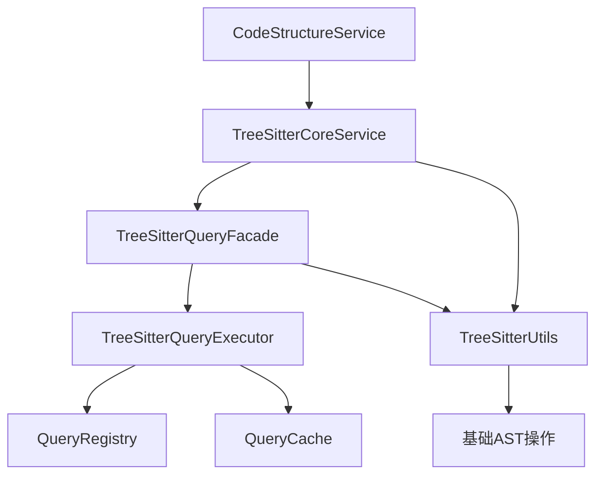
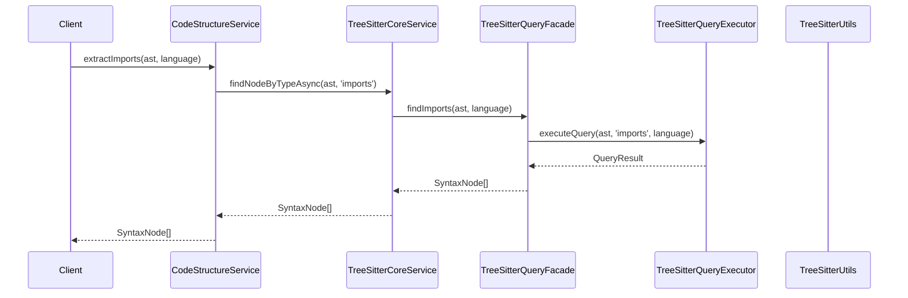
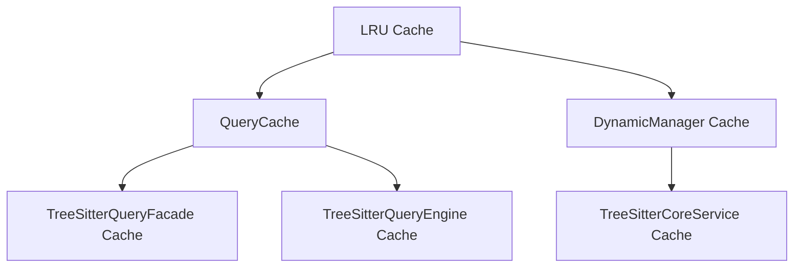

# TreeSitter 架构职责划分文档

## 概述

本文档详细说明了重构后的 TreeSitter 相关服务与工具类的职责划分，确保各组件职责清晰、功能互补，形成完整的代码解析架构。

## 架构组件概览



## 核心组件职责划分

### 1. CodeStructureService - 代码结构服务

**定位**: 专门负责代码结构提取的业务服务层
**职责**:
- 处理具体的业务逻辑实现
- 提供代码结构提取功能
- 与TreeSitterCoreService协作完成查询任务

**核心功能**:
```typescript
// 代码结构提取
- extractFunctions(ast, language): Promise<SyntaxNode[]>
- extractClasses(ast, language): Promise<SyntaxNode[]>
- extractImports(ast, language): Promise<SyntaxNode[]>
- extractExports(ast, language): Promise<SyntaxNode[]>
- extractMethods(ast, language): Promise<SyntaxNode[]>
- extractInterfaces(ast, language): Promise<SyntaxNode[]>
- extractTypes(ast, language): Promise<SyntaxNode[]>

// 同步与异步支持
- extractImportNodes(ast): SyntaxNode[]
- extractImportNodesAsync(ast): Promise<SyntaxNode[]>
```

**使用场景**:
- 需要提取具体代码结构的业务场景
- 与TreeSitterCoreService配合使用
- 生产环境中的代码分析任务

**设计原则**:
- 专注于具体的业务逻辑实现
- 与TreeSitterCoreService保持清晰的职责分离
- 提供一致的API接口
- 遵循单一职责原则

### 2. TreeSitterCoreService - 核心服务

**定位**: 统一的 TreeSitter 服务入口
**职责**:
- 协调各个查询组件
- 提供完整的服务接口
- 管理解析器生命周期
- 处理通用查询逻辑
- 提供基础工具方法

**核心功能**:
```typescript
// 解析功能
- parseCode(code, language): Promise<ParseResult>
- parseFile(filePath, code): Promise<ParseResult>
- detectLanguage(filePath): Promise<ParserLanguage>

// 通用查询功能（同步版本）
- findNodeByType(ast, type): SyntaxNode[]
- getNodeText(node, sourceCode): string
- getNodeLocation(node): LocationInfo
- getNodeName(node): string
- findNodesByTypes(ast, types): SyntaxNode[]

// 通用查询功能（异步版本）
- findNodeByTypeAsync(ast, type): Promise<SyntaxNode[]>
- queryTree(ast, queryPattern): QueryMatch[]

// 高级功能
- getQueryEngine(): TreeSitterQueryEngine
- getDynamicManager(): DynamicParserManager
```

**注意**:
- 具体的业务逻辑（如extractFunctions、extractClasses等）已移至CodeStructureService
- TreeSitterCoreService专注于通用处理逻辑和组件协调
- 与TreeSitterQueryFacade配合提供完整的查询能力

**设计原则**:
- 提供统一的服务接口
- 协调同步和异步操作
- 确保向后兼容性
- 遵循单一职责原则

### 2. TreeSitterQueryFacade - 查询门面

**定位**: 简化查询的统一接口
**职责**:
- 为 `TreeSitterQueryExecutor` 提供简单易用的查询 API
- 管理查询结果的缓存
- 作为 `TreeSitterCoreService` 与 `TreeSitterQueryExecutor` 之间的适配层
- 处理具体的代码结构查询

**核心功能**:
```typescript
// 主要查询接口
- findFunctions(ast, language): Promise<SyntaxNode[]>
- findClasses(ast, language): Promise<SyntaxNode[]>
- findImports(ast, language): Promise<SyntaxNode[]>
- findExports(ast, language): Promise<SyntaxNode[]>
- findMethods(ast, language): Promise<SyntaxNode[]>
- findInterfaces(ast, language): Promise<SyntaxNode[]>
- findTypes(ast, language): Promise<SyntaxNode[]>
- findProperties(ast, language): Promise<SyntaxNode[]>
- findVariables(ast, language): Promise<SyntaxNode[]>

// 批量查询
- findMultiple(ast, language, types): Promise<Map<string, SyntaxNode[]>>
- findAllMainStructures(ast, language): Promise<MainStructures>

// 详细查询
- executeQueryDetailed(ast, queryType, language): Promise<QueryResult>
- executeMultipleDetailed(ast, language, types): Promise<Map<string, QueryResult>>
```

**注意**:
- 该组件**不包含**智能回退逻辑。回退由 `TreeSitterCoreService` 统一协调。
- 其主要作用是封装和简化底层查询。
- 与 `CodeStructureService` 配合提供完整的业务逻辑实现。

**设计原则**:
- 提供一致的查询接口
- 专注于性能优化（缓存）
- 保持接口的简洁性
- 遵循单一职责原则

### 3. TreeSitterQueryExecutor - 查询执行器

**定位**: 底层查询执行单元
**职责**:
- 执行基于 Tree-sitter 的 S-expression 查询
- 管理预编译的查询对象和结果缓存
- 提供原始的查询结果
- 与TreeSitterQueryFacade配合提供查询能力

**核心功能**:
```typescript
// 查询执行
- executeQuery(ast, queryType, language): Promise<QueryResult>
- executeQueryWithPattern(ast, pattern, language): Promise<QueryResult>

// 模式管理
- registerPattern(queryType, pattern): void
- getPattern(queryType): QueryPattern
- hasPattern(queryType): boolean

// 性能优化
- clearCache(): void
- getPerformanceStats(): PerformanceStats
- warmupCache(ast, language): Promise<void>
```

**设计原则**:
- 保持功能的纯粹性（只负责执行）
- 提供高性能的查询执行
- 作为架构的底层基础组件
- 遵循单一职责原则

### 4. TreeSitterCoreService - 核心服务

**定位**: 统一的 TreeSitter 服务入口
**职责**:
- 协调各个查询组件
- 提供完整的服务接口
- 管理解析器生命周期
- 处理通用查询逻辑
- 提供基础工具方法

**核心功能**:
```typescript
// 解析功能
- parseCode(code, language): Promise<ParseResult>
- parseFile(filePath, code): Promise<ParseResult>
- detectLanguage(filePath): Promise<ParserLanguage>

// 通用查询功能（同步版本）
- findNodeByType(ast, type): SyntaxNode[]
- getNodeText(node, sourceCode): string
- getNodeLocation(node): LocationInfo
- getNodeName(node): string
- findNodesByTypes(ast, types): SyntaxNode[]

// 通用查询功能（异步版本）
- findNodeByTypeAsync(ast, type): Promise<SyntaxNode[]>
- queryTree(ast, queryPattern): QueryMatch[]

// 高级功能
- getQueryEngine(): TreeSitterQueryEngine
- getDynamicManager(): DynamicParserManager
```

**注意**:
- 具体的业务逻辑（如extractFunctions、extractClasses等）已移至CodeStructureService
- TreeSitterCoreService专注于通用处理逻辑和组件协调
- 与TreeSitterQueryFacade配合提供完整的查询能力

**设计原则**:
- 提供统一的服务接口
- 协调同步和异步操作
- 确保向后兼容性
- 遵循单一职责原则

## 调用关系和数据流

### 1. 正常查询流程



### 2. 回退机制流程

```mermaid
sequenceDiagram
    participant Client
    participant StructureService as CodeStructureService
    participant CoreService as TreeSitterCoreService
    participant Facade as TreeSitterQueryFacade
    participant Executor as TreeSitterQueryExecutor
    participant Utils as TreeSitterUtils

    Client->>StructureService: extractImports(ast, language)
    StructureService->>CoreService: findNodeByTypeAsync(ast, 'imports')
    CoreService->>Facade: findImports(ast, language)
    Facade->>Executor: executeQuery(ast, 'imports', language)
    Executor-->>Facade: Error
    // 回退逻辑由 CoreService 统一处理
    Utils-->>Facade: SyntaxNode[]
    Facade-->>CoreService: SyntaxNode[]
    CoreService-->>StructureService: SyntaxNode[]
    StructureService-->>Client: SyntaxNode[]
```

## 性能和缓存策略

### 1. 多层缓存架构



### 2. 缓存键策略

- **TreeSitterQueryFacade**: `simple:${astHash}:${queryType}:${language}`
- **TreeSitterQueryExecutor**: `engine:${astHash}:${queryType}:${language}`
- **TreeSitterCoreService**: `${astHash}:${type}`

## 错误处理和回退策略

### 1. 三层回退机制

1. **第一层**: TreeSitterQueryExecutor 执行查询
2. **第二层**: TreeSitterCoreService 协调回退
3. **第三层**: TreeSitterUtils 基础保障

### 2. 错误处理原则

- **优雅降级**: 查询失败时自动回退，不抛出异常
- **日志记录**: 记录回退原因，便于调试
- **性能监控**: 监控回退频率，优化查询系统
- **分层处理**: 不同层级负责不同类型的错误处理

## 使用指南

### 1. 何时使用各组件

**TreeSitterUtils**:
- 需要简单的节点操作
- 查询系统不可用时的回退
- 语言无关的基础功能

**TreeSitterQueryFacade**:
- 常见的代码结构查询
- 批量查询操作
- 需要通过 `TreeSitterCoreService` 获取回退保障

**TreeSitterQueryExecutor**:
- 复杂的查询模式
- 自定义查询规则
- 高性能查询需求

**TreeSitterCoreService**:
- 通用查询接口
- 组件协调和回退处理
- 基础解析功能

**CodeStructureService**:
- 具体的业务逻辑实现
- 代码结构提取需求
- 生产环境使用

### 2. 最佳实践

1. **优先使用高级接口**: 使用 TreeSitterQueryFacade 而非直接调用 TreeSitterUtils
2. **异步优先**: 在可能的情况下使用异步版本的方法
3. **错误处理**: 依赖内置的回退机制，无需手动处理错误
4. **性能优化**: 利用缓存机制，避免重复查询
5. **职责分离**: 使用CodeStructureService处理业务逻辑，TreeSitterCoreService处理通用功能
6. **架构一致性**: 遵循重构后的架构设计，保持组件间清晰的职责划分

## 未来扩展方向

### 1. 功能增强

- **业务服务扩展**: CodeStructureService 等业务服务的扩展
- **更多查询类型**: 支持更多编程语言的特定结构
- **智能缓存**: 基于使用频率的智能缓存策略
- **并行查询**: 支持并行执行多个查询

### 2. 性能优化

- **缓存策略**: 优化多层缓存架构，提升查询性能
- **增量解析**: 支持代码变更的增量解析
- **内存优化**: 优化大型文件的内存使用
- **查询优化**: 基于统计信息的查询优化

### 3. 架构演进

- **业务服务层**: CodeStructureService 等业务服务的进一步细化
- **插件系统**: 支持自定义查询插件
- **分布式查询**: 支持分布式查询处理
- **实时更新**: 支持代码变更的实时更新

## 总结

重构后的 TreeSitter 架构实现了清晰的职责划分：

- **TreeSitterUtils**: 基础工具，提供语言无关的 AST 操作
- **TreeSitterQueryFacade**: 查询门面，提供简化的查询接口
- **TreeSitterQueryExecutor**: 查询执行器，提供强大的查询能力
- **TreeSitterCoreService**: 统一服务，协调各组件并提供通用查询接口
- **CodeStructureService**: 业务服务，处理具体的代码结构提取逻辑

这种架构设计确保了系统的稳定性、可扩展性和易用性，为代码解析和搜索提供了坚实的基础。

## 模块导出

为了便于使用，所有相关组件都通过统一的入口导出：

```typescript
// 从 'src/service/parser/index.ts' 导出
export { TreeSitterCoreService } from './core/parse/TreeSitterCoreService';
export { CodeStructureService } from './core/structure/CodeStructureService';
export { TreeSitterQueryFacade, TreeSitterQueryEngine } from './core/query';
export { TreeSitterUtils, FallbackExtractor } from './utils';
export { LanguageDetector } from './core/language-detection';
export { languageExtensionMap } from './utils';
```