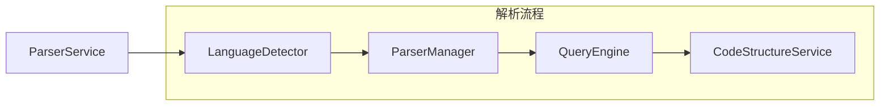

基于对 `structure` 和 `language-detection` 目录的分析，我完全同意您的观点。让我更新重构方案：

## 更新的架构重构方案

### 1. 目录重新组织分析

#### 1.1 structure 目录分析
**现状**：
- `CodeStructureService` 是 parse 后的串行处理步骤
- 依赖 `TreeSitterCoreService`，不存在依赖混乱
- 职责清晰：专门负责代码结构提取的业务逻辑

**结论**：**应该迁移到 parser 目录下**，作为解析流程的一部分。

#### 1.2 language-detection 目录分析
**现状**：
- `LanguageDetector` 是解析的前置步骤
- 为解析器提供语言识别功能
- 独立的检测服务，职责单一

**结论**：**应该迁移到 parser 目录下**，作为解析流程的起点。

### 2. 关于 parser 模块位置的重新思考

您提出的观点非常正确：**整个 parser 模块不应该作为 core 目录内的模块**。

**理由**：
1. **串行流程特性**：parser 模块的整体流程是串行的（语言检测 → 解析 → 结构提取），并非核心层
2. **业务逻辑属性**：parser 模块包含具体的业务逻辑，不符合 core 层的定位
3. **独立性**：parser 模块可以独立存在，不依赖其他 core 模块

### 3. 新的目录结构方案

```
src/service/parser/
├── ParserService.ts           # 统一的解析服务入口
├── detection/                 # 语言检测模块
│   ├── LanguageDetector.ts
│   └── index.ts
├── parsing/                   # 核心解析模块
│   ├── ParserManager.ts       # 原 DynamicParserManager
│   ├── QueryEngine.ts         # 原 TreeSitterQueryEngine
│   ├── QueryRegistry.ts
│   ├── CacheService.ts
│   └── types.ts
├── structure/                 # 结构提取模块
│   ├── CodeStructureService.ts
│   └── index.ts
├── constants/                 # 查询常量
│   └── queries/
└── types/                     # 统一类型定义
```

### 4. 重构后的架构流程



### 5. 统一的 ParserService 设计

```typescript
export class ParserService {
  private languageDetector: LanguageDetector;
  private parserManager: ParserManager;
  private queryEngine: QueryEngine;
  private structureService: CodeStructureService;
  private cacheService: CacheService;

  constructor() {
    this.languageDetector = new LanguageDetector();
    this.parserManager = new ParserManager();
    this.queryEngine = new QueryEngine();
    this.structureService = new CodeStructureService(this.queryEngine);
    this.cacheService = new CacheService();
  }

  // 完整的解析流程
  async parseFile(filePath: string, content: string): Promise<ParseResult> {
    // 1. 语言检测
    const languageResult = await this.languageDetector.detectLanguage(filePath, content);
    
    // 2. 解析代码
    const parseResult = await this.parserManager.parseCode(content, languageResult.language);
    
    // 3. 提取结构
    const structure = await this.structureService.extractStructure(parseResult.ast, languageResult.language);
    
    return {
      ...parseResult,
      language: languageResult,
      structure
    };
  }

  // 单独的功能接口
  async detectLanguage(filePath: string, content?: string): Promise<LanguageDetectionResult> {
    return this.languageDetector.detectLanguage(filePath, content);
  }

  async parseCode(code: string, language: string): Promise<ParseResult> {
    return this.parserManager.parseCode(code, language);
  }

  async extractStructure(ast: SyntaxNode, language: string): Promise<CodeStructure> {
    return this.structureService.extractStructure(ast, language);
  }
}
```

### 6. 迁移策略

#### 6.1 第一阶段：创建新结构
1. 创建 `src/service/parser/` 目录
2. 迁移 `language-detection` 到 `parser/detection/`
3. 合并 `parse` 和 `query` 到 `parser/parsing/`
4. 迁移 `structure` 到 `parser/structure/`

#### 6.2 第二阶段：重构服务
1. 创建统一的 `ParserService`
2. 重构各模块之间的依赖关系
3. 统一接口和类型定义

#### 6.3 第三阶段：更新调用方
1. 更新所有引用旧模块的代码
2. 提供向后兼容的适配器
3. 逐步移除旧的 core 目录

### 7. 优势分析

#### 7.1 解决核心问题
- **消除循环依赖**：所有模块在同一个串行流程中
- **统一职责**：parser 模块专注于解析流程
- **简化架构**：减少不必要的抽象层次

#### 7.2 符合架构原则
- **单一职责**：每个子模块职责明确
- **开闭原则**：易于扩展新的解析步骤
- **依赖倒置**：高层模块不依赖低层模块

#### 7.3 实际收益
- **维护性提升**：代码组织更清晰
- **性能优化**：减少模块间调用开销
- **开发效率**：新功能添加更直观

### 8. 风险控制

- **渐进式迁移**：分阶段实施，降低风险
- **向后兼容**：保持现有接口可用
- **充分测试**：确保功能正确性

这个方案完全解决了原有的架构问题，同时符合您提出的简化原则：通过合并模块和重新组织目录结构，从根本上解决了依赖混乱和职责不清的问题。