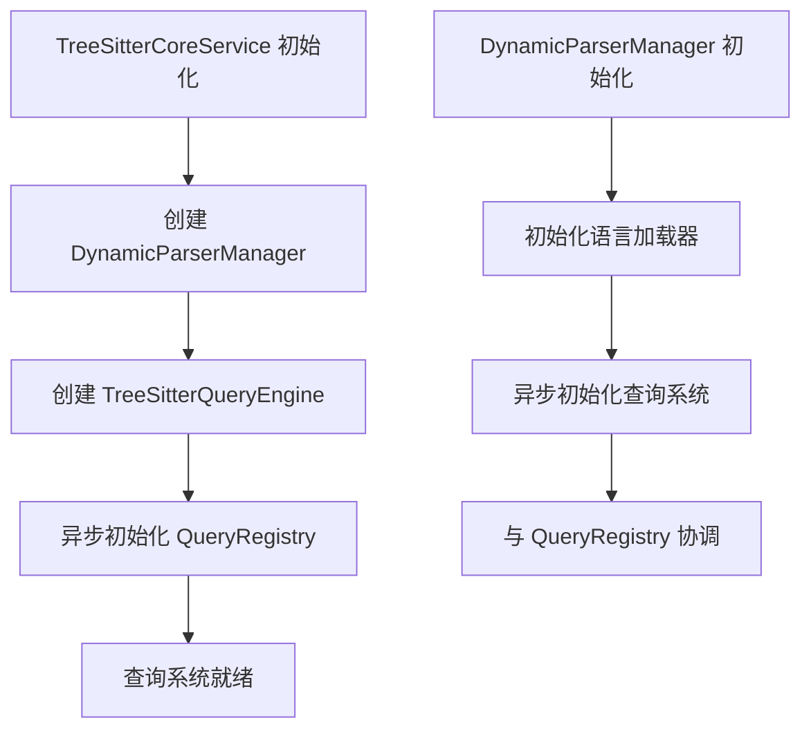
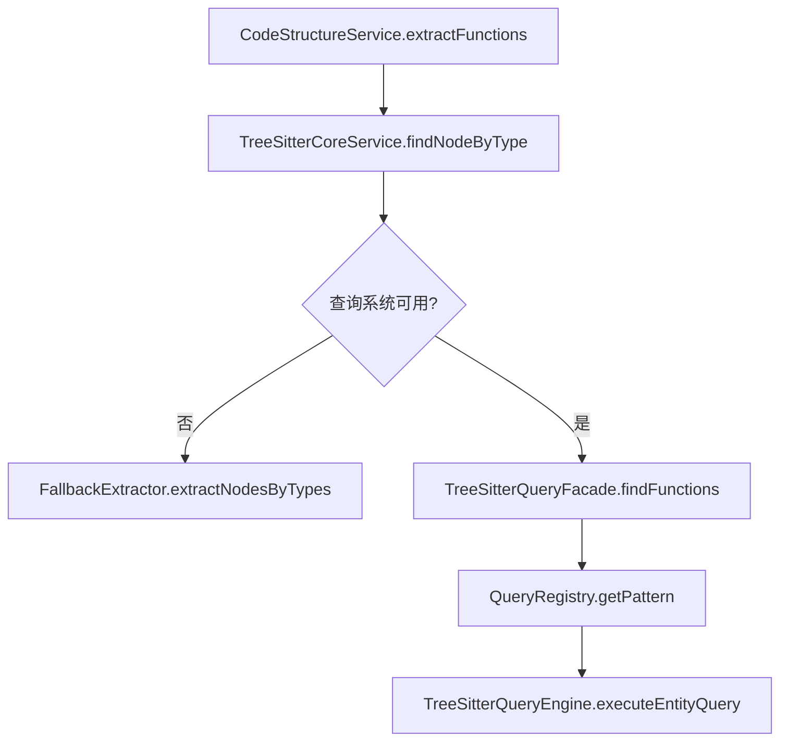
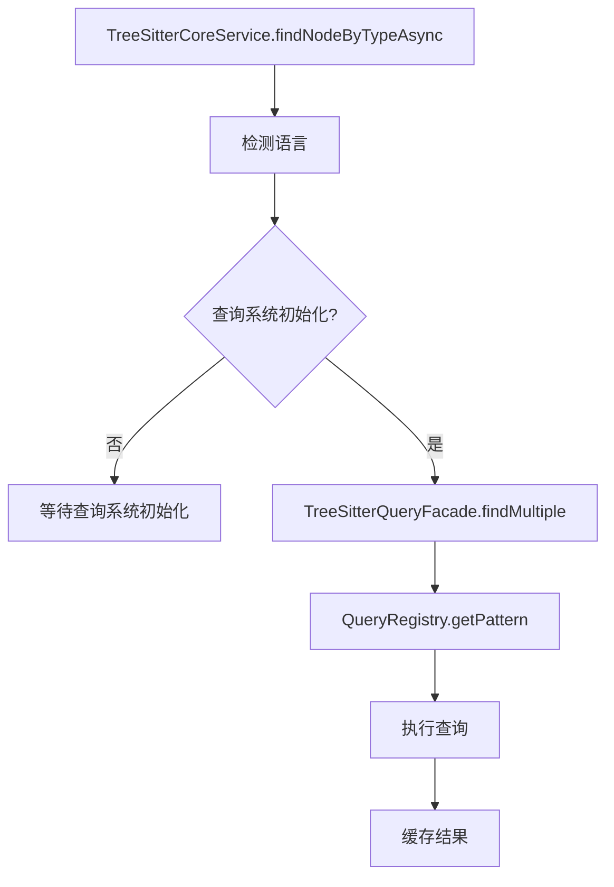
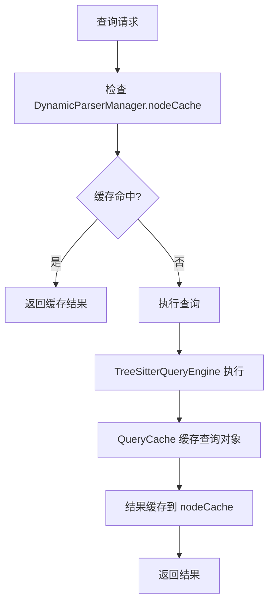
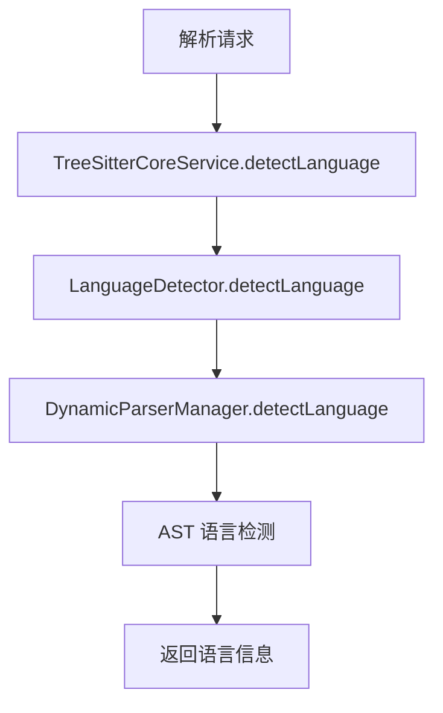

# src\service\parser\core\query 目录与 src\service\parser\core\parse 目录协调关系分析

## 系统架构概览

`src\service\parser\core\query` 和 `src\service\parser\core\parse` 两个目录构成了一个分层的代码解析和查询系统，采用了清晰的职责分离和协调机制。

## 目录职责分工

### parse 目录 - 基础解析层
- **[`TreeSitterCoreService.ts`](src/service/parser/core/parse/TreeSitterCoreService.ts:38)**: 核心解析服务，管理 Tree-sitter 解析器和基础解析功能
- **[`TreeSitterService.ts`](src/service/parser/core/parse/TreeSitterService.ts:8)**: 高层服务接口，委托给核心服务和结构服务
- **[`DynamicParserManager.ts`](src/service/parser/core/parse/DynamicParserManager.ts:38)**: 动态解析器管理，按需加载语言解析器

### query 目录 - 查询执行层
- **[`TreeSitterQueryExecutor.ts`](src/service/parser/core/query/TreeSitterQueryExecutor.ts:59)**: 查询执行引擎，处理复杂的语义查询
- **[`TreeSitterQueryFacade.ts`](src/service/parser/core/query/TreeSitterQueryFacade.ts:16)**: 查询门面，提供简化的查询接口
- **[`QueryRegistry.ts`](src/service/parser/core/query/QueryRegistry.ts:9)**: 查询注册表，管理多语言查询模式

### structure 目录 - 业务逻辑层
- **[`CodeStructureService.ts`](src/service/parser/core/structure/CodeStructureService.ts:12)**: 代码结构服务，协调解析和查询功能

## 协调机制分析

### 1. 初始化协调



**关键协调点**:
- [`TreeSitterCoreService`](src/service/parser/core/parse/TreeSitterCoreService.ts:68) 在构造函数中创建 [`TreeSitterQueryEngine`](src/service/parser/core/query/TreeSitterQueryExecutor.ts:59) 实例
- [`DynamicParserManager`](src/service/parser/core/parse/DynamicParserManager.ts:98) 异步初始化 [`QueryRegistryImpl`](src/service/parser/core/query/QueryRegistry.ts:9)
- 两个系统都通过 [`QueryRegistryImpl.initialize()`](src/service/parser/core/query/QueryRegistry.ts:18) 协调查询系统的初始化

### 2. 查询执行协调

#### 同步查询路径


#### 异步查询路径


**关键协调机制**:
- [`TreeSitterCoreService.findNodeByTypeAsync()`](src/service/parser/core/parse/TreeSitterCoreService.ts:280) 优先使用 [`TreeSitterQueryFacade`](src/service/parser/core/query/TreeSitterQueryFacade.ts:16)
- 查询失败时自动回退到 [`FallbackExtractor`](src/service/parser/core/parse/DynamicParserManager.ts:292)
- 通过 [`useOptimizedQueries`](src/service/parser/core/parse/TreeSitterCoreService.ts:55) 标志控制查询系统使用

### 3. 缓存协调机制



**多层缓存协调**:
- **解析器缓存**: [`DynamicParserManager`](src/service/parser/core/parse/DynamicParserManager.ts:122) 缓存 Tree-sitter 解析器实例
- **AST 缓存**: [`DynamicParserManager`](src/service/parser/core/parse/DynamicParserManager.ts:179) 缓存解析结果
- **查询对象缓存**: [`QueryCache`](src/service/parser/core/query/QueryCache.ts:22) 缓存预编译查询
- **节点缓存**: [`DynamicParserManager.nodeCache`](src/service/parser/core/parse/DynamicParserManager.ts:59) 缓存查询结果

### 4. 语言检测协调



**协调流程**:
- [`TreeSitterCoreService`](src/service/parser/core/parse/TreeSitterCoreService.ts:115) 使用 [`LanguageDetector`](src/service/parser/core/parse/TreeSitterCoreService.ts:53) 进行语言检测
- [`DynamicParserManager`](src/service/parser/core/parse/DynamicParserManager.ts:239) 提供备用的语言检测机制
- 查询系统使用检测到的语言选择相应的查询模式

## 关键协调接口

### 1. TreeSitterCoreService 中的查询集成

```typescript
// TreeSitterCoreService.ts 第 295-297 行
const queryResults = await TreeSitterQueryFacade.findMultiple(ast, lang, [type]);
const nodes = queryResults.get(type) || [];
```

### 2. DynamicParserManager 中的查询回退

```typescript
// DynamicParserManager.ts 第 286-287 行
const functions = await TreeSitterQueryFacade.findFunctions(ast, lang);
```

### 3. CodeStructureService 中的协调逻辑

```typescript
// CodeStructureService.ts 第 32 行
const result = await this.coreService.findNodeByTypeAsync(ast, 'functions');
```

## 错误处理和回退机制

### 1. 查询系统失败回退
- 查询系统初始化失败时，自动禁用优化查询
- 查询执行失败时，回退到 [`FallbackExtractor`](src/service/parser/core/parse/DynamicParserManager.ts:292)
- 保持系统可用性，即使查询系统不可用

### 2. 语言不支持回退
- 查询系统不支持的语言，使用通用节点类型匹配
- 通过 [`isQuerySupported()`](src/service/parser/core/parse/TreeSitterCoreService.ts:578) 检查支持情况

### 3. 缓存失败回退
- 缓存服务不可用时，直接执行查询
- 缓存键冲突时，重新生成缓存键

## 性能优化协调

### 1. 查询预热
- [`TreeSitterQueryFacade.warmupCache()`](src/service/parser/core/query/TreeSitterQueryFacade.ts:290) 预加载常用查询
- [`DynamicParserManager`](src/service/parser/core/parse/DynamicParserManager.ts:67) 初始化时预加载解析器

### 2. 并行执行
- [`TreeSitterQueryEngine.executeMultipleEntityQueries()`](src/service/parser/core/query/TreeSitterQueryExecutor.ts:302) 并行执行多个查询
- [`DynamicParserManager`](src/service/parser/core/parse/DynamicParserManager.ts:67) 支持并行语言检测

### 3. 智能缓存策略
- 基于使用频率的缓存淘汰
- 分层缓存减少重复计算
- 缓存统计信息指导优化

## 配置和监控协调

### 1. 统一配置管理
- [`useOptimizedQueries`](src/service/parser/core/parse/TreeSitterCoreService.ts:55) 标志控制查询系统使用
- [`querySystemInitialized`](src/service/parser/core/parse/TreeSitterCoreService.ts:57) 状态跟踪

### 2. 性能监控集成
- [`TreeSitterCoreService.getPerformanceStats()`](src/service/parser/core/parse/TreeSitterCoreService.ts:487) 集成查询系统统计
- [`DynamicParserManager.getPerformanceStats()`](src/service/parser/core/parse/DynamicParserManager.ts:434) 提供解析性能数据

### 3. 状态同步
- 查询系统状态在多个组件间同步
- 初始化状态协调确保系统一致性

## 总结

`query` 和 `parse` 目录通过以下机制实现高效协调：

1. **分层架构**: parse 层负责基础解析，query 层负责语义查询，structure 层负责业务逻辑
2. **异步初始化**: 协调各组件的初始化顺序，避免依赖冲突
3. **智能回退**: 查询系统不可用时自动回退到基础解析功能
4. **多层缓存**: 协调不同层级的缓存策略，提升整体性能
5. **统一接口**: 通过门面模式提供一致的查询接口
6. **状态同步**: 实时同步系统状态，确保组件间一致性

这种设计实现了高内聚、低耦合的架构，既保证了系统的可扩展性，又确保了在各种情况下的稳定性和性能。