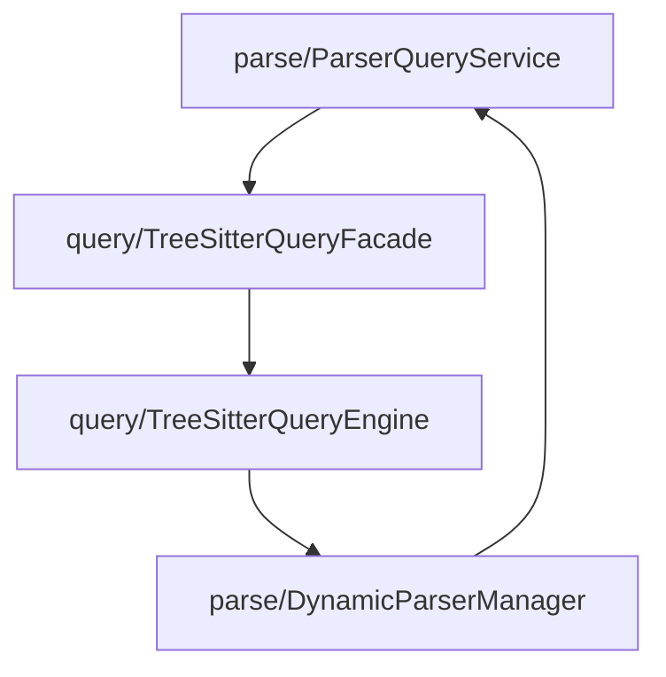
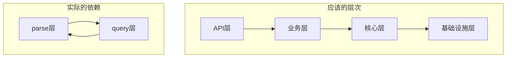

## 依赖关系和耦合度分析

### 1. 循环依赖问题

**严重问题**：parse 目录和 query 目录之间存在循环依赖。

**具体依赖链**：


**代码证据**：
```typescript
// ParserQueryService.ts 依赖 TreeSitterQueryFacade
import { TreeSitterQueryFacade } from '../query/TreeSitterQueryFacade';

// TreeSitterQueryExecutor.ts 动态导入 DynamicParserManager
const { DynamicParserManager } = await import('../parse/DynamicParserManager');
```

### 2. 高耦合度分析

**parse 目录对 query 目录的依赖**：
- `ParserQueryService` 直接依赖 `TreeSitterQueryFacade`
- `ParserQueryService` 依赖 `QueryRegistryImpl`
- `DynamicParserManager` 依赖 `QueryRegistryImpl`

**query 目录对 parse 目录的依赖**：
- `TreeSitterQueryExecutor` 动态导入 `DynamicParserManager`
- `TreeSitterQueryExecutor` 需要 parse 层的语言检测功能

### 3. 跨层依赖问题

**违反分层原则**：


**问题**：
- 同级别的两个目录相互依赖，没有清晰的层次关系
- 缺乏统一的依赖方向，导致架构混乱

### 4. 接口耦合度

**紧耦合问题**：
- 两个目录使用不同的类型系统，但需要相互转换
- 缓存键生成策略不统一，导致缓存无法共享
- 查询结果格式不一致，需要额外的转换层

### 5. 初始化依赖复杂

**初始化顺序问题**：
```typescript
// ParserQueryService 需要等待 QueryRegistry 初始化
private async initializeQuerySystem(): Promise<void> {
  const success = await QueryRegistryImpl.initialize();
}

// DynamicParserManager 也需要等待 QueryRegistry 初始化
private async initializeQuerySystem(): Promise<void> {
  const success = await QueryRegistryImpl.initialize();
}
```

**问题**：
- 多个组件都需要初始化同一个系统
- 初始化顺序不明确，可能导致竞态条件

现在让我识别潜在的架构问题。