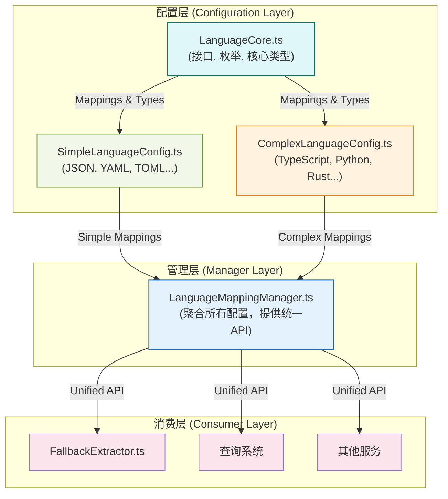

### 新架构设计方案：分层配置

这个方案的核心思想是根据配置的**稳定性和复杂度**进行分层，职责划分如下：

1.  **`LanguageCore.ts` (核心定义层)**:
    *   **职责**: 存放最稳定、最基础的定义，这些是整个语言解析系统的基石。
    *   **内容**:
        *   `LanguageMapping` 接口定义。
        *   `LANGUAGE_CATEGORIES`, `QUERY_TYPES`, `STRATEGY_TYPES` 等枚举式常量。
        *   基础的、不依赖具体语言配置的工具函数。

2.  **`SimpleLanguageConfig.ts` (简单配置层)**:
    *   **职责**: 管理那些仅需要基础解析支持的语言（例如，配置文件、标记语言）。这些语言通常查询规则简单或没有特定查询。
    *   **内容**:
        *   `LANGUAGE_MAPPINGS` 的一个子集，包含 `json`, `yaml`, `toml`, `css`, `html` 等。
        *   这些配置的 `supportedQueryTypes` 数组通常较短或为空。

3.  **`ComplexLanguageConfig.ts` (复杂配置层)**:
    *   **职责**: 管理那些具有丰富查询规则和深度解析支持的核心编程语言。
    *   **内容**:
        *   `LANGUAGE_MAPPINGS` 的另一个子集，包含您列出的 `typescript`, `python`, `java`, `rust` 等(见src\service\parser\constants\queries目录中通过文件夹管理查询规则的部分)。
        *   这些配置通常拥有详尽的 `supportedQueryTypes` 和更复杂的设置。

4.  **`LanguageMappingManager.ts` (管理与聚合层)**:
    *   **职责**: 作为统一的入口，它负责**加载并合并**所有配置层，为上层应用提供一个完整的、统一的语言配置视图。应用的其它部分不应该关心配置是来自哪个文件。
    *   **内容**:
        *   导入 `SimpleLanguageConfig` 和 `ComplexLanguageConfig`。
        *   在初始化时将两者合并成一个完整的 `mappings` Map。
        *   所有外部查询都通过这个 Manager 进行，隐藏了底层的配置分离细节。

### 架构图

下面是新架构的 Mermaid 可视化图，展示了文件之间的关系和职责划分。

### 优势分析

这种分层设计完美地解决了您提出的问题：

1.  **避免文件过大**: 每个配置文件都聚焦于特定的职责和复杂度，保持了较小的规模，易于阅读和维护。
2.  **职责清晰**:
    *   `Core` 层定义“是什么”（数据结构）。
    *   `Simple` 和 `Complex` 层定义“有哪些”（数据实例）。
    *   `Manager` 层定义“怎么用”（业务逻辑）。
3.  **隔离复杂度**: 对简单语言的修改不会触及复杂语言的配置，反之亦然。这降低了维护成本和引入错误的风险。
4.  **可扩展性**: 未来如果需要引入更多“社区支持”或“实验性”的语言，可以简单地增加一个新的配置文件（如 `CommunityLanguageConfig.ts`），然后在 `Manager` 中聚合它，而无需改动现有配置。

### 下一步计划

如果这个设计方案符合您的预期，我将准备一个详细的实施计划，然后切换到 `code` 模式来执行以下步骤：

1.  **创建** `LanguageCore.ts`, `SimpleLanguageConfig.ts`, `ComplexLanguageConfig.ts` 文件。
2.  **重构** `LanguageMappingConfig.ts` 和 `LanguageConstants.ts`，将它们的内容按新架构拆分到上述新文件中。
3.  **修改** `LanguageMappingManager.ts` 以加载并合并 `Simple` 和 `Complex` 两个配置。
4.  **更新**所有相关文件的导入路径。
5.  **运行测试**确保重构没有破坏现有功能。
