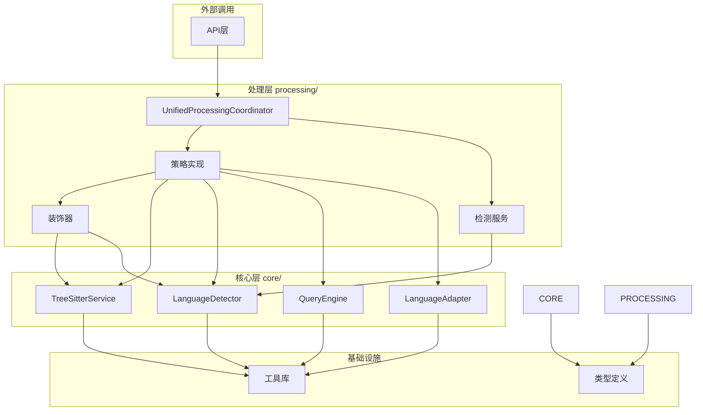

# 核心服务边界定义

## 概述

本文档定义了 `core/` 和 `processing/` 目录的职责边界和依赖关系，确保清晰的架构分层。

## 核心服务边界 (core/)

### 职责范围

`core/` 目录专注于提供基础设施和底层服务，包括：

#### 1. 解析服务 (parse/)
- **TreeSitterService**: AST解析的核心服务
- **TreeSitterCoreService**: 底层TreeSitter封装
- **DynamicParserManager**: 动态解析器管理

#### 2. 语言检测 (language-detection/)
- **LanguageDetector**: 语言特征检测
- **TreeSitterLanguageDetector**: 基于TreeSitter的语言检测

#### 3. 语言适配器 (normalization/)
- **LanguageAdapterFactory**: 语言适配器工厂
- **BaseLanguageAdapter**: 基础适配器接口
- **各种语言适配器**: 特定语言的适配器实现

#### 4. 查询引擎 (query/)
- **QueryEngineFactory**: 查询引擎工厂
- **QueryCache**: 查询结果缓存
- **QueryRegistry**: 查询注册表
- **TreeSitterQueryEngine**: TreeSitter查询引擎

### 依赖规则

- **不依赖** `processing/` 目录
- **不依赖** `universal/` 和 `splitting/` 目录
- **可以依赖** 外部工具库和基础设施
- **提供** 基础服务给上层使用

## 处理层边界 (processing/)

### 职责范围

`processing/` 目录专注于业务逻辑和策略实现，包括：

#### 1. 策略实现 (strategies/)
- **providers/**: 策略提供者
- **impl/**: 具体策略实现
- **decorators/**: 策略装饰器
- **factory/**: 策略工厂
- **manager/**: 策略管理器

#### 2. 检测服务 (detection/)
- **UnifiedDetectionService**: 统一检测服务
- **FileFeatureDetector**: 文件特征检测器

#### 3. 协调管理 (coordination/)
- **UnifiedProcessingCoordinator**: 统一处理协调器
- **UnifiedStrategyManager**: 统一策略管理器

#### 4. 工具函数 (utils/)
- **ComplexityCalculator**: 复杂度计算
- **SemanticBoundaryAnalyzer**: 语义边界分析

### 依赖规则

- **可以依赖** `core/` 目录的基础服务
- **不依赖** `universal/` 和 `splitting/` 目录（已整合）
- **提供** 业务逻辑给外部调用

## 依赖关系图

## 接口契约

### 核心服务提供的接口

1. **TreeSitterService**
   - `parseCode(code: string, language: string): Promise<ParseResult>`
   - `extractFunctions(ast: SyntaxNode): Promise<SyntaxNode[]>`
   - `extractClasses(ast: SyntaxNode): Promise<SyntaxNode[]>`

2. **LanguageDetector**
   - `detectLanguage(filePath: string, content?: string): Promise<LanguageDetectionResult>`
   - `isLanguageSupportedForAST(language: string): boolean`

3. **QueryEngine**
   - `queryTree(ast: SyntaxNode, pattern: string): QueryResult[]`
   - `getCachedQuery(key: string): QueryResult | null`

### 处理层实现的接口

1. **ISplitStrategy**
   - `split(content: string, language: string, ...): Promise<CodeChunk[]>`
   - `supportsLanguage(language: string): boolean`
   - `getPriority(): number`

2. **IStrategyProvider**
   - `createStrategy(options?: ChunkingOptions): ISplitStrategy`
   - `getName(): string`
   - `getDependencies(): string[]`

## 数据流向

1. **自上而下**: API → Processing → Core
2. **自下而上**: Core → Processing → API
3. **横向**: Processing内部组件通过接口通信

## 迁移指南

### 从 universal/splitting 迁移到 processing

1. **策略实现**: 迁移到 `processing/strategies/impl/`
2. **装饰器**: 迁移到 `processing/strategies/decorators/`
3. **工厂**: 整合到 `processing/strategies/factory/`
4. **协调器**: 整合到 `processing/coordination/`

### 从 core/strategy 迁移到 processing

1. **AST策略**: 迁移为 `processing/strategies/providers/` 中的高级策略
2. **管理器**: 整合到 `processing/strategies/manager/`
3. **配置**: 整合到统一的配置管理系统

## 性能考虑

1. **缓存策略**: 核心服务提供基础缓存，处理层提供业务缓存
2. **懒加载**: 核心服务支持懒加载，减少初始化开销
3. **资源管理**: 核心服务负责资源生命周期管理

## 扩展性原则

1. **核心服务**: 保持稳定，提供基础能力
2. **处理层**: 灵活扩展，支持新策略和装饰器
3. **接口设计**: 面向接口编程，降低耦合度