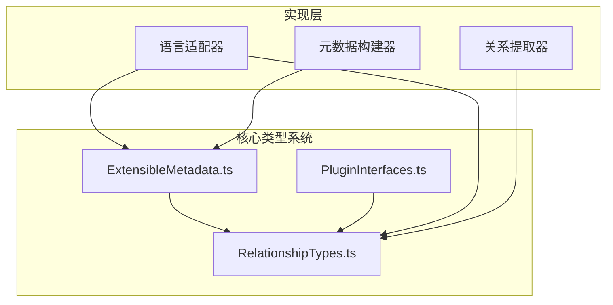

# 三个TypeScript文件分析报告

## 文件概述

这三个文件位于 `src\service\parser\core\normalization\types\` 目录下，构成了代码解析器核心模块的类型定义系统，专门用于处理代码分析结果的标准化和关系提取。

## 1. ExtensibleMetadata.ts - 可扩展元数据系统

### 作用
- 定义了一个灵活的元数据管理系统，用于存储和构建代码分析结果
- 提供了多种元数据类型的接口定义，包括关系、符号、性能、注解等
- 实现了建造者模式（Builder Pattern），便于元数据的构建和管理

### 核心组件
- **ExtensibleMetadata接口**: 核心元数据接口，包含语言、复杂度、依赖等基础字段，以及多种可选的扩展字段
- **MetadataBuilder类**: 提供链式调用的元数据构建器，支持各种元数据类型的添加和设置
- **MetadataUtils类**: 提供元数据的合并、验证、克隆等工具方法

### 实际使用情况
- 被多个语言适配器（Python、JavaScript、Java、Go、C++）广泛使用
- 在 `MetadataBuilder.ts` 中被扩展为增强版元数据构建器
- 用于标准化查询结果的元数据构建，包括性能指标、错误处理、位置信息等

## 2. PluginInterfaces.ts - 插件接口系统

### 作用
- 定义了完整的插件系统架构，支持多种类型的插件扩展
- 提供了插件生命周期管理、配置管理和事件处理机制
- 支持关系提取器、语言辅助、元数据处理、性能监控等多种插件类型

### 核心组件
- **IPlugin接口**: 基础插件接口，定义了插件的基本属性和生命周期方法
- **专用插件接口**: 包括IRelationshipExtractorPlugin、ILanguageHelperPlugin等6种专用插件接口
- **插件管理接口**: IPluginManager、IPluginFactory、IPluginLoader等管理类接口
- **事件系统**: PluginEvent和IPluginEventEmitter支持插件间通信

### 实际使用情况
- 目前主要作为类型定义存在，尚未在代码库中找到具体的实现类
- 在RelationshipTypes.ts中被引用，主要用于关系提取器插件的类型定义
- 为未来的插件化架构提供了完整的类型基础

## 3. RelationshipTypes.ts - 关系类型系统

### 作用
- 定义了代码分析中所有可能的关系类型和分类
- 提供了关系类型的映射、验证和分类工具
- 支持数据流、控制流、语义、生命周期等11种关系类别

### 核心组件
- **RelationshipCategory枚举**: 定义了11种关系类别
- **关系类型定义**: 为每个类别定义了具体的关系类型
- **RelationshipTypeMapping类**: 提供关系类型分类、验证和查询的工具方法
- **关系结果接口**: RelationshipResult定义了关系提取的标准输出格式

### 实际使用情况
- 被ExtensibleMetadata.ts引用，用于关系元数据的类型定义
- 被PluginInterfaces.ts引用，用于关系提取器插件的接口定义
- 在RelationshipExtractorManager.ts和BaseRelationshipExtractor.ts中被广泛使用
- 被多个语言适配器使用，用于识别和处理不同类型的关系

## 三个文件的相互关系

1. **RelationshipTypes.ts** 是基础，被其他两个文件引用
2. **ExtensibleMetadata.ts** 使用RelationshipTypes定义关系元数据
3. **PluginInterfaces.ts** 使用RelationshipTypes定义插件接口
4. 三个文件共同构成了代码解析器的类型基础架构

## 系统架构价值

1. **模块化设计**: 三个文件各司其职，职责清晰分离
2. **可扩展性**: 支持新的元数据类型、插件类型和关系类型的扩展
3. **类型安全**: 提供完整的TypeScript类型定义，确保编译时类型检查
4. **标准化**: 为代码分析结果提供了统一的数据格式和接口规范

## 当前状态与建议

1. **ExtensibleMetadata.ts** 和 **RelationshipTypes.ts** 已被广泛使用，实现成熟
2. **PluginInterfaces.ts** 目前主要是类型定义，建议考虑实现具体的插件管理器
3. 整体架构设计良好，为代码解析系统的扩展和维护提供了坚实的基础