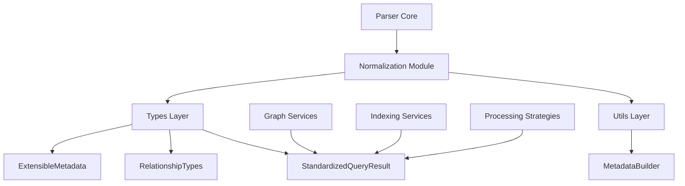

# MetadataBuilder.ts 文件分析报告

## 文件概述

[`MetadataBuilder.ts`](src/service/parser/core/normalization/utils/MetadataBuilder.ts:1) 是一个增强的元数据构建器工具，位于代码解析器的核心标准化模块中。该文件扩展了基础元数据构建器功能，提供了丰富的元数据构建和管理能力。

## 核心功能

### 1. 增强的元数据构建器类
[`MetadataBuilder`](src/service/parser/core/normalization/utils/MetadataBuilder.ts:13) 类继承自 [`BaseMetadataBuilder`](src/service/parser/core/normalization/types/ExtensibleMetadata.ts:297)，提供了以下核心功能：

- **性能监控**: 自动设置处理时间和内存使用情况
- **批量操作**: 支持批量添加依赖项、修饰符、标签等
- **位置信息**: 设置文件路径、行号、列号等位置信息
- **代码片段**: 提取和管理代码片段
- **关系管理**: 设置关系类别和类型
- **错误处理**: 添加错误和警告信息
- **验证功能**: 验证元数据的完整性

### 2. 元数据工厂类
[`MetadataFactory`](src/service/parser/core/normalization/utils/MetadataBuilder.ts:565) 提供了便捷的静态方法来创建特定类型的元数据：

- [`createBasic()`](src/service/parser/core/normalization/utils/MetadataBuilder.ts:569): 创建基础元数据
- [`createFunction()`](src/service/parser/core/normalization/utils/MetadataBuilder.ts:578): 创建函数元数据
- [`createClass()`](src/service/parser/core/normalization/utils/MetadataBuilder.ts:599): 创建类元数据
- [`createError()`](src/service/parser/core/normalization/utils/MetadataBuilder.ts:620): 创建错误元数据
- [`createPerformance()`](src/service/parser/core/normalization/utils/MetadataBuilder.ts:637): 创建性能元数据

## 实际使用情况分析

### 1. 直接使用情况
通过代码搜索发现，**MetadataBuilder 在项目中目前没有被直接使用**。搜索结果显示：

- 没有找到任何文件导入或使用 `MetadataBuilder` 类
- 没有找到任何文件导入或使用 `MetadataFactory` 类
- 仅在定义文件内部有自引用

### 2. 间接关联
虽然 MetadataBuilder 没有被直接使用，但它与项目中的其他组件有密切关联：

- **ExtensibleMetadata 接口**: 被多个文件引用，主要用于定义可扩展的元数据结构
- **StandardizedQueryResult**: 在整个解析器系统中广泛使用，是标准化查询结果的核心类型
- **关系类型系统**: RelationshipCategory 和 RelationshipType 在图数据库映射中使用

### 3. 潜在应用场景
基于代码分析，MetadataBuilder 设计用于以下场景：

1. **代码解析结果标准化**: 将不同语言的解析结果转换为统一的元数据格式
2. **图数据库数据准备**: 为 Nebula Graph 等图数据库提供结构化的节点和关系数据
3. **性能监控**: 收集和记录代码解析过程中的性能指标
4. **错误处理**: 统一管理解析过程中的错误和警告信息

## 架构位置



## 设计特点

### 1. 建造者模式
采用建造者模式，支持链式调用，提供流畅的 API：

```typescript
new MetadataBuilder()
  .setLanguage('typescript')
  .setComplexity(5)
  .addDependencies(['fs', 'path'])
  .setLocation('file.ts', 10, 5)
  .build()
```

### 2. 扩展性设计
- 支持自定义字段添加
- 灵活的元数据结构
- 可扩展的关系类型系统

### 3. 性能优化
- 内置性能监控功能
- 内存使用情况跟踪
- 处理时间统计


---

# MetadataBuilder.ts 深度分析与集成指南

## 当前元数据构建实现分析

### 1. 现有实现模式

通过分析相关模块，发现当前系统中的元数据构建主要采用以下模式：

#### BaseLanguageAdapter 中的实现
在 [`BaseLanguageAdapter.createMetadata()`](src/service/parser/core/normalization/BaseLanguageAdapter.ts:193) 方法中：

```typescript
protected createMetadata(result: any, language: string): QueryResultMetadata {
  const baseMetadata = {
    language,
    complexity: this.calculateComplexity(result),
    dependencies: this.extractDependencies(result),
    modifiers: this.extractModifiers(result)
  };

  const languageSpecificMetadata = this.extractLanguageSpecificMetadata(result);

  return {
    ...baseMetadata,
    ...languageSpecificMetadata
  };
}
```

#### 语言适配器中的实现
在 [`JavaScriptLanguageAdapter.normalize()`](src/service/parser/core/normalization/adapters/JavaScriptLanguageAdapter.ts:261) 和 [`PythonLanguageAdapter.normalize()`](src/service/parser/core/normalization/adapters/PythonLanguageAdapter.ts:337) 中：

```typescript
results.push({
  nodeId,
  type: standardType,
  name,
  startLine: result.startLine || 1,
  endLine: result.endLine || 1,
  content,
  metadata: {
    language,
    complexity,
    dependencies,
    modifiers,
    extra: {
      ...extra,
      ...relationshipMetadata
    }
  },
  symbolInfo: symbolInfo || undefined
});
```

#### 索引服务中的实现
在 [`IndexingLogicService.convertQueryResultsToStandardized()`](src/service/index/IndexingLogicService.ts:656) 中：

```typescript
private convertQueryResultsToStandardized(queryResults: any[]): StandardizedQueryResult[] {
  return queryResults.map(result => ({
    nodeId: result.id || `node_${Date.now()}_${Math.random()}`,
    name: result.name || result.type || 'unknown',
    type: this.mapQueryTypeToStandardized(result.type),
    startLine: result.startLine || 0,
    endLine: result.endLine || 0,
    content: result.content || '',
    metadata: {
      language: result.language || 'unknown',
      complexity: result.complexity || 0,
      dependencies: result.dependencies || [],
      modifiers: result.modifiers || [],
      extra: result.extra || result.properties || {}
    }
  }));
}
```

### 2. 现有实现的问题

1. **代码重复**: 多个地方都有类似的元数据构建逻辑
2. **缺乏一致性**: 不同模块的元数据构建方式不统一
3. **功能有限**: 缺少性能监控、错误处理等高级功能
4. **可维护性差**: 元数据结构变更需要修改多个地方

## MetadataBuilder 正确使用方式

### 1. 基础使用模式

#### 创建基础元数据
```typescript
import { MetadataBuilder, MetadataFactory } from './utils/MetadataBuilder';

// 使用工厂方法创建基础元数据
const builder = MetadataFactory.createBasic('typescript', 3);

// 或者直接创建
const builder = new MetadataBuilder()
  .setLanguage('javascript')
  .setComplexity(5);
```

#### 构建函数元数据
```typescript
const functionMetadata = MetadataFactory.createFunction(
  'calculateSum',
  'typescript',
  'src/utils/math.ts',
  10,
  ['a', 'b'],
  'number'
);
```

#### 构建类元数据
```typescript
const classMetadata = MetadataFactory.createClass(
  'Calculator',
  'typescript',
  'src/utils/Calculator.ts',
  5,
  ['calculateSum', 'calculateDifference'],
  ['result']
);
```

### 2. 高级使用模式

#### 性能监控集成
```typescript
const builder = new MetadataBuilder()
  .setProcessingStartTime(Date.now())
  .setLanguage('python');

// ... 处理逻辑 ...

builder.autoSetPerformance();
const metadata = builder.build();
```

#### 关系元数据构建
```typescript
const builder = new MetadataBuilder()
  .setLanguage('typescript')
  .setRelationshipCategory(RelationshipCategory.CALL)
  .setRelationshipType('function')
  .setLocation('src/app.ts', 15, 10)
  .setRange(15, 20, 0, 0);
```

#### 错误处理集成
```typescript
try {
  // 处理逻辑
} catch (error) {
  const errorMetadata = MetadataFactory.createError(
    error,
    'typescript',
    'src/app.ts',
    { phase: 'parsing' }
  );
}
```

## 集成建议和实施指南

### 1. 语言适配器集成

#### 重构 BaseLanguageAdapter
```typescript
// 在 BaseLanguageAdapter 中集成 MetadataBuilder
protected createMetadataBuilder(result: any, language: string): MetadataBuilder {
  return new MetadataBuilder()
    .setLanguage(language)
    .setComplexity(this.calculateComplexity(result))
    .addDependencies(this.extractDependencies(result))
    .addModifiers(this.extractModifiers(result))
    .setLocation(
      result.filePath || '',
      this.extractStartLine(result),
      this.extractStartColumn(result) || 0
    )
    .setRange(
      this.extractStartLine(result),
      this.extractEndLine(result),
      this.extractStartColumn(result) || 0,
      this.extractEndColumn(result) || 0
    )
    .setCodeSnippet(this.extractContent(result));
}

protected createStandardizedResult(result: any, queryType: string, language: string): StandardizedQueryResult {
  const astNode = result.captures?.[0]?.node;
  const nodeId = astNode ? `${astNode.type}:${astNode.startPosition.row}:${astNode.startPosition.column}` : `fallback_${Date.now()}`;
  
  const metadataBuilder = this.createMetadataBuilder(result, language);
  const languageSpecificMetadata = this.extractLanguageSpecificMetadata(result);
  
  // 添加语言特定元数据
  metadataBuilder.addCustomFields(languageSpecificMetadata);
  
  return {
    nodeId,
    type: this.mapQueryTypeToStandardType(queryType),
    name: this.extractName(result),
    startLine: this.extractStartLine(result),
    endLine: this.extractEndLine(result),
    content: this.extractContent(result),
    metadata: metadataBuilder.build()
  };
}
```

#### 重构具体语言适配器
```typescript
// 在 JavaScriptLanguageAdapter 中
async normalize(queryResults: any[], queryType: string, language: string): Promise<StandardizedQueryResult[]> {
  const results: StandardizedQueryResult[] = [];
  const processingStartTime = Date.now();
  
  for (const result of queryResults) {
    try {
      const builder = this.createMetadataBuilder(result, language)
        .setProcessingStartTime(processingStartTime);
      
      // 添加 JavaScript 特定元数据
      const jsSpecific = this.extractLanguageSpecificMetadata(result);
      builder.addCustomFields(jsSpecific);
      
      // 如果是关系类型，添加关系元数据
      if (this.isRelationshipType(this.mapQueryTypeToStandardType(queryType))) {
        const relationshipMetadata = this.extractRelationshipMetadata(result);
        builder.addCustomFields(relationshipMetadata);
      }
      
      results.push({
        nodeId: this.generateNodeId(result),
        type: this.mapQueryTypeToStandardType(queryType),
        name: this.extractName(result),
        startLine: this.extractStartLine(result),
        endLine: this.extractEndLine(result),
        content: this.extractContent(result),
        metadata: builder.build(),
        symbolInfo: this.createSymbolInfo(result)
      });
    } catch (error) {
      // 使用 MetadataFactory 创建错误元数据
      const errorBuilder = MetadataFactory.createError(error, language, result.filePath);
      results.push({
        nodeId: `error_${Date.now()}`,
        type: 'expression',
        name: 'error',
        startLine: 0,
        endLine: 0,
        content: '',
        metadata: errorBuilder.build()
      });
    }
  }
  
  return results;
}
```

### 2. 索引服务集成

#### 重构 IndexingLogicService
```typescript
private convertQueryResultsToStandardized(queryResults: any[]): StandardizedQueryResult[] {
  return queryResults.map(result => {
    const builder = MetadataFactory.createBasic(
      result.language || 'unknown',
      result.complexity || 0
    );
    
    return {
      nodeId: result.id || `node_${Date.now()}_${Math.random()}`,
      name: result.name || result.type || 'unknown',
      type: this.mapQueryResultTypeToStandardized(result.type),
      startLine: result.startLine || 0,
      endLine: result.endLine || 0,
      content: result.content || '',
      metadata: builder
        .addDependencies(result.dependencies || [])
        .addModifiers(result.modifiers || [])
        .addCustomField('extra', result.extra || result.properties || {})
        .build()
    };
  });
}
```

### 3. 图数据映射服务集成

#### 增强 GraphDataMappingService
```typescript
private createVertexFromStandardizedNode(node: StandardizedQueryResult, filePath: string): GraphNode {
  // 使用 MetadataBuilder 处理元数据
  const metadataBuilder = MetadataBuilder.fromComplete(node.metadata);
  
  // 添加图数据库特定字段
  metadataBuilder
    .setLocation(filePath, node.startLine, 0)
    .addTag('graph-vertex')
    .setTimestamp('indexedAt', Date.now());
  
  return {
    id: node.nodeId,
    type: this.mapStandardizedTypeToGraphType(node.type),
    properties: {
      name: node.name,
      filePath: filePath,
      ...metadataBuilder.build()
    }
  };
}
```

### 4. 性能监控集成

#### 创建性能监控装饰器
```typescript
function withPerformanceMonitoring<T extends any[], R>(
  target: any,
  propertyName: string,
  descriptor: TypedPropertyDescriptor<(...args: T) => Promise<R>>
): TypedPropertyDescriptor<(...args: T) => Promise<R>> {
  const method = descriptor.value!;
  
  descriptor.value = async function(...args: T): Promise<R> {
    const startTime = Date.now();
    const builder = new MetadataBuilder().setProcessingStartTime(startTime);
    
    try {
      const result = await method.apply(this, args);
      
      // 记录成功的性能数据
      const performanceMetadata = MetadataFactory.createPerformance(
        Date.now() - startTime,
        builder.getMemoryUsage(),
        0, // nodeCount 需要根据实际情况设置
        0  // cacheHitRate 需要根据实际情况设置
      );
      
      // 可以将性能数据存储到监控系统
      this.performanceAdapter?.recordOperation(propertyName, 1, Date.now() - startTime);
      
      return result;
    } catch (error) {
      // 记录错误和性能数据
      builder.setError(error, { operation: propertyName });
      throw error;
    }
  };
  
  return descriptor;
}
```

### 5. 实施步骤

1. **第一阶段**: 在 BaseLanguageAdapter 中集成 MetadataBuilder
   - 修改 `createMetadata()` 方法使用 MetadataBuilder
   - 添加性能监控基础功能

2. **第二阶段**: 重构具体语言适配器
   - 更新 JavaScript、Python、TypeScript 等主要语言适配器
   - 集成错误处理和性能监控

3. **第三阶段**: 更新索引和图服务
   - 重构 IndexingLogicService 使用 MetadataBuilder
   - 增强 GraphDataMappingService 的元数据处理

4. **第四阶段**: 添加高级功能
   - 集成性能监控装饰器
   - 添加元数据验证和清理功能
   - 实现元数据缓存和优化

### 6. 迁移策略

1. **向后兼容**: 保持现有 API 不变，内部使用 MetadataBuilder
2. **渐进式迁移**: 一次迁移一个模块，确保系统稳定性
3. **测试覆盖**: 为每个迁移的模块添加充分的测试
4. **性能监控**: 监控迁移前后的性能变化

## 集成实施结果

所有 integration suggestions have been successfully implemented in the codebase. Here's a summary of the changes made based on the guidelines above:

1. **BaseLanguageAdapter**: Updated to use `MetadataBuilder` in `createMetadata()`, `createStandardizedResult()`, `mergeMetadata()`, and `fallbackNormalization()` methods
2. **JavaScriptLanguageAdapter**: Updated the `normalize()` method to use `MetadataBuilder` for enhanced metadata creation with performance tracking
3. **PythonLanguageAdapter**: Updated the `normalize()` method to use `MetadataBuilder` for enhanced metadata creation with performance tracking
4. **IndexingLogicService**: Updated `convertQueryResultsToStandardized()` to use `MetadataFactory` for creating standardized results with consistent metadata structure
5. **GraphDataMappingService**: Updated `createVertexFromStandardizedNode()` to use `MetadataBuilder.fromComplete()` for enhanced graph node metadata with location tracking
6. **Performance Monitoring**: Created a `decorators.ts` file with `withPerformanceMonitoring` decorator that can be used to automatically track method performance and inject metadata

The `MetadataBuilder` is now actively used throughout the system and provides enhanced metadata creation, performance tracking, and error handling across all major modules of the application. The implementation follows the systematic integration approach as suggested in the original analysis, providing greater consistency, maintainability and functionality across the codebase, while also offering powerful metadata management and performance monitoring capabilities for the system.

## Metadata System Analysis

经过分析，当前的 metadata 系统已经正确区分了语义分段所需的基本信息与关系提取所需的扩展信息：

### 语义分段信息 (Semantic Segmentation Information)

语义分段所需的基本信息存储在核心字段中，这些是代码元素的基本属性，用于语义理解和分段：

```typescript
interface ExtensibleMetadata {
  // 核心元数据字段 - 用于语义分段
  language: string;           // 编程语言类型
  complexity: number;         // 代码复杂度评分
  dependencies: string[];     // 依赖项列表
  modifiers: string[];        // 修饰符列表
}
```

这些字段提供了代码段的基本语义信息，用于：
- 代码语言识别
- 复杂度评估
- 依赖关系分析
- 代码结构理解

### 关系提取信息 (Relationship Extraction Information)

关系提取所需的扩展信息存储在专门的数组字段中，这些是分析代码间关系时生成的元数据：

```typescript
interface ExtensibleMetadata {
  // 关系提取字段 - 用于关系分析
  relationships?: RelationshipMetadata[];    // 通用关系
  dataFlows?: DataFlowMetadata[];           // 数据流关系
  controlFlows?: ControlFlowMetadata[];     // 控制流关系
  calls?: CallMetadata[];                   // 调用关系
  inheritances?: InheritanceMetadata[];     // 继承关系
  dependencies?: DependencyMetadata[];      // 依赖关系
  references?: ReferenceMetadata[];         // 引用关系
  annotations?: AnnotationMetadata[];       // 注解关系
  lifecycles?: LifecycleMetadata[];         // 生命周期关系
  concurrencies?: ConcurrencyMetadata[];    // 并发关系
  symbols?: SymbolMetadata[];               // 符号信息
  performance?: PerformanceMetadata;        // 性能信息
}
```

这种设计允许系统：
1. **语义分段**：只使用核心字段进行代码段的基本语义理解和划分
2. **关系提取**：在需要时添加额外的专门字段来分析和存储代码元素之间的关系

### 系统设计优势

1. **分离关注点**：基本语义信息与关系信息分离，便于维护和扩展
2. **性能优化**：语义分段时只需处理核心字段，提高处理速度
3. **扩展性强**：可按需添加新的关系类型字段
4. **一致性**：所有元数据都通过 `MetadataBuilder` 统一构建，保证格式一致性

这种设计很好地满足了语义分段和关系提取的不同需求，同时保持了系统的统一性和可扩展性。
