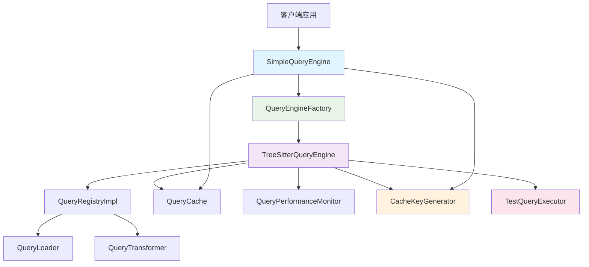

# 查询引擎架构文档

## 📊 概述

本文档描述了优化后的查询引擎架构，包括两个核心查询引擎及其相关组件的设计和实现。

## 🏗️ 架构组件

### 核心查询引擎

#### 1. TreeSitterQueryEngine (基础引擎)
- **文件位置**: [`TreeSitterQueryEngine.ts`](./TreeSitterQueryEngine.ts:1)
- **职责**: 底层查询执行引擎，负责实际的Tree-sitter查询操作
- **功能**:
  - 管理查询模式注册、加载和执行
  - 提供丰富的查询结果信息（节点、捕获、位置等）
  - 支持复杂的查询条件和模式管理
  - 集成缓存和性能监控

#### 2. SimpleQueryEngine (简化接口)
- **文件位置**: [`SimpleQueryEngine.ts`](./SimpleQueryEngine.ts:1)
- **职责**: 上层应用接口，提供简化的查询方法
- **功能**:
  - 专注于常见用例（函数、类、导入、导出等）
  - 优化缓存策略和批量查询功能
  - 提供性能统计和缓存管理
  - 支持详细查询结果返回

  SimpleQueryEngine 是一个简化的查询引擎，它作为 TreeSitterQueryEngine 的包装器，为常见用例提供更易用的接口。TreeSitterQueryEngine 是底层的实现，负责实际的 tree-sitter 语法树查询。

主要关系：

依赖关系：SimpleQueryEngine 通过 QueryEngineFactory 获取 TreeSitterQueryEngine 实例，并调用其 executeQuery 方法执行查询
接口简化：SimpleQueryEngine 提供静态方法如 findFunctions、findClasses 等，直接返回节点数组；而 TreeSitterQueryEngine 返回详细的 QueryResult 对象
功能扩展：SimpleQueryEngine 添加了缓存优化、批量查询（findMultiple）、性能统计（getPerformanceStats）等功能
共享类型：两者都使用 QueryResult 和 QueryMatch 接口，但 SimpleQueryEngine 主要处理节点提取和缓存
架构层次：TreeSitterQueryEngine 是核心查询执行引擎，SimpleQueryEngine 是其上的便利层，提供更简单的 API 和优化功能。


### 支持组件

#### 3. QueryEngineFactory (工厂类)
- **文件位置**: [`QueryEngineFactory.ts`](./QueryEngineFactory.ts:1)
- **职责**: 提供TreeSitterQueryEngine的单例实例
- **功能**:
  - 单例模式管理
  - 实例重置功能（主要用于测试）
  - 初始化状态检查

#### 4. CacheKeyGenerator (缓存键管理)
- **文件位置**: [`CacheKeyGenerator.ts`](./CacheKeyGenerator.ts:1)
- **职责**: 统一的缓存键生成策略
- **功能**:
  - 为不同查询引擎提供一致的缓存键生成
  - 避免缓存键冲突
  - 支持简单查询、Tree-sitter查询和批量查询

#### 5. TestQueryExecutor (测试执行器)
- **文件位置**: [`../__tests__/query/TestQueryExecutor.ts`](../__tests__/query/TestQueryExecutor.ts:1)
- **职责**: 测试环境专用的模拟查询结果生成
- **功能**:
  - 为各种查询类型创建模拟结果
  - 测试环境检测
  - 完整的节点类型模拟支持

#### 6. 其他支持组件
- **QueryCache**: 查询结果缓存管理
- **QueryPerformanceMonitor**: 性能监控和统计
- **QueryRegistry**: 查询模式注册表
- **QueryLoader**: 查询模式加载器【支持预加载部分常用语言】
- **QueryTransformer**: 查询结果转换器

## 🔄 依赖关系



### 依赖特点
- **单向依赖**: SimpleQueryEngine → TreeSitterQueryEngine
- **工厂模式**: SimpleQueryEngine通过QueryEngineFactory获取TreeSitterQueryEngine实例
- **共享组件**: 两个引擎共享QueryCache、QueryPerformanceMonitor和CacheKeyGenerator
- **测试分离**: 测试代码完全分离到TestQueryExecutor

## ✅ 优化成果

### 1. 解决循环导入问题
- ✅ 创建独立的QueryEngineFactory类
- ✅ 消除了模块间的循环依赖风险

### 2. 统一缓存键管理
- ✅ 实现CacheKeyGenerator统一管理缓存键
- ✅ 使用不同前缀避免冲突：`simple:`、`treesitter:`、`batch:`
- ✅ 提供缓存键验证和提取功能

### 3. 分离测试代码
- ✅ 测试代码完全分离到TestQueryExecutor
- ✅ 主逻辑更加清晰，专注于生产功能
- ✅ 测试环境检测和模拟结果生成

### 4. 接口一致性改进
- ✅ 添加executeQueryDetailed()方法返回完整QueryResult
- ✅ 添加executeMultipleDetailed()方法支持批量详细查询
- ✅ 保持向后兼容性，原有简化方法继续可用

### 5. 配置系统集成
- ✅ 集成USE_OPTIMIZED_QUERIES环境变量
- ✅ 通过TreeSitterConfigService统一管理配置
- ✅ 提供完整的配置验证和默认值

## 🚀 使用示例

### 基本查询
```typescript
// 简化查询（返回SyntaxNode[]）
const functions = await SimpleQueryEngine.findFunctions(ast, 'typescript');

// 详细查询（返回完整QueryResult）
const detailedResult = await SimpleQueryEngine.executeQueryDetailed(ast, 'functions', 'typescript');
```

### 批量查询
```typescript
// 简化批量查询
const results = await SimpleQueryEngine.findMultiple(ast, 'typescript', ['functions', 'classes']);

// 详细批量查询
const detailedResults = await SimpleQueryEngine.executeMultipleDetailed(ast, 'typescript', ['functions', 'classes']);
```

### 配置管理
```typescript
// 通过环境变量控制
process.env.USE_OPTIMIZED_QUERIES = 'true'; // 启用优化查询
process.env.TREE_SITTER_CACHE_SIZE = '2000'; // 设置缓存大小
```

## 📈 性能特性

### 缓存策略
- **两级缓存**: 查询对象缓存 + 结果缓存
- **智能键生成**: 基于AST内容而非对象引用
- **批量缓存**: 支持批量查询结果缓存

### 性能监控
- **查询时间统计**: 记录每个查询的执行时间
- **缓存命中率**: 监控缓存效果
- **系统指标**: 内存使用、响应时间等

### 预热机制
```typescript
// 缓存预热
await SimpleQueryEngine.warmupCache(ast, 'typescript');
```

## 🛠️ 配置选项

### 环境变量
- `USE_OPTIMIZED_QUERIES`: 启用/禁用优化查询系统 (默认: true)
- `TREE_SITTER_CACHE_SIZE`: 缓存大小 (默认: 1000)
- `TREE_SITTER_TIMEOUT`: 查询超时时间 (默认: 30000ms)
- `TREE_SITTER_SUPPORTED_LANGUAGES`: 支持的语言列表
- `TREE_SITTER_ENABLED`: 启用/禁用Tree-sitter解析

## 🎯 最佳实践

### 1. 查询选择
- 使用SimpleQueryEngine进行常见查询操作
- 需要详细信息时使用executeQueryDetailed()
- 批量查询优先使用findMultiple()

### 2. 性能优化
- 启用缓存预热机制
- 合理设置缓存大小
- 监控性能指标

### 3. 错误处理
- 查询失败时有完整的回退机制
- 详细的错误信息和日志记录
- 优雅降级保证系统稳定性

## 🔮 未来扩展

### 可能的改进方向
1. **查询结果压缩**: 减少内存占用
2. **异步查询优化**: 提升并发性能
3. **智能缓存策略**: 基于使用频率的缓存管理
4. **查询结果流式处理**: 处理大型代码库

### 扩展点
- 新的查询模式注册
- 自定义缓存策略
- 性能监控指标扩展
- 查询结果处理器

## 📝 总结

优化后的查询引擎架构具有以下特点：

1. **清晰的职责分离**: 每个组件都有明确的职责
2. **良好的扩展性**: 易于添加新功能和查询模式
3. **高性能**: 多级缓存和性能优化
4. **完善的错误处理**: 详细的错误信息和回退机制
5. **灵活的配置**: 通过环境变量灵活控制行为
6. **测试友好**: 测试代码完全分离，易于单元测试

这种架构设计非常适合代码搜索和分析场景，既提供了强大的底层查询能力，又为常见用例提供了简单易用的接口。