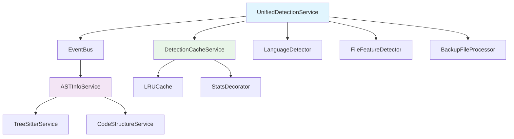

## 5. 重构建议

基于以上分析，我提出以下重构建议来解决 `UnifiedDetectionService` 的越权问题：

### 5.1 缓存重构方案

#### 问题：
- `UnifiedDetectionService` 实现了自己的简单缓存，与项目缓存架构不一致

#### 解决方案：
1. **移除自定义缓存实现**：
   - 删除第79行的 `private detectionCache: Map<string, DetectionResult> = new Map();`
   - 删除第571-584行的 `cacheDetectionResult()` 方法
   - 删除第549-566行的 `getContentHash()` 方法

2. **使用项目统一缓存**：
   ```typescript
   import { LRUCache, StatsDecorator } from '../../../../utils/cache';
   
   // 在构造函数中注入缓存服务
   constructor(
     // ... 其他依赖
     @inject(TYPES.DetectionCache) private cache?: StatsDecorator<string, DetectionResult>
   ) {
     // 初始化缓存
     this.cache = cache || new StatsDecorator(new LRUCache<string, DetectionResult>(1000, {
       enableStats: true,
       defaultTTL: 300000 // 5分钟TTL
     }));
   }
   ```

3. **重构缓存使用逻辑**：
   ```typescript
   async detectFile(filePath: string, content: string): Promise<DetectionResult> {
     const cacheKey = `${filePath}:${content.length}`;
     
     // 使用统一缓存
     const cached = this.cache.get(cacheKey);
     if (cached) {
       this.logger?.debug(`Cache hit for detection: ${filePath}`);
       return cached;
     }
     
     // 检测逻辑...
     const result = await this.performDetection(filePath, content);
     
     // 缓存结果
     this.cache.set(cacheKey, result);
     return result;
   }
   ```

### 5.2 TreeSitter 解析重构方案

#### 问题：
- `UnifiedDetectionService` 直接处理 TreeSitter 解析，违反了单一职责原则

#### 解决方案：
1. **移除 AST 生成逻辑**：
   - 删除第158-169行的 AST 生成代码
   - 删除第508-548行的 `generateAST()` 方法
   - 删除第481-503行的 `shouldGenerateAST()` 方法

2. **将 AST 信息生成移至专门的服务**：
   ```typescript
   // 创建新的服务：ASTInfoService
   @injectable()
   export class ASTInfoService {
     constructor(
       @inject(TYPES.TreeSitterService) private treeSitterService: TreeSitterService
     ) {}
     
     async generateASTInfo(content: string, language: string): Promise<ASTInfo | null> {
       // 将原来的 generateAST 逻辑移到这里
     }
   }
   ```

3. **通过事件总线协调**：
   ```typescript
   // UnifiedDetectionService 只负责检测，通过事件通知其他服务
   async detectFile(filePath: string, content: string): Promise<DetectionResult> {
     // 检测逻辑...
     const result = await this.performDetection(filePath, content);
     
     // 发布检测完成事件，让其他服务处理AST生成
     this.eventBus?.emit(ParserEvents.FILE_DETECTED, {
       filePath,
       result,
       content // 传递内容供AST服务使用
     });
     
     return result;
   }
   ```

### 5.3 职责重新划分

#### 重构后的 UnifiedDetectionService 职责：
1. **文件语言检测**（基于扩展名和内容）
2. **文件特征分析**
3. **备份文件处理**
4. **处理策略推荐**（仅推荐，不执行）

#### 新增的服务：
1. **ASTInfoService**：负责 AST 信息生成
2. **DetectionCacheService**：负责检测结果的缓存管理

### 5.4 重构实施步骤

#### 第一阶段：缓存重构
1. 创建 `DetectionCacheService` 使用项目统一缓存
2. 修改 `UnifiedDetectionService` 注入和使用缓存服务
3. 移除自定义缓存实现
4. 更新相关测试

#### 第二阶段：AST 解析重构
1. 创建 `ASTInfoService` 处理 AST 生成
2. 修改 `UnifiedDetectionService` 移除 AST 相关代码
3. 通过事件总线协调检测和AST生成
4. 更新相关测试

#### 第三阶段：接口优化
1. 精简 `DetectionResult` 接口，移除 AST 相关字段
2. 优化事件总线设计
3. 完善错误处理和日志记录

### 5.5 重构后的架构图



### 5.6 重构收益

1. **职责清晰**：每个服务专注于自己的核心职责
2. **架构一致**：使用项目统一的缓存和事件机制
3. **易于测试**：服务解耦，便于单元测试
4. **易于扩展**：新功能可以通过事件总线添加，不影响核心检测逻辑
5. **性能优化**：使用项目优化的缓存实现，提升性能