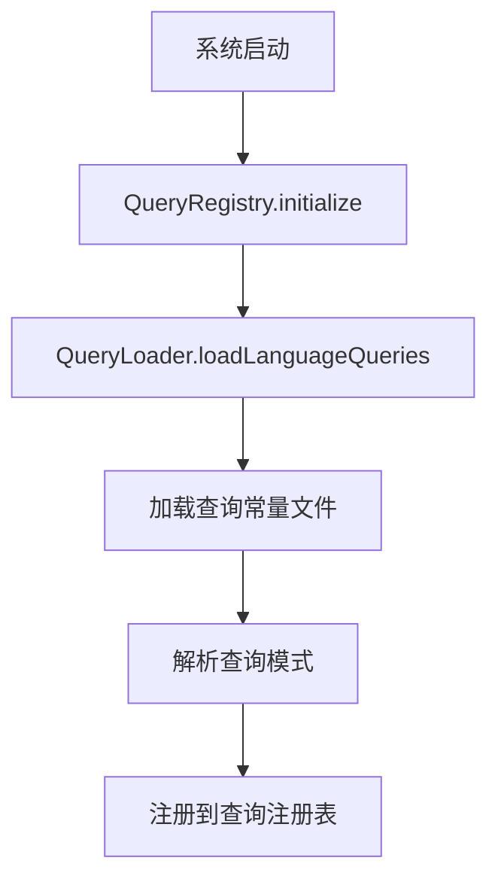
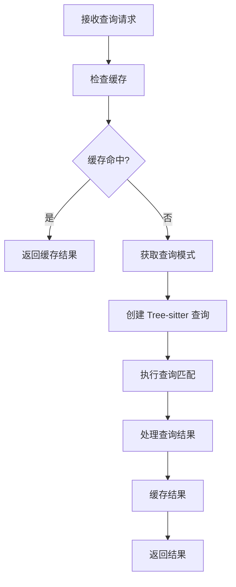

# src\service\parser\core\query 目录功能分析报告

## 系统概述

`src\service\parser\core\query` 目录是一个基于 Tree-sitter 的多语言代码查询和分析系统，专门用于从源代码中提取实体和关系信息，支持代码理解、索引和语义分析。该系统采用模块化设计，支持多种编程语言，并提供了完整的查询执行、缓存和测试框架。

## 核心架构组件

### 1. 查询执行引擎
- **[`TreeSitterQueryExecutor.ts`](src/service/parser/core/query/TreeSitterQueryExecutor.ts:59)**: 核心查询引擎，负责执行 Tree-sitter 查询并处理结果
- **[`TreeSitterQueryFacade.ts`](src/service/parser/core/query/TreeSitterQueryFacade.ts:16)**: 简化的查询门面，提供易用的 API 接口
- **[`QueryResultProcessor.ts`](src/service/parser/core/query/QueryResultProcessor.ts:22)**: 查询结果处理器，将 Tree-sitter 匹配转换为类型化对象

### 2. 查询管理系统
- **[`QueryRegistry.ts`](src/service/parser/core/query/QueryRegistry.ts:9)**: 查询注册表，管理所有语言的查询模式
- **[`QueryLoader.ts`](src/service/parser/core/query/QueryLoader.ts:24)**: 查询加载器，支持动态加载和热重载
- **[`query-config.ts`](src/service/parser/core/query/query-config.ts:115)**: 动态查询配置管理器，支持运行时配置更新

### 3. 缓存和性能优化
- **[`QueryCache.ts`](src/service/parser/core/query/QueryCache.ts:15)**: 统一查询缓存管理器，支持多层缓存
- **[`QueryPerformanceMonitor.ts`](src/service/parser/core/query/QueryPerformanceMonitor.ts)**: 性能监控组件
- **[`QueryPatternExtractor.ts`](src/service/parser/core/query/QueryPatternExtractor.ts)**: 查询模式提取器

## 语言支持和查询常量

### 支持的编程语言
系统支持 20+ 种编程语言，包括：
- **主流语言**: C, C++, TypeScript, JavaScript, Python, Java, Go, Rust
- **其他语言**: Swift, Kotlin, Ruby, PHP, Scala, Solidity, Lua, OCaml, Elixir, Zig
- **特殊格式**: HTML, CSS, JSON, YAML, TOML, Vue, TSX, 嵌入式模板

### 查询组织结构
每种语言的查询按照以下结构组织：
```
queries-constant/{language}/
├── index.ts                # 主入口文件
├── entities.ts             # 实体查询
├── relationships/          # 关系查询
│   ├── call.ts             # 调用关系
│   ├── inheritance.ts      # 继承关系
│   ├── concurrency.ts      # 并发关系
│   └── ...
├── payload/                # 作为实体的附加信息
│   ├── data-flow.ts        # 数据流关系
│   ├── control-flow.ts     # 控制流关系
│   └── ...
```

## 实体和关系类型系统

### 实体类型 ([`EntityTypes.ts`](src/service/parser/core/query/types/EntityTypes.ts:11))
```typescript
enum EntityType {
  PREPROCESSOR = 'preprocessor',     // 预处理器指令
  TYPE_DEFINITION = 'type_definition', // 类型定义
  FUNCTION = 'function',             // 函数定义
  VARIABLE = 'variable',             // 变量声明
  ANNOTATION = 'annotation'          // 注解和注释
}
```

### 关系类型 ([`RelationshipTypes.ts`](src/service/parser/core/query/types/RelationshipTypes.ts:26))
系统支持 9 大类关系：
- **调用关系**: CALL, METHOD_CALL, FUNCTION_POINTER_CALL
- **数据流关系**: ASSIGNMENT, PARAMETER_PASSING, RETURN_VALUE
- **控制流关系**: CONDITIONAL, LOOP, JUMP
- **依赖关系**: INCLUDE, TYPE_REFERENCE, FUNCTION_REFERENCE
- **继承关系**: EXTENDS, IMPLEMENTS, COMPOSITION
- **生命周期关系**: INITIALIZATION, CLEANUP
- **语义关系**: ERROR_HANDLING, RESOURCE_MANAGEMENT
- **引用关系**: REFERENCE
- **注解关系**: ANNOTATION

## 查询执行流程

### 1. 查询加载和初始化


### 2. 查询执行过程


## 缓存机制

### 多层缓存架构
- **查询对象缓存**: 缓存预编译的 Tree-sitter Query 对象
- **结果缓存**: 缓存查询结果，支持实体、关系和混合查询
- **AST 缓存**: 缓存语法树对象
- **LRU 策略**: 使用最近最少使用算法管理缓存

### 缓存键生成
- 使用 [`HashUtils`](src/service/parser/core/query/QueryCache.ts:52) 生成哈希键
- 支持基于 AST、查询类型和语言的复合键
- 提供缓存统计和性能监控

## 测试框架

### 测试组织结构
```
__tests__/
├── TreeSitterQueryExecutor.integration.test.ts  # 集成测试
├── ast-cache.test.ts                           # 缓存测试
└── queries-constant/__tests__/                  # 查询常量测试
    ├── c/                                      # C 语言测试
    │   ├── functions/                          # 函数查询测试
    │   ├── structs/                            # 结构体查询测试
    │   ├── variables/                          # 变量查询测试
    │   └── relationships/                      # 关系查询测试
    └── cpp/                                    # C++ 语言测试
        ├── classes/                            # 类查询测试
        └── concurrency-relationships/          # 并发关系测试
```

### 测试格式
- **`.tsqnb` 文件**: Jupyter Notebook 格式的测试用例
- **JSON 配置**: 测试元数据和配置
- **自动化脚本**: 支持批量测试和结果验证

## 主要功能特性

### 1. 多语言支持
- 统一的查询接口，支持 20+ 种编程语言
- 语言特定的查询优化和实体识别
- 可扩展的语言支持架构

### 2. 实体和关系提取
- 精确的代码实体识别（函数、类、变量等）
- 丰富的语义关系提取（调用、继承、数据流等）
- 支持复杂代码模式的分析

### 3. 高性能查询
- 多层缓存机制提升查询性能
- 并行查询支持
- 查询结果预处理和优化

### 4. 灵活的配置系统
- 动态查询配置管理
- 运行时查询类型注册
- 支持自定义查询模式

### 5. 完整的测试框架
- 全面的单元测试和集成测试
- 自动化测试执行和验证
- 性能基准测试

## 应用场景

### 1. 代码索引和搜索
- 为代码搜索引擎提供结构化数据
- 支持语义代码搜索和推荐
- 代码片段索引和检索

### 2. 代码分析和理解
- 代码质量分析和度量
- 依赖关系分析和影响评估
- 代码复杂度分析

### 3. 开发工具支持
- IDE 智能提示和自动补全
- 代码导航和重构工具
- 错误检测和修复建议

### 4. 知识图谱构建
- 代码知识图谱的实体和关系提取
- 技术文档自动生成
- 代码相似性分析

## 系统优势

1. **模块化设计**: 清晰的组件分离，易于维护和扩展
2. **高性能**: 多层缓存和并行处理，支持大规模代码分析
3. **可扩展性**: 支持新语言和查询类型的动态添加
4. **类型安全**: 完整的 TypeScript 类型定义
5. **测试覆盖**: 全面的测试框架确保系统稳定性

这个查询系统为代码搜索助手项目提供了强大的代码分析能力，是整个系统的核心组件之一。