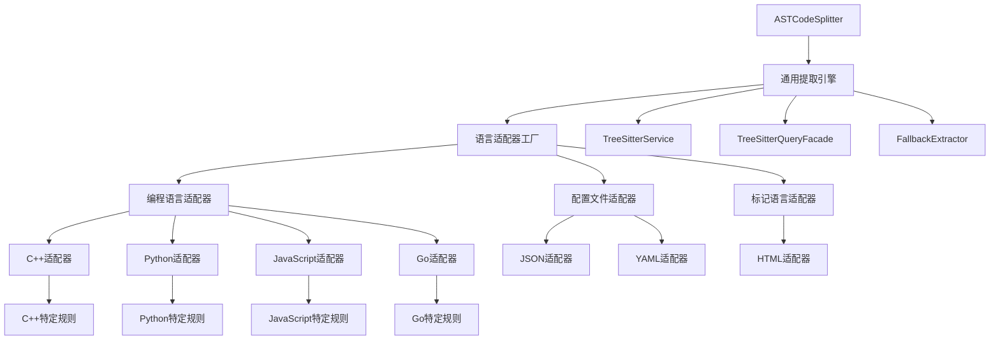

## ASTCodeSplitter 通用性分析与架构设计

基于对多种语言适配器的深入分析，我现在可以提供一个关于 ASTCodeSplitter 是否应该作为通用处理模块的全面分析：

### 1. 多语言适配器差异分析

#### 1.1 编程语言适配器（C++, Python, JavaScript, Go）

**共同特征**：
- 都继承自 [`BaseLanguageAdapter`](src/service/parser/core/normalization/adapters/BaseLanguageAdapter.ts:1)
- 支持函数、类、方法、变量等编程概念
- 具有相似的查询类型：`functions`, `classes`, `variables`, `types`
- 支持关系提取：调用、数据流、继承、并发等

**关键差异**：

| 语言 | 特有结构 | 节点类型示例 | 特殊处理 |
|------|----------|-------------|----------|
| C++ | 模板、命名空间、预处理器 | `template_declaration`, `namespace_definition`, `preproc_include` | 模板参数提取、宏处理 |
| Python | 装饰器、异步函数、推导式 | `decorated_definition`, `async_function`, `comprehension` | 装饰器链分析、异步上下文 |
| JavaScript | JSX、闭包、原型链 | `jsx_element`, `function_expression`, `prototype` | JSX混合内容、动态特性 |
| Go | 接口、goroutine、channel | `interface_type`, `go_statement`, `channel` | 并发模式、接口实现 |

#### 1.2 配置文件适配器（JSON, YAML）

**共同特征**：
- 继承自 [`ConfigLanguageAdapter`](src/service/parser/core/normalization/adapters/ConfigLanguageAdapter.ts:1)
- 处理键值对、数组、对象结构
- 支持配置路径解析和数据类型推断

**关键差异**：

| 语言 | 特有结构 | 节点类型示例 | 特殊处理 |
|------|----------|-------------|----------|
| JSON | 对象、数组、标量值 | `object`, `array`, `pair` | 类型推断、嵌套深度计算 |
| YAML | 锚点、别名、多文档 | `anchor`, `alias`, `document` | 引用解析、缩进级别处理 |

#### 1.3 标记语言适配器（HTML）

**特征**：
- 实现了 [`IEnhancedHtmlLanguageAdapter`](src/service/parser/core/normalization/adapters/HtmlLanguageAdapter.ts:11) 接口
- 处理标签、属性、脚本/样式块
- 支持资源引用和自定义元素检测

### 2. 通用性分析结论

#### 2.1 可以通用化的部分

**核心提取逻辑**：
- AST节点遍历算法
- 基本的位置信息提取
- 通用的复杂度计算框架
- 代码块创建和元数据构建

**基础设施**：
- [`TreeSitterService`](src/service/parser/core/parse/TreeSitterService.ts:13) 提供的统一接口
- [`TreeSitterQueryFacade`](src/service/parser/core/query/TreeSitterQueryFacade.ts:11) 查询系统
- [`FallbackExtractor`](src/service/parser/utils/FallbackExtractor.ts:17) 回退机制
- [`CodeChunkBuilder`](src/service/parser/processing/types/CodeChunk.ts:85) 构建工具

#### 2.2 需要语言特定的部分

**结构识别**：
- 不同语言的函数/类定义模式
- 语言特有的语法结构（装饰器、模板、JSX等）
- 嵌套规则的差异

**语义处理**：
- 语言特定的复杂度因素
- 修饰符和关键字的识别
- 关系提取的语义差异

### 3. 推荐架构设计

基于分析，我推荐采用**分层适配器架构**，既保持通用性又支持语言特定扩展：



### 4. 具体实现方案

#### 4.1 通用 ASTCodeSplitter 重构

```typescript
/**
 * 通用AST代码分割器
 * 支持多语言的智能代码分段
 */
@injectable()
export class ASTCodeSplitter {
  private adapterFactory: LanguageAdapterFactory;
  private currentContent: string = '';

  constructor(
    @inject(TYPES.TreeSitterService) private treeSitterService: TreeSitterService,
    @inject(TYPES.LanguageDetectionService) private languageDetectionService: LanguageDetectionService,
    @inject(TYPES.LoggerService) private logger: LoggerService,
    @inject(TYPES.LanguageAdapterFactory) adapterFactory: LanguageAdapterFactory,
    config: ASTSplitterConfig = {}
  ) {
    this.config = {
      maxFunctionSize: 1000,
      maxClassSize: 2000,
      maxNamespaceSize: 3000,
      minFunctionLines: 3,
      minClassLines: 2,
      maxChunkSize: 1500,
      minChunkSize: 50,
      enableNestedExtraction: true,
      maxNestingLevel: 2,
      preserveNestedMethods: true,
      preserveNestedFunctions: false,
      preserveNestedClasses: false,
      preferSemanticBoundaries: true,
      extractImports: true,
      extractNamespaces: true,
      extractTemplates: true,
      fallbackStrategies: ['line-based', 'bracket-balancing'],
      enableFallback: true,
      ...config
    };
    this.adapterFactory = adapterFactory;
  }

  async split(content: string, filePath: string, language: string | undefined): Promise<CodeChunk[]> {
    try {
      // 检测语言
      const detectedLanguage = language || await this.detectLanguage(filePath, content);
      if (!detectedLanguage) {
        return this.fallbackSplit(content, filePath, language);
      }

      // 获取语言适配器
      const adapter = this.adapterFactory.getAdapter(detectedLanguage);
      if (!adapter) {
        this.logger.warn(`未找到语言适配器: ${detectedLanguage}`);
        return this.fallbackSplit(content, filePath, language);
      }

      // 解析AST
      const parseResult = await this.treeSitterService.parseCode(content, detectedLanguage);
      if (!parseResult.success) {
        return this.fallbackSplit(content, filePath, language);
      }

      // 使用适配器进行分段
      const chunks = await this.extractWithAdapter(
        adapter,
        parseResult.ast,
        content,
        filePath,
        detectedLanguage
      );

      this.logger.debug(`ASTCodeSplitter produced ${chunks.length} chunks for ${filePath}`);
      return chunks;
    } catch (error) {
      this.logger.error(`ASTCodeSplitter failed for ${filePath}: ${error}`);
      return this.fallbackSplit(content, filePath, language);
    }
  }

  private async extractWithAdapter(
    adapter: ILanguageAdapter,
    ast: Parser.SyntaxNode,
    content: string,
    filePath: string,
    language: string
  ): Promise<CodeChunk[]> {
    this.currentContent = content;
    
    try {
      // 使用适配器的语言特定规则
      const extractors = adapter.getStructureExtractors();
      const chunks: CodeChunk[] = [];

      // 第一层：顶级结构
      const topLevelChunks = await this.extractTopLevelStructures(
        extractors.topLevel,
        ast,
        content,
        filePath,
        language
      );
      chunks.push(...topLevelChunks);

      // 第二层：嵌套结构（如果启用）
      if (this.config.enableNestedExtraction && this.config.maxNestingLevel >= 2) {
        const nestedChunks = await this.extractNestedStructures(
          extractors.nested,
          ast,
          content,
          filePath,
          language
        );
        chunks.push(...nestedChunks);
      }

      // 第三层：内部结构（如果启用）
      if (this.config.enableNestedExtraction && this.config.maxNestingLevel >= 3) {
        const internalChunks = await this.extractInternalStructures(
          extractors.internal,
          ast,
          content,
          filePath,
          language
        );
        chunks.push(...internalChunks);
      }

      return chunks.length > 0 ? chunks : [this.createFileLevelChunk(content, filePath, language)];
    } catch (error) {
      this.logger.error(`适配器提取失败: ${error}`);
      return [this.createFileLevelChunk(content, filePath, language)];
    }
  }
}
```

#### 4.2 语言适配器接口

```typescript
/**
 * 语言适配器接口
 * 定义语言特定的结构提取规则
 */
export interface ILanguageAdapter {
  /**
   * 获取支持的语言
   */
  getSupportedLanguage(): string;

  /**
   * 获取结构提取器
   */
  getStructureExtractors(): LanguageStructureExtractors;

  /**
   * 验证节点是否有效
   */
  validateNode(node: Parser.SyntaxNode, type: string): boolean;

  /**
   * 提取节点名称
   */
  extractNodeName(node: Parser.SyntaxNode): string;

  /**
   * 计算节点复杂度
   */
  calculateNodeComplexity(node: Parser.SyntaxNode, content: string): number;

  /**
   * 获取语言特定的配置
   */
  getLanguageConfig(): LanguageConfig;
}

/**
 * 语言结构提取器
 */
export interface LanguageStructureExtractors {
  /**
   * 顶级结构提取器
   */
  topLevel: TopLevelExtractor[];

  /**
   * 嵌套结构提取器
   */
  nested: NestedExtractor[];

  /**
   * 内部结构提取器
   */
  internal: InternalExtractor[];
}

/**
 * 顶级结构提取器
 */
export interface TopLevelExtractor {
  type: 'functions' | 'classes' | 'namespaces' | 'imports' | 'types' | 'templates';
  extract: (ast: Parser.SyntaxNode, language: string) => Promise<ExtractedNode[]>;
  validate: (node: ExtractedNode) => boolean;
  createChunk: (node: ExtractedNode, content: string, filePath: string, language: string) => CodeChunk;
}
```

#### 4.3 C++ 语言适配器示例

```typescript
/**
 * C++语言适配器实现
 */
export class CppLanguageAdapter implements ILanguageAdapter {
  getSupportedLanguage(): string {
    return 'cpp';
  }

  getStructureExtractors(): LanguageStructureExtractors {
    return {
      topLevel: [
        {
          type: 'functions',
          extract: async (ast, language) => {
            const nodes = await this.treeSitterService.extractFunctions(ast, language);
            return nodes.map(node => this.extractNodeInfo(node));
          },
          validate: (node) => this.validateFunctionNode(node),
          createChunk: (node, content, filePath, language) => 
            this.createFunctionChunk(node, content, filePath, language)
        },
        {
          type: 'classes',
          extract: async (ast, language) => {
            const nodes = await this.treeSitterService.extractClasses(ast, language);
            return nodes.map(node => this.extractNodeInfo(node));
          },
          validate: (node) => this.validateClassNode(node),
          createChunk: (node, content, filePath, language) => 
            this.createClassChunk(node, content, filePath, language)
        },
        {
          type: 'namespaces',
          extract: async (ast, language) => {
            return this.extractNamespaces(ast, language);
          },
          validate: (node) => this.validateNamespaceNode(node),
          createChunk: (node, content, filePath, language) => 
            this.createNamespaceChunk(node, content, filePath, language)
        }
      ],
      nested: [
        {
          type: 'methods',
          extract: async (ast, language) => {
            return this.extractMethodsFromClasses(ast, language);
          },
          validate: (node) => this.validateMethodNode(node),
          createChunk: (node, content, filePath, language) => 
            this.createMethodChunk(node, content, filePath, language)
        }
      ],
      internal: [
        {
          type: 'variables',
          extract: async (ast, language) => {
            return this.extractLocalVariables(ast, language);
          },
          validate: (node) => this.validateVariableNode(node),
          createChunk: (node, content, filePath, language) => 
            this.createVariableChunk(node, content, filePath, language)
        }
      ]
    };
  }

  private validateFunctionNode(node: ExtractedNode): boolean {
    const lineCount = node.location.endLine - node.location.startLine + 1;
    const size = node.text.length;

    return (
      lineCount >= 3 &&
      size <= 1000 &&
      size >= 50
    );
  }

  private createFunctionChunk(node: ExtractedNode, content: string, filePath: string, language: string): CodeChunk {
    return new CodeChunkBuilder()
      .setContent(node.text)
      .setStartLine(node.location.startLine)
      .setEndLine(node.location.endLine)
      .setLanguage(language)
      .setStrategy('ast-splitter')
      .setType(ChunkType.FUNCTION)
      .addMetadata('filePath', filePath)
      .addMetadata('functionName', node.name)
      .addMetadata('complexity', this.calculateNodeComplexity(node.node, node.text))
      .addMetadata('level', 1)
      .addMetadata('hasNestedContent', true)
      .build();
  }
}
```

### 5. 优势与特点

1. **高度通用性**：核心逻辑统一，语言特定规则分离
2. **易于扩展**：新增语言只需实现适配器接口
3. **性能优化**：复用现有的 TreeSitter 基础设施
4. **配置灵活**：支持语言特定的配置参数
5. **降级机制**：统一的降级策略，语言特定的回退逻辑

### 6. 实施建议

1. **第一阶段**：实现通用框架和 C++ 适配器
2. **第二阶段**：添加 Python、JavaScript、Go 适配器
3. **第三阶段**：实现配置文件和标记语言适配器
4. **第四阶段**：优化性能和添加高级特性

这种架构既保持了 ASTCodeSplitter 的通用性，又充分支持了不同语言的特定需求，是一个平衡且可扩展的解决方案。