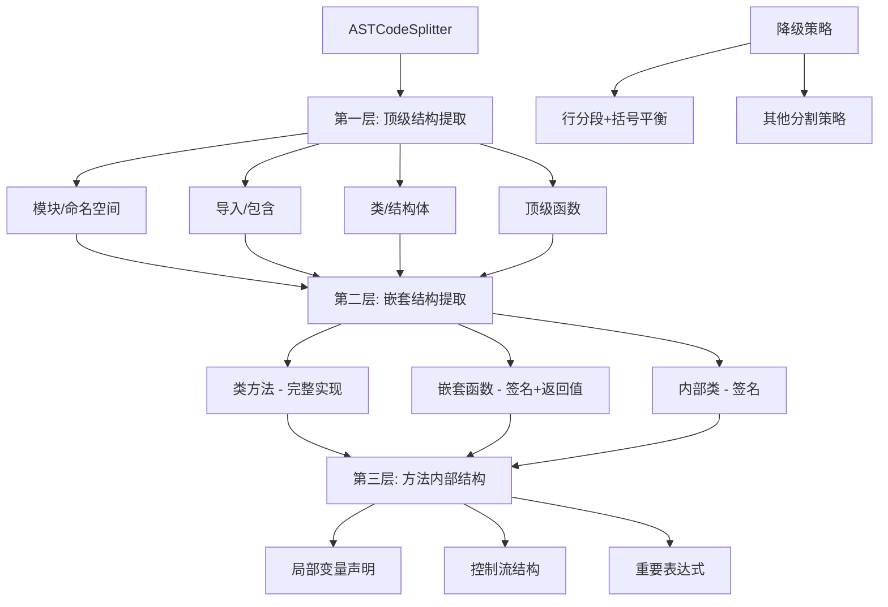

## ASTCodeSplitter 重构方案 - 支持嵌套提取的分层架构

基于对 CppLanguageAdapter 和现有系统的深入分析，我设计了一个支持嵌套提取的分层架构方案：

### 1. 分层提取架构设计



### 2. 可提取的代码结构模式

基于 CppLanguageAdapter 的分析，我们可以提取以下结构：

#### 2.1 顶级结构（第一层）
- **模块/命名空间**: `namespace_definition`
- **导入/包含**: `preproc_include`, `using_declaration`
- **类/结构体**: `class_specifier`, `struct_specifier`, `union_specifier`
- **顶级函数**: `function_definition`
- **类型定义**: `type_definition`, `type_alias_declaration`, `enum_specifier`
- **模板声明**: `template_declaration`
- **预处理器**: `preproc_def`, `preproc_function_def`

#### 2.2 嵌套结构（第二层）
- **类方法**: 完整实现，包括方法体
- **嵌套函数**: 仅保留签名和返回值，不保留完整实现
- **内部类**: 仅保留类声明签名
- **构造函数/析构函数**: 完整实现
- **运算符重载**: 完整实现

#### 2.3 内部结构（第三层）
- **局部变量声明**: 重要变量声明
- **控制流结构**: if、for、while、switch等关键结构
- **重要表达式**: 复杂表达式、函数调用等

### 3. 配置参数优化

```typescript
interface ASTSplitterConfig {
  // 大小限制
  maxFunctionSize: 1000;        // 函数最大字符数
  maxClassSize: 2000;           // 类最大字符数
  maxNamespaceSize: 3000;       // 命名空间最大字符数
  minFunctionLines: 3;          // 函数最小行数
  minClassLines: 2;             // 类最小行数
  maxChunkSize: 1500;           // 通用代码块最大大小
  minChunkSize: 50;             // 通用代码块最小大小
  
  // 嵌套提取控制
  enableNestedExtraction: true;     // 是否启用嵌套提取
  maxNestingLevel: 2;               // 最大嵌套层级
  preserveNestedMethods: true;      // 是否保留嵌套方法的完整实现
  preserveNestedFunctions: false;   // 是否保留嵌套函数的完整实现
  preserveNestedClasses: false;     // 是否保留嵌套类的完整实现
  
  // 语义边界控制
  preferSemanticBoundaries: true;   // 是否优先语义边界
  extractImports: true;             // 是否提取导入语句
  extractNamespaces: true;          // 是否提取命名空间
  extractTemplates: true;           // 是否提取模板声明
  
  // 降级策略
  fallbackStrategies: ['line-based', 'bracket-balancing']; // 降级策略顺序
  enableFallback: true;             // 是否启用降级
}
```

### 4. 实现方案

#### 4.1 重构主提取方法

```typescript
async split(content: string, filePath: string, language: string | undefined): Promise<CodeChunk[]> {
  try {
    // 检查语言支持
    if (!language || !this.languageDetectionService.isLanguageSupportedForAST(language)) {
      return this.fallbackSplit(content, filePath, language);
    }

    // 使用Tree-sitter解析AST
    const parseResult = await this.treeSitterService.parseCode(content, language);
    if (!parseResult.success) {
      return this.fallbackSplit(content, filePath, language);
    }

    // 分层提取代码块
    const chunks = await this.extractChunksHierarchically(
      parseResult.ast, 
      content, 
      filePath, 
      language
    );

    this.logger.debug(`ASTCodeSplitter produced ${chunks.length} chunks for ${filePath}`);
    return chunks;
  } catch (error) {
    this.logger.error(`ASTCodeSplitter failed for ${filePath}: ${error}`);
    return this.fallbackSplit(content, filePath, language);
  }
}
```

#### 4.2 分层提取实现

```typescript
private async extractChunksHierarchically(
  ast: Parser.SyntaxNode, 
  content: string, 
  filePath: string, 
  language: string
): Promise<CodeChunk[]> {
  const chunks: CodeChunk[] = [];
  
  try {
    // 第一层：提取顶级结构
    const topLevelChunks = await this.extractTopLevelStructures(ast, content, filePath, language);
    chunks.push(...topLevelChunks);
    
    // 第二层：提取嵌套结构（如果启用）
    if (this.config.enableNestedExtraction && this.config.maxNestingLevel >= 2) {
      const nestedChunks = await this.extractNestedStructures(ast, content, filePath, language);
      chunks.push(...nestedChunks);
    }
    
    // 第三层：提取内部结构（如果启用）
    if (this.config.enableNestedExtraction && this.config.maxNestingLevel >= 3) {
      const internalChunks = await this.extractInternalStructures(ast, content, filePath, language);
      chunks.push(...internalChunks);
    }
    
    // 如果没有提取到任何内容，返回整个文件
    if (chunks.length === 0) {
      chunks.push(this.createFileLevelChunk(content, filePath, language));
    }
    
    return chunks;
  } catch (error) {
    this.logger.error(`分层提取失败: ${error}`);
    return [this.createFileLevelChunk(content, filePath, language)];
  }
}
```

#### 4.3 顶级结构提取

```typescript
private async extractTopLevelStructures(
  ast: Parser.SyntaxNode, 
  content: string, 
  filePath: string, 
  language: string
): Promise<CodeChunk[]> {
  const chunks: CodeChunk[] = [];
  
  try {
    // 并行提取各种顶级结构
    const [
      namespaces,
      imports,
      classes,
      functions,
      types,
      templates
    ] = await Promise.all([
      this.extractNamespaces(ast, language),
      this.extractImports(ast, language),
      this.extractClasses(ast, language),
      this.extractFunctions(ast, language),
      this.extractTypes(ast, language),
      this.extractTemplates(ast, language)
    ]);
    
    // 处理命名空间
    for (const ns of namespaces) {
      chunks.push(this.createChunk(
        ns.text,
        ns.location.startLine,
        ns.location.endLine,
        language,
        ChunkType.MODULE,
        {
          filePath,
          namespaceName: ns.name,
          complexity: this.calculateComplexity(ns.text),
          strategy: 'ast-splitter',
          level: 1
        }
      ));
    }
    
    // 处理导入语句
    for (const imp of imports) {
      chunks.push(this.createChunk(
        imp.text,
        imp.location.startLine,
        imp.location.endLine,
        language,
        ChunkType.IMPORT,
        {
          filePath,
          importPath: imp.name,
          strategy: 'ast-splitter',
          level: 1
        }
      ));
    }
    
    // 处理类和结构体
    for (const cls of classes) {
      chunks.push(this.createChunk(
        cls.text,
        cls.location.startLine,
        cls.location.endLine,
        language,
        ChunkType.CLASS,
        {
          filePath,
          className: cls.name,
          complexity: this.calculateComplexity(cls.text),
          strategy: 'ast-splitter',
          level: 1,
          hasNestedContent: true // 标记可能有嵌套内容
        }
      ));
    }
    
    // 处理函数
    for (const func of functions) {
      chunks.push(this.createChunk(
        func.text,
        func.location.startLine,
        func.location.endLine,
        language,
        ChunkType.FUNCTION,
        {
          filePath,
          functionName: func.name,
          complexity: this.calculateComplexity(func.text),
          strategy: 'ast-splitter',
          level: 1,
          hasNestedContent: true // 标记可能有嵌套内容
        }
      ));
    }
    
    // 处理类型定义
    for (const type of types) {
      chunks.push(this.createChunk(
        type.text,
        type.location.startLine,
        type.location.endLine,
        language,
        ChunkType.TYPE,
        {
          filePath,
          typeName: type.name,
          strategy: 'ast-splitter',
          level: 1
        }
      ));
    }
    
    // 处理模板声明
    for (const template of templates) {
      chunks.push(this.createChunk(
        template.text,
        template.location.startLine,
        template.location.endLine,
        language,
        ChunkType.GENERIC,
        {
          filePath,
          templateName: template.name,
          strategy: 'ast-splitter',
          level: 1
        }
      ));
    }
    
    return chunks;
  } catch (error) {
    this.logger.error(`顶级结构提取失败: ${error}`);
    return [];
  }
}
```

#### 4.4 嵌套结构提取

```typescript
private async extractNestedStructures(
  ast: Parser.SyntaxNode, 
  content: string, 
  filePath: string, 
  language: string
): Promise<CodeChunk[]> {
  const chunks: CodeChunk[] = [];
  
  try {
    // 获取所有类和函数节点
    const [classNodes, functionNodes] = await Promise.all([
      this.treeSitterService.extractClasses(ast, language),
      this.treeSitterService.extractFunctions(ast, language)
    ]);
    
    // 处理类中的嵌套方法
    for (const classNode of classNodes) {
      const methods = await this.extractMethodsFromClass(classNode, language);
      
      for (const method of methods) {
        const shouldPreserveFull = this.config.preserveNestedMethods;
        const methodContent = shouldPreserveFull ? 
          method.text : 
          this.extractMethodSignatureOnly(method.text);
          
        chunks.push(this.createChunk(
          methodContent,
          method.location.startLine,
          method.location.endLine,
          language,
          ChunkType.FUNCTION,
          {
            filePath,
            functionName: method.name,
            className: this.getClassName(classNode),
            complexity: this.calculateComplexity(methodContent),
            strategy: 'ast-splitter',
            level: 2,
            isNested: true,
            isSignatureOnly: !shouldPreserveFull
          }
        ));
      }
    }
    
    // 处理函数中的嵌套函数
    for (const funcNode of functionNodes) {
      const nestedFunctions = await this.extractNestedFunctionsFromFunction(funcNode, language);
      
      for (const nestedFunc of nestedFunctions) {
        const shouldPreserveFull = this.config.preserveNestedFunctions;
        const funcContent = shouldPreserveFull ? 
          nestedFunc.text : 
          this.extractFunctionSignatureOnly(nestedFunc.text);
          
        chunks.push(this.createChunk(
          funcContent,
          nestedFunc.location.startLine,
          nestedFunc.location.endLine,
          language,
          ChunkType.FUNCTION,
          {
            filePath,
            functionName: nestedFunc.name,
            parentFunction: this.getFunctionName(funcNode),
            complexity: this.calculateComplexity(funcContent),
            strategy: 'ast-splitter',
            level: 2,
            isNested: true,
            isSignatureOnly: !shouldPreserveFull
          }
        ));
      }
    }
    
    return chunks;
  } catch (error) {
    this.logger.error(`嵌套结构提取失败: ${error}`);
    return [];
  }
}
```

#### 4.5 降级策略实现

```typescript
private fallbackSplit(content: string, filePath: string, language: string | undefined): CodeChunk[] {
  this.logger.info(`使用降级策略处理 ${filePath}`);
  
  // 尝试使用其他分割策略
  for (const strategy of this.config.fallbackStrategies) {
    try {
      switch (strategy) {
        case 'line-based':
          return this.lineBasedSplit(content, filePath, language);
        case 'bracket-balancing':
          return this.bracketBalancingSplit(content, filePath, language);
        default:
          this.logger.warn(`未知的降级策略: ${strategy}`);
      }
    } catch (error) {
      this.logger.warn(`降级策略 ${strategy} 失败: ${error}`);
    }
  }
  
  // 最终降级：整个文件作为单个代码块
  return [this.createFileLevelChunk(content, filePath, language)];
}

private bracketBalancingSplit(content: string, filePath: string, language: string | undefined): CodeChunk[] {
  const chunks: CodeChunk[] = [];
  const lines = content.split('\n');
  let currentChunk = '';
  let startLine = 1;
  let bracketCount = 0;
  
  for (let i = 0; i < lines.length; i++) {
    const line = lines[i];
    currentChunk += line + '\n';
    
    // 计算括号平衡
    bracketCount += (line.match(/{/g) || []).length;
    bracketCount -= (line.match(/}/g) || []).length;
    
    // 如果括号平衡且达到最小大小，创建代码块
    if (bracketCount === 0 && currentChunk.length >= this.config.minChunkSize) {
      chunks.push(this.createChunk(
        currentChunk.trim(),
        startLine,
        i + 1,
        language || 'unknown',
        ChunkType.GENERIC,
        {
          filePath,
          strategy: 'bracket-balancing',
          fallback: true
        }
      ));
      
      currentChunk = '';
      startLine = i + 2;
    }
  }
  
  // 处理剩余内容
  if (currentChunk.trim().length > 0) {
    chunks.push(this.createChunk(
      currentChunk.trim(),
      startLine,
      lines.length,
      language || 'unknown',
      ChunkType.GENERIC,
      {
        filePath,
        strategy: 'bracket-balancing',
        fallback: true
      }
    ));
  }
  
  return chunks.length > 0 ? chunks : [this.createFileLevelChunk(content, filePath, language)];
}
```

### 5. 优势与特点

1. **分层提取**：支持多层嵌套结构的智能提取
2. **语义边界**：基于AST语义边界进行精确分段
3. **可配置性**：丰富的配置选项控制提取行为
4. **降级机制**：多级降级策略确保鲁棒性
5. **性能优化**：并行提取和缓存机制
6. **语言适配**：基于现有语言适配器的扩展能力

这个方案充分利用了项目现有的强大基础设施，同时提供了更精细和智能的代码分段能力，特别适合处理复杂的C++代码结构。