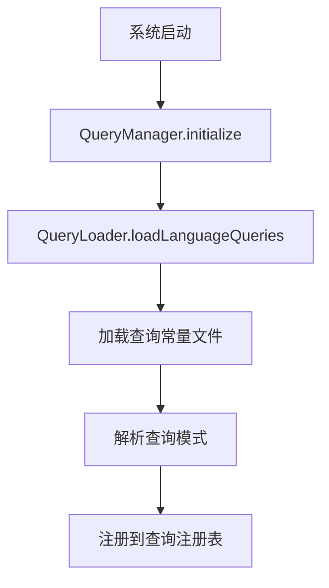
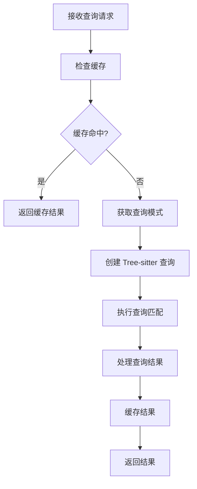

# src\service\parser\query 目录职责说明文档

## 概述

`src\service\parser\query` 目录是一个基于 Tree-sitter 的多语言代码查询和分析系统，专门用于从源代码中提取实体和关系信息，支持代码理解、索引和语义分析。该系统采用模块化设计，支持多种编程语言，并提供了完整的查询执行、缓存和测试框架。

## 核心组件职责分析

### 1. 查询管理系统

#### [`QueryManager.ts`](src/service/parser/query/QueryManager.ts:9)
**职责**: 统一查询管理器，整合了 QueryLoader、QueryRegistry 和 QueryPatternExtractor 的功能
- 全局查询系统初始化和状态管理
- 多语言查询模式的加载和管理
- 查询类型发现和验证
- 查询语法验证和错误处理
- 查询统计信息和性能监控

#### [`QueryRegistry.ts`](src/service/parser/query/QueryRegistry.ts:9)
**职责**: 查询注册表，管理所有语言的查询模式
- 查询模式的注册和存储
- 查询类型的分类和组织
- 语言特定查询的映射管理
- 查询配置的验证和更新

#### [`QueryLoader.ts`](src/service/parser/query/QueryLoader.ts:24)
**职责**: 查询加载器，支持新的目录结构
- 动态加载语言查询文件
- 支持新旧查询文件结构的兼容
- 查询文件的智能分类和提取
- 查询类型发现和验证

### 2. 查询执行引擎

#### [`QueryExecutor.ts`](src/service/parser/query/QueryExecutor.ts:92)
**职责**: 整合查询执行器，提供统一的查询接口
- 实体查询执行（函数、类型、变量等）
- 关系查询执行（调用、数据流、控制流等）
- 混合查询执行（实体和关系组合）
- 查询策略选择和优先级管理
- 性能优化和缓存管理

#### [`QueryResultProcessor.ts`](src/service/parser/query/QueryResultProcessor.ts:22)
**职责**: 查询结果处理器，将 Tree-sitter 匹配转换为类型化对象
- Tree-sitter 查询结果的类型化转换
- 实体和关系的识别和构建
- 语言特定的实体工厂管理
- 结果的位置信息和元数据提取

### 3. 缓存和性能优化

#### [`CacheService.ts`](src/service/parser/query/CacheService.ts:58)
**职责**: 统一缓存服务，整合解析器缓存和查询缓存
- 多层缓存架构（解析器、AST、查询结果、实体、关系）
- 缓存键生成和哈希管理
- 缓存统计和性能监控
- 缓存清理和配置管理

#### [`QueryPerformanceMonitor.ts`](src/service/parser/query/QueryPerformanceMonitor.ts:9)
**职责**: 查询性能监控器
- 查询执行时间的记录和统计
- 缓存命中率的监控
- 系统性能指标的收集
- 周期性性能报告生成

### 4. 查询模式管理

#### [`QueryPatternExtractor.ts`](src/service/parser/query/QueryPatternExtractor.ts:5)
**职责**: 查询模式提取器工具类
- 从查询字符串中提取特定关键词的模式
- 查询模式的智能分类和组织
- 查询模式的验证和优化

#### [`QueryConfig.ts`](src/service/parser/query/QueryConfig.ts:94)
**职责**: 简化的查询配置系统
- 查询类型配置的定义和管理
- 复合查询的配置和组织
- 查询配置的验证和更新
- 语言特定查询的映射管理

### 5. 解析器管理

#### [`DynamicParserManager.ts`](src/service/parser/query/DynamicParserManager.ts:39)
**职责**: 动态解析器管理器，按需加载语言解析器
- Tree-sitter 语言解析器的动态加载
- 语言检测和文件解析
- 解析器缓存和性能优化
- 回退机制和错误处理

## 查询常量目录结构

### [`queries-constant/`](src/service/parser/query/queries-constant/)
**职责**: 存储所有语言的 Tree-sitter 查询模式

#### 组织结构
```
queries-constant/
├── {language}/                    # 每种语言的查询目录
│   ├── index.ts                  # 主入口文件，整合所有查询
│   ├── entities/                 # 实体查询
│   │   ├── functions.ts         # 函数查询
│   │   ├── classes.ts           # 类查询
│   │   ├── variables.ts         # 变量查询
│   │   └── ...
│   ├── relationships/            # 关系查询
│   │   ├── control-flow.ts      # 控制流关系
│   │   ├── data-flow.ts         # 数据流关系
│   │   └── ...
│   └── shared/                   # 共享查询
│       ├── call-expressions.ts  # 调用表达式
│       ├── function-annotations.ts # 函数注解
│       └── ...
├── {language}.ts                 # 旧结构兼容文件
└── __tests__/                    # 测试文件
```

#### 支持的编程语言
- **主流语言**: TypeScript, JavaScript, Python, Java, Go, Rust, C, C++, C#
- **其他语言**: Swift, Kotlin, Ruby, PHP, Scala, Solidity, Lua, OCaml, Elixir, Zig
- **特殊格式**: HTML, CSS, JSON, YAML, TOML, Vue, TSX, 嵌入式模板

## 实体和关系类型系统

### 实体类型 ([`types/EntityTypes.ts`](src/service/parser/query/types/EntityTypes.ts:11))
```typescript
enum EntityType {
  PREPROCESSOR = 'preprocessor',     // 预处理器指令
  TYPE_DEFINITION = 'type_definition', // 类型定义
  FUNCTION = 'function',             // 函数定义
  VARIABLE = 'variable',             // 变量声明
  ANNOTATION = 'annotation'          // 注解和注释
}
```

### 关系类型 ([`types/RelationshipTypes.ts`](src/service/parser/query/types/RelationshipTypes.ts:26))
系统支持 9 大类关系：
- **调用关系**: CALL, METHOD_CALL, FUNCTION_POINTER_CALL
- **数据流关系**: ASSIGNMENT, PARAMETER_PASSING, RETURN_VALUE
- **控制流关系**: CONDITIONAL, LOOP, JUMP
- **依赖关系**: INCLUDE, TYPE_REFERENCE, FUNCTION_REFERENCE
- **继承关系**: EXTENDS, IMPLEMENTS, COMPOSITION
- **生命周期关系**: INITIALIZATION, CLEANUP
- **语义关系**: ERROR_HANDLING, RESOURCE_MANAGEMENT
- **引用关系**: REFERENCE
- **注解关系**: ANNOTATION

## 查询执行流程

### 1. 查询加载和初始化


### 2. 查询执行过程


## 缓存机制

### 多层缓存架构
- **查询对象缓存**: 缓存预编译的 Tree-sitter Query 对象
- **结果缓存**: 缓存查询结果，支持实体、关系和混合查询
- **AST 缓存**: 缓存语法树对象
- **LRU 策略**: 使用最近最少使用算法管理缓存

### 缓存键生成
- 使用 [`HashUtils`](src/service/parser/query/CacheService.ts:52) 生成哈希键
- 支持基于 AST、查询类型和语言的复合键
- 提供缓存统计和性能监控

## 主要功能特性

### 1. 多语言支持
- 统一的查询接口，支持 20+ 种编程语言
- 语言特定的查询优化和实体识别
- 可扩展的语言支持架构

### 2. 实体和关系提取
- 精确的代码实体识别（函数、类、变量等）
- 丰富的语义关系提取（调用、继承、数据流等）
- 支持复杂代码模式的分析

### 3. 高性能查询
- 多层缓存机制提升查询性能
- 并行查询支持
- 查询结果预处理和优化

### 4. 灵活的配置系统
- 动态查询配置管理
- 运行时查询类型注册
- 支持自定义查询模式

### 5. 完整的测试框架
- 全面的单元测试和集成测试
- 自动化测试执行和验证
- 性能基准测试

## 应用场景

### 1. 代码索引和搜索
- 为代码搜索引擎提供结构化数据
- 支持语义代码搜索和推荐
- 代码片段索引和检索

### 2. 代码分析和理解
- 代码质量分析和度量
- 依赖关系分析和影响评估
- 代码复杂度分析

### 3. 开发工具支持
- IDE 智能提示和自动补全
- 代码导航和重构工具
- 错误检测和修复建议

### 4. 知识图谱构建
- 代码知识图谱的实体和关系提取
- 技术文档自动生成
- 代码相似性分析

## 系统优势

1. **模块化设计**: 清晰的组件分离，易于维护和扩展
2. **高性能**: 多层缓存和并行处理，支持大规模代码分析
3. **可扩展性**: 支持新语言和查询类型的动态添加
4. **类型安全**: 完整的 TypeScript 类型定义
5. **测试覆盖**: 全面的测试框架确保系统稳定性

这个查询系统为代码搜索助手项目提供了强大的代码分析能力，是整个系统的核心组件之一。