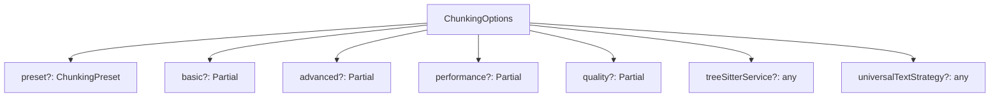

## 配置类型分析报告

### 1. 配置预设枚举 (ChunkingPreset)

[`ChunkingPreset`](src/service/parser/types/config-types.ts:7-12) 枚举定义了四种预设配置模式：

- **FAST**: 快速模式，优先考虑性能，提供基础功能
- **BALANCED**: 平衡模式，在功能和性能之间取得平衡（默认预设）
- **QUALITY**: 质量模式，提供最高质量和最全面的功能
- **CUSTOM**: 自定义模式，允许用户完全控制所有配置项

**使用场景**：
- 在 [`ChunkingPresetFactory.createPreset()`](src/service/parser/processing/types/splitting-types.ts:54) 中根据预设创建完整配置
- 各种策略实现（如 [`IntelligentStrategy`](src/service/parser/processing/strategies/impl/IntelligentStrategy.ts:28)、[`SemanticStrategy`](src/service/parser/processing/strategies/impl/SemanticStrategy.ts:15)）在构造函数中使用预设作为基础配置

### 2. 基础分段配置 (BasicChunkingConfig)

[`BasicChunkingConfig`](src/service/parser/types/config-types.ts:15-26) 包含代码分段的基础参数：

| 配置项 | 类型 | 作用 | 使用位置 |
|--------|------|------|----------|
| `maxChunkSize` | number | 最大块大小（字符数） | [`ChunkingConfigManager.validateConfig()`](src/service/parser/processing/config/ChunkingConfigManager.ts:169) |
| `minChunkSize` | number | 最小块大小（字符数） | [`ChunkingConfigManager.validateConfig()`](src/service/parser/processing/config/ChunkingConfigManager.ts:169) |
| `overlapSize` | number | 块之间重叠大小 | [`OverlapPostProcessor.shouldApply()`](src/service/parser/processing/post-processing/OverlapPostProcessor.ts:39) |
| `preserveFunctionBoundaries` | boolean | 是否保持函数边界完整 | 各种策略实现中用于决定是否在函数边界处分段 |
| `preserveClassBoundaries` | boolean | 是否保持类边界完整 | 各种策略实现中用于决定是否在类边界处分段 |
| `includeComments` | boolean | 是否包含注释 | 影响分段时是否保留代码注释 |
| `extractSnippets` | boolean | 是否提取代码片段 | 用于从大块代码中提取有意义的片段 |
| `addOverlap` | boolean | 是否添加重叠内容 | [`OverlapPostProcessor.shouldApply()`](src/service/parser/processing/post-processing/OverlapPostProcessor.ts:37) |
| `optimizationLevel` | string | 优化级别（low/medium/high） | 控制分段算法的优化程度 |
| `maxLines` | number | 最大行数限制 | 限制单个块的最大行数 |

### 3. 高级分段配置 (AdvancedChunkingConfig)

[`AdvancedChunkingConfig`](src/service/parser/types/config-types.ts:29-56) 包含代码分段的高级功能配置：

| 配置项 | 类型 | 作用 | 使用位置 |
|--------|------|------|----------|
| `adaptiveBoundaryThreshold` | boolean | 自适应边界阈值 | 启用基于代码复杂度的动态边界调整 |
| `contextAwareOverlap` | boolean | 上下文感知重叠 | 根据代码上下文智能计算重叠内容 |
| `semanticWeight` | number | 语义权重（0-1） | [`ChunkingConfigManager.validateConfig()`](src/service/parser/processing/config/ChunkingConfigManager.ts:179) |
| `syntacticWeight` | number | 语法权重（0-1） | [`ChunkingConfigManager.validateConfig()`](src/service/parser/processing/config/ChunkingConfigManager.ts:179) |
| `enableASTBoundaryDetection` | boolean | 启用AST边界检测 | 使用抽象语法树进行精确边界检测 |
| `astNodeTracking` | boolean | AST节点跟踪 | 跟踪AST节点使用情况，避免重复处理 |
| `enableChunkDeduplication` | boolean | 启用块去重 | [`OverlapPostProcessor`](src/service/parser/processing/post-processing/OverlapPostProcessor.ts:68) |
| `maxOverlapRatio` | number | 最大重叠比例 | [`UnifiedOverlapCalculator`](src/service/parser/processing/strategies/impl/IntelligentStrategy.ts:45) |
| `deduplicationThreshold` | number | 去重阈值 | [`OverlapPostProcessor`](src/service/parser/processing/post-processing/OverlapPostProcessor.ts:70) |
| `chunkMergeStrategy` | string | 块合并策略 | 控制如何合并相似的代码块 |
| `minChunkSimilarity` | number | 最小块相似度 | 判断两个块是否相似的阈值 |
| `enableSmartDeduplication` | boolean | 启用智能去重 | 使用更高级的去重算法 |
| `similarityThreshold` | number | 相似度阈值 | [`OverlapPostProcessor`](src/service/parser/processing/post-processing/OverlapPostProcessor.ts:74) |
| `overlapMergeStrategy` | string | 重叠合并策略 | 控制重叠内容的合并方式 |
| `maxOverlapLines` | number | 最大重叠行数 | [`OverlapPostProcessor`](src/service/parser/processing/post-processing/OverlapPostProcessor.ts:76) |
| `enableEnhancedBalancing` | boolean | 启用增强平衡 | [`OverlapPostProcessor`](src/service/parser/processing/post-processing/OverlapPostProcessor.ts:78) |
| `balancedChunkerThreshold` | number | 平衡块器阈值 | [`OverlapPostProcessor`](src/service/parser/processing/post-processing/OverlapPostProcessor.ts:78) |
| `enableIntelligentFiltering` | boolean | 启用智能过滤 | [`OverlapPostProcessor`](src/service/parser/processing/post-processing/OverlapPostProcessor.ts:80) |
| `minChunkSizeThreshold` | number | 最小块大小阈值 | [`OverlapPostProcessor`](src/service/parser/processing/post-processing/OverlapPostProcessor.ts:81) |
| `maxChunkSizeThreshold` | number | 最大块大小阈值 | [`OverlapPostProcessor`](src/service/parser/processing/post-processing/OverlapPostProcessor.ts:82) |
| `enableSmartRebalancing` | boolean | 启用智能重新平衡 | [`OverlapPostProcessor`](src/service/parser/processing/post-processing/OverlapPostProcessor.ts:83) |
| `rebalancingStrategy` | string | 重新平衡策略 | [`OverlapPostProcessor`](src/service/parser/processing/post-processing/OverlapPostProcessor.ts:84) |
| `enableBoundaryOptimization` | boolean | 启用边界优化 | [`OverlapPostProcessor`](src/service/parser/processing/post-processing/OverlapPostProcessor.ts:85) |
| `boundaryOptimizationThreshold` | number | 边界优化阈值 | [`OverlapPostProcessor`](src/service/parser/processing/post-processing/OverlapPostProcessor.ts:86) |
| `enableAdvancedMerging` | boolean | 启用高级合并 | [`OverlapPostProcessor`](src/service/parser/processing/post-processing/OverlapPostProcessor.ts:87) |
| `mergeDecisionThreshold` | number | 合并决策阈值 | [`OverlapPostProcessor`](src/service/parser/processing/post-processing/OverlapPostProcessor.ts:87) |

### 4. 性能配置 (PerformanceConfig)

[`PerformanceConfig`](src/service/parser/types/config-types.ts:59-65) 包含与性能优化相关的配置：

| 配置项 | 类型 | 作用 | 使用位置 |
|--------|------|------|----------|
| `enablePerformanceOptimization` | boolean | 启用性能优化 | 控制是否应用各种性能优化技术 |
| `enablePerformanceMonitoring` | boolean | 启用性能监控 | 启用分段过程的性能监控和统计 |
| `enableChunkingCoordination` | boolean | 启用分段协调 | 协调多个分段策略的执行顺序 |
| `strategyExecutionOrder` | string[] | 策略执行顺序 | [`OverlapPostProcessor`](src/service/parser/processing/post-processing/OverlapPostProcessor.ts:93) |
| `enableNodeTracking` | boolean | 启用节点跟踪 | [`OverlapPostProcessor`](src/service/parser/processing/post-processing/OverlapPostProcessor.ts:94) |

### 5. 质量配置 (QualityConfig)

[`QualityConfig`](src/service/parser/types/config-types.ts:68-93) 包含与分段质量相关的配置，分为四个子配置：

#### 5.1 边界评分 (boundaryScoring)
| 配置项 | 类型 | 作用 | 使用位置 |
|--------|------|------|----------|
| `enableSemanticScoring` | boolean | 启用语义评分 | 基于语义信息评估分段边界质量 |
| `minBoundaryScore` | number | 最小边界分数 | [`OverlapPostProcessor`](src/service/parser/processing/post-processing/OverlapPostProcessor.ts:99) |
| `maxSearchDistance` | number | 最大搜索距离 | [`OverlapPostProcessor`](src/service/parser/processing/post-processing/OverlapPostProcessor.ts:100) |
| `languageSpecificWeights` | boolean | 语言特定权重 | [`OverlapPostProcessor`](src/service/parser/processing/post-processing/OverlapPostProcessor.ts:101) |

#### 5.2 重叠策略 (overlapStrategy)
| 配置项 | 类型 | 作用 | 使用位置 |
|--------|------|------|----------|
| `preferredStrategy` | string | 首选策略（semantic/syntactic/line/overlap） | 控制重叠计算的首选方法 |
| `enableContextOptimization` | boolean | 启用上下文优化 | 基于上下文优化重叠内容 |
| `qualityThreshold` | number | 质量阈值 | 控制重叠内容的质量要求 |

#### 5.3 函数特定选项 (functionSpecificOptions)
| 配置项 | 类型 | 作用 | 使用位置 |
|--------|------|------|----------|
| `preferWholeFunctions` | boolean | 优先保持函数完整 | 尽量不分割函数 |
| `minFunctionOverlap` | number | 最小函数重叠 | 函数间的最小重叠大小 |
| `maxFunctionSize` | number | 最大函数大小 | 单个函数块的最大大小 |
| `maxFunctionLines` | number | 最大函数行数 | 单个函数块的最大行数 |
| `minFunctionLines` | number | 最小函数行数 | 单个函数块的最小行数 |
| `enableSubFunctionExtraction` | boolean | 启用子函数提取 | 从大函数中提取子函数 |

#### 5.4 类特定选项 (classSpecificOptions)
| 配置项 | 类型 | 作用 | 使用位置 |
|--------|------|------|----------|
| `keepMethodsTogether` | boolean | 保持方法在一起 | 尽量将类的方法保持在同一块中 |
| `classHeaderOverlap` | number | 类头部重叠 | 类声明部分的重叠大小 |
| `maxClassSize` | number | 最大类大小 | 单个类块的最大大小 |

### 6. 统一的 ChunkingOptions 接口

[`ChunkingOptions`](src/service/parser/types/config-types.ts:96-115) 是统一的配置接口，整合了所有配置层级：

**配置整合机制**：
1. **分层设计**：所有子配置都是可选的（Partial类型），允许灵活组合
2. **预设优先**：通过preset可以快速应用预定义的配置组合
3. **策略注入**：支持直接注入treeSitterService和universalTextStrategy实例

**使用模式**：
- 在各种策略实现中作为构造函数参数（如[`IntelligentStrategy`](src/service/parser/processing/strategies/impl/IntelligentStrategy.ts:26)）
- 在配置管理器中进行合并和验证（如[`ChunkingConfigManager`](src/service/parser/processing/config/ChunkingConfigManager.ts)）
- 在后处理器中控制处理行为（如[`OverlapPostProcessor`](src/service/parser/processing/post-processing/OverlapPostProcessor.ts:47)）
